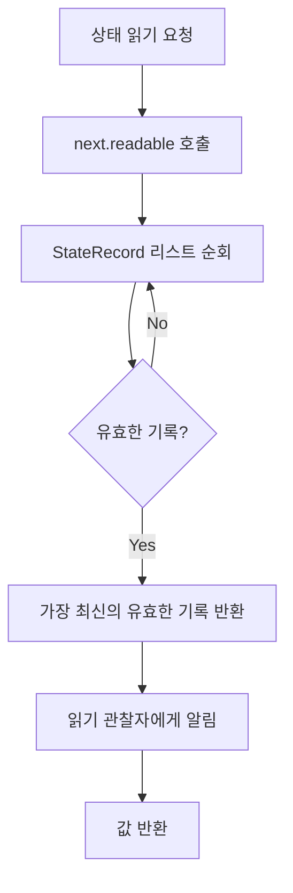
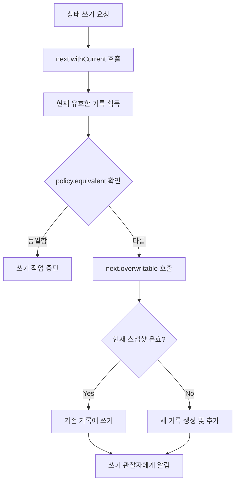

# 읽기와 쓰기 상태 (Reading and writing state)

상태 기록을 읽고 쓰는 것에 대해 살펴봅시다.

## 상태 읽기 메커니즘

"객체를 읽을 때 주어진 스냅샷 상태(`StateObject`)에 대한 `StateRecord` 목록을 순회하여 가장 최근에 유효한 것(가장 높은 스냅샷 ID를 가진)을 찾는다"라고 이전 섹션에서 다루었는데, 이에 해당하는 부분이 코드에서 어떻게 표현되는지 살펴보겠습니다.

### TextField에서의 상태 사용 예시

```kotlin
@Composable
fun TextField(...) {
  // ...
  var textFieldValueState by remember { 
    mutableStateOf(TextFieldValue(text = value)) 
  }
  // ...
}
```

이는 `compose.material` 라이브러리의 `TextField` Composable 함수입니다. 텍스트 값의 **가변적인 상태**를 기억하므로 값이 업데이트될 때마다 Composable이 화면에 새 문자를 표시하도록 Recompose 됩니다.

### mutableStateOf 함수

`remember` 함수의 호출은 설명과 관련이 없으므로 생략하겠습니다. 다음은 스냅샷 상태를 생성하는 데 사용되는 `mutableStateOf` 함수입니다.

```kotlin
fun <T> mutableStateOf(
    value: T,
    policy: SnapshotMutationPolicy<T> = structuralEqualityPolicy()
): MutableState<T> = createSnapshotMutableState(value, policy)
```

이는 궁극적으로 `value: T` 및 `SnapshotMutationPolicy<T>`를 인수로 가져오는 **SnapshotMutationState 상태 객체**를 생성합니다. 전달된 새 값이 현재 값과 다른지 여부를 확인하기 위해 값을 래핑(메모리에 저장)하고 업데이트해야 할 때마다 변형 정책을 사용합니다.

### SnapshotMutableStateImpl의 value 속성

```kotlin
internal open class SnapshotMutableStateImpl<T>(
    value: T,
    override val policy: SnapshotMutationPolicy<T>
) : StateObject, SnapshotMutableState<T> {

  override var value: T
    get() = next.readable(this).value
    set(value) = next.withCurrent {
      if (!policy.equivalent(it.value, value)) {
        next.overwritable(this, it) { this.value = value }
      }
    }
    
  private var next: StateStateRecord<T> = StateStateRecord(value)
    
  // ...
}
```

#### Getter 동작

`getter`를 사용하여 `TextField` Composable(예를 들어 `textFieldValueState.value`)의 내부 값에 접근할 때마다 다음과 같은 프로세스가 수행됩니다:

1. `next`라는 상태 기록(LinkedList의 첫 번째 기록)에 대한 참조를 가져옴
2. `readable` 메서드를 호출하여 순회를 시작
3. **현재 스냅샷**에 대해 현재(가장 새로운) 유효하고 읽어들일 수 있는 상태를 찾기 위해 순회 수행
4. 등록된 모든 **읽기 작업 관찰자**에게 알림

반복되는 모든 상태 기록에 대해 이전 섹션에서 살펴본 유효 조건에 따라 유효한지 확인합니다. 따라서 현재의 스냅샷은 현재 스레드에 속한 스냅샷이 되며, 만약 현재 스레드가 어떤 스레드에도 연결되지 않은 경우 **전역 스냅샷**이 됩니다.

이것이 `mutableStateOf`에 대한 스냅샷 상태를 읽는 방법입니다. 이는 `mutableStateListOf`에 의해 반환된 것과 같이 사용 가능한 다른 가변적인 스냅샷 상태의 구현과 유사합니다.



## 상태 쓰기 메커니즘

상태를 작성하려면 프로퍼티의 `setter`를 보면 됩니다. 아래 코드를 통해서 살펴보겠습니다.

### Setter 동작

```kotlin
set(value) = next.withCurrent {
  if (!policy.equivalent(it.value, value)) {
    next.overwritable(this, it) { this.value = value }
  }
}
```

#### 쓰기 프로세스

1. **withCurrent 함수** 호출
   - 내부적으로 `readable` 메서드를 호출
   - 현재 가장 유효한 최신의 읽기 작업이 가능한 상태 기록을 매개변수로 전달하여 후행 람다식을 실행

2. **값 동등성 확인**
   - 제공된 `SnapshotMutationPolicy`를 사용하여 새로운 값이 현재 값과 동일한지 여부를 확인
   - 동일하지 않은 경우 쓰기 프로세스 시작

3. **overwritable 함수 실행**
   - 쓰기 작업이 가능한 상태 기록을 사용하여 블록을 실행
   - 가장 유효하고 최신의 기록을 후보 기록으로 제안
   - 현재의 스냅샷이 유효한 경우 이를 사용하여 쓰기 작업을 수행
   - 그렇지 않으면 새 기록을 생성하여 목록의 맨 앞에 추가하여 새로운 초기 기록이 되도록 함

4. **쓰기 관찰자 알림**
   - 등록된 모든 **쓰기 관찰자**에게 값이 새롭게 쓰였다는 사실을 알림



## 구현 세부 사항

> **참고**: 구현 세부 사항은 미래에 쉽게 바뀔 수 있으므로 의도적으로 더 깊은 구현 세부 사항을 다루지는 않겠지만, 간단하게 살펴보았습니다.

| 작업 | 메서드 | 주요 역할 |
|------|--------|----------|
| **읽기** | `readable()` | 현재 유효한 최신 상태 기록 찾기 및 읽기 관찰자 알림 |
| **쓰기** | `overwritable()` | 쓰기 가능한 기록 선택 또는 생성 및 쓰기 관찰자 알림 |
| **현재 상태 획득** | `withCurrent()` | readable 메서드를 호출하여 현재 유효한 기록 전달 |

## 요약

- **상태 읽기**는 `readable()` 메서드를 통해 `StateRecord` LinkedList를 순회하여 현재 스냅샷에 대해 가장 유효하고 최신의 상태 기록을 찾는 과정입니다
- **상태 쓰기**는 `SnapshotMutationPolicy`를 통해 값의 변경 여부를 확인한 후, `overwritable()` 메서드로 기존 기록을 수정하거나 새 기록을 생성하는 과정입니다
- `mutableStateOf`는 `SnapshotMutableStateImpl` 클래스를 생성하며, 이 클래스의 `value` 속성의 getter/setter를 통해 읽기/쓰기 작업이 수행됩니다
- 읽기와 쓰기 작업 모두 등록된 **관찰자**(observer)에게 알림을 보내어 Recomposition을 트리거할 수 있도록 합니다
- 현재 스냅샷은 현재 스레드에 속한 스냅샷이며, 스레드가 연결되지 않은 경우 전역 스냅샷이 사용됩니다
- `SnapshotMutationPolicy`는 새 값과 기존 값의 동등성을 판단하여 불필요한 쓰기 작업을 방지합니다
