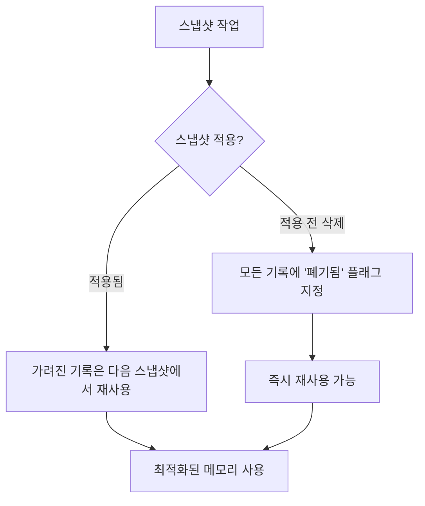

# 오래된 기록 제거 또는 재사용하기 (Removing or reusing obsolete records)

**다중 버전 동시성 제어(MVCC)** 는 동일한 상태의 여러 버전을 저장할 수 있다는 사실(기록)로 인해 흥미로운 문제를 야기합니다. 더 이상 사용되지 않으며 절대 읽을 수 없는 버전은 제거해야 합니다. Compose가 이 문제를 어떻게 해결하는지 설명하기 전에, 먼저 **"열려있는 스냅샷(open snapshots)"** 의 개념을 소개하겠습니다.

---

## 열려있는 스냅샷 (Open Snapshots)

새로 생성된 스냅샷은 **열려 있는 스냅샷 Set**에 추가되며, 닫힐 때까지 그대로 유지됩니다.

### 스냅샷 상태에 따른 기록의 유효성

| 스냅샷 상태 | 기록의 유효성 | 설명 |
|-----------|-------------|------|
| **열려 있음 (Open)** | 다른 스냅샷에 대해 유효하지 않음 | 해당 스냅샷의 모든 상태 기록은 다른 스냅샷에서 읽을 수 없음 |
| **닫힘 (Closed)** | 모든 새 스냅샷에 대해 유효함 | 생성된 모든 새 스냅샷에서 모든 기록을 읽을 수 있음 |

> 스냅샷을 닫는다는 것은 생성된 모든 새 스냅샷에 대해 모든 기록이 자동으로 **유효(새로 생성된 모든 스냅샷에서 읽을 수 있음)** 해짐을 의미합니다.

---

## 사용되지 않는 기록의 재활용

Compose는 다음과 같은 방식으로 사용되지 않는 기록을 재활용합니다.

### 1. 가장 낮은 순서의 열려있는 스냅샷 추적

- Compose는 **공개 스냅샷의 ID Set**을 추적합니다
- 해당 ID는 **단조롭게(monotonically)** 생성되며 지속적으로 증가합니다
- 이를 통해 가장 낮은 순서의 열려있는 스냅샷을 추적할 수 있습니다

### 2. 기록 재사용 조건

기록이 다음 조건을 만족하면 안전하게 재사용할 수 있습니다:

```kotlin
// 기록이 유효하지만 가장 낮은 순서의 열린 스냅샷에 표시되지 않는 경우
if (record.isValid && !record.isVisibleToLowestOpenSnapshot()) {
    // 다른 스냅샷에서 선택되지 않으므로 안전하게 재사용 가능
    record.reuse()
}
```

---

## 성능 최적화

### 가려진 기록(Obscured Records) 재사용의 효과

**가려진 기록**을 재사용하면 다음과 같은 성능 향상을 얻을 수 있습니다:

- 일반적으로 **가변적인 상태 객체에 1~2개의 기록만 유지**
- 메모리 사용량 감소 및 조회 성능 향상

### 재사용 시나리오



#### 두 가지 재사용 패턴

1. **스냅샷 적용 후**
   - 가려진 기록은 다음 스냅샷에서 재사용됩니다

2. **스냅샷 적용 전 삭제**
   - 모든 기록에 **유효하지 않음(폐기됨)** 플래그가 지정됩니다
   - 즉시 재사용할 수 있습니다

---

## 요약

- **다중 버전 동시성 제어(MVCC)** 는 동일한 상태의 여러 버전을 저장하므로, 더 이상 사용되지 않는 버전을 제거하는 메커니즘이 필요합니다
- **열려있는 스냅샷**은 열려있는 동안 다른 스냅샷에서 읽을 수 없으며, 닫히면 모든 새 스냅샷에서 읽을 수 있게 됩니다
- Compose는 **공개 스냅샷의 ID Set**을 추적하여 가장 낮은 순서의 열려있는 스냅샷을 파악합니다
- 기록이 유효하지만 가장 낮은 순서의 열린 스냅샷에 표시되지 않으면 **안전하게 재사용**할 수 있습니다
- **가려진 기록**을 재사용하면 가변적인 상태 객체에 1~2개의 기록만 유지되어 **성능이 크게 향상**됩니다
- 스냅샷 적용 시와 적용 전 삭제 시 서로 다른 재사용 전략을 사용하여 메모리를 효율적으로 관리합니다
