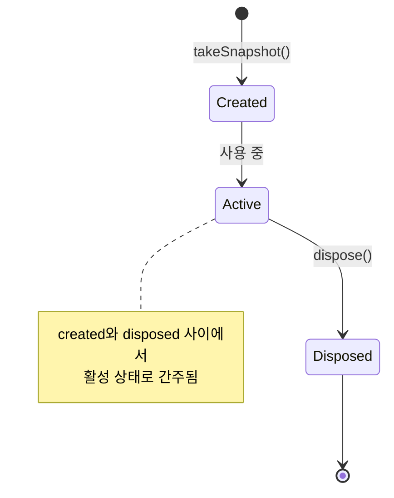
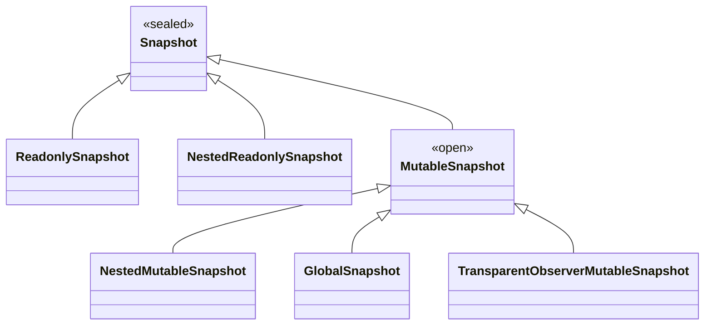

# 스냅샷 (The Snapshot)

## 스냅샷의 개념

**스냅샷(Snapshot)** 은 언제든지 찍을 수 있으며, 스냅샷이 찍히는 주어진 순간에 **프로그램의 현재 상태**(모든 스냅샷 상태 객체)를 반영합니다. 여러 스냅샷을 찍을 수 있으며, 모두 프로그램 상태로부터 **자체 격리된 복사본**을 받게 됩니다. 즉, 해당 시점의 모든 스냅샷 상태 객체에 대한 현재 상태의 복사본입니다(`State` 인터페이스를 구현하는 객체).

이 접근 방식은 스냅샷 중 하나에서 상태 객체를 업데이트하더라도, 다른 스냅샷의 동일한 상태 객체의 다른 복사본에 영향을 주지 않기 때문에 **상태를 수정하는 것이 안전**합니다. 스냅샷은 서로 **격리**되어 있습니다. 여러 스레드가 있는 동시 시나리오에서, 각 스레드는 다른 스냅샷을 향할 것이고, 결과적으로 상태의 다른 복사본을 처리할 것입니다.

## 스냅샷 생성과 관리

Compose Runtime은 프로그램의 현재 상태를 모델링하기 위해 `Snapshot` 클래스를 제공합니다. 스냅샷을 찍으려는 경우 다음과 같은 정적 메서드를 호출하기만 하면 됩니다:

```kotlin
val snapshot = Snapshot.takeSnapshot()
```

이것은 모든 상태 객체의 현재 값을 찍어내고, 이러한 값들은 `snapshot.dispose()`가 호출될 때까지 보존됩니다. 이것이 스냅샷의 수명을 결정합니다.

### 스냅샷 라이프사이클

스냅샷에는 라이프사이클이 있습니다. 스냅샷 사용을 마쳤을 때, 이를 **폐기(dispose)** 해야 합니다. `snapshot.dispose()`를 호출하지 않으면 스냅샷과 관련된 모든 리소스와 해당 스냅샷이 유지하는 상태에 대해 **메모리 누수**가 발생합니다.



### 스냅샷 ID와 버전 관리

스냅샷이 찍힐 때, **ID**가 주어져서 다른 스냅샷이 유지하는 잠재적으로 동일한 상태의 다른 버전들과 쉽게 구별될 수 있도록 합니다. 이를 통해 프로그램 상태를 **버전화**할 수 있습니다. 다시 말해, 프로그램 상태를 버전에 따라 일관되게 유지할 수 있게 합니다(**다중 버전 동시성 제어**).

## 스냅샷 사용 예제

`Snapshot`이 어떻게 작동하는지 이해하는 가장 좋은 방법은 코드를 살펴보는 것입니다. 이와 관련하여 Zach Klipp의 자세한 포스트에서 발췌한 코드는 아래와 같습니다.

```kotlin
fun main() {
  val dog = Dog()
  dog.name.value = "Spot"
  val snapshot = Snapshot.takeSnapshot()
  dog.name.value = "Fido"
  
  println(dog.name.value)
  snapshot.enter { println(dog.name.value) }
  println(dog.name.value)
}

// Output:
// Fido
// Spot
// Fido
```

### `enter` 함수의 역할

`enter` 함수는 일반적으로 "**스냅샷에 진입한다**"라고도 불리며, 람다를 스냅샷의 컨텍스트에서 실행합니다. 따라서 스냅샷이 모든 상태에 대한 **진실의 원천(Source of Truth)** 이 됩니다. 

람다식에서 읽은 모든 상태는 스냅샷에서 값을 가져옵니다. 이 메커니즘은 Compose와 모든 다른 클라이언트 라이브러리가 주어진 스냅샷의 컨텍스트에서 상태를 사용하는 모든 로직을 수행할 수 있게 합니다. 이 작업은 내부적인 스레드에서 시작되며, `enter` 호출이 반환될 때까지만 수행됩니다. 따라서 다른 스레드는 완전히 영향을 받지 않습니다.

위의 예시에서 우리는 강아지의 이름이 업데이트된 후 **"Fido"** 라는 값을 출력하는 것을 볼 수 있지만, 스냅샷의 컨텍스트(`enter` 호출)에서 읽으면 **"Spot"** 이 반환되는데, 이는 스냅샷이 찍히는 순간에 가지고 있던 값입니다.

> `enter` 내부에서는 사용 중인 스냅샷 타입(읽기 전용인지 혹은 가변적인지)에 따라 상태를 읽고 쓸 수 있습니다. 가변적인 타입의 스냅샷은 추후에 자세히 살펴볼 예정입니다.

## 스냅샷 타입

### 읽기 전용 스냅샷

`Snapshot.takeSnapshot()`을 통해 생성한 스냅샷은 **불변**, 즉 **읽기 전용(read-only)** 입니다. 보유하고 있는 모든 상태는 변경할 수 없습니다. 스냅샷의 상태 객체의 값을 변경하려고 하면 예외가 발생합니다.

### 가변 스냅샷

하지만 모든 상태가 읽기 전용인 것은 아니며, 때로는 값을 업데이트(쓰기)해야 할 수도 있습니다. Compose는 보유 중인 상태 값을 변경할 수 있는 `Snapshot` 계약의 구현체인 `MutableSnapshot`을 제공합니다. 그 외에도 사용 가능한 부가적인 추가 구현도 제공됩니다.

### 스냅샷 계층 구조

아래는 `Snapshot`을 상속받고 있는 다양한 타입의 스냅샷들에 대한 간략한 예시 목록입니다:

```kotlin
sealed class Snapshot(...) {
  class ReadonlySnapshot(...) : Snapshot() {...}
  class NestedReadonlySnapshot(...) : Snapshot() {...}
  open class MutableSnapshot(...) : Snapshot() {...}
  class NestedMutableSnapshot(...) : MutableSnapshot() {...}
  class GlobalSnapshot(...) : MutableSnapshot() {...}
  class TransparentObserverMutableSnapshot(...) : MutableSnapshot() {...}
}
```



## 스냅샷 타입별 특징

위에 정의된 다양한 유형의 스냅샷들을 간략하게 살펴보도록 하겠습니다.

| 스냅샷 타입 | 설명 |
|-----------|------|
| **ReadonlySnapshot** | 보유하고 있는 스냅샷 상태 객체는 수정할 수 없으며 읽기만 가능합니다. |
| **MutableSnapshot** | 보유하고 있는 스냅샷 상태 객체를 읽고 수정할 수 있습니다. |
| **NestedReadonlySnapshot / NestedMutableSnapshot** | 스냅샷이 트리를 형성하므로 하위에 대한 읽기 전용 및 가변적인 스냅샷입니다. 스냅샷에는 중첩된 스냅샷이 여러 개 있을 수 있습니다. |
| **GlobalSnapshot** | 전역(공유) 프로그램 상태를 보유하는 가변적인 스냅샷입니다. 이는 궁극적으로 사실상 모든 스냅샷의 루트이기도 합니다. |
| **TransparentObserverMutableSnapshot** | 특별한 경우에만 사용됩니다. 상태 격리를 적용하지 않으며, 상태 객체를 읽고 쓸 때마다 읽기 및 쓰기 관찰자에게 알리기 위한 역할로만 존재합니다. 여기에 있는 모든 상태 기록은 기본적으로 유효하지 않은 것으로 표시되므로, 다른 스냅샷에서는 이를 보거나 읽을 수 없습니다. 이 유형의 스냅샷 ID는 항상 상위 항목의 ID이므로, 이에 대해 생성된 모든 기록은 실제로 상위 항목과 연결됩니다. 수행된 모든 작업이 마치 상위 스냅샷에서 수행된 것과 같다는 점에서 "투명"합니다. |

## 요약

- **스냅샷**은 특정 시점의 프로그램 상태를 격리된 복사본으로 캡처하는 메커니즘입니다.
- 스냅샷은 서로 격리되어 있어 한 스냅샷의 상태 변경이 다른 스냅샷에 영향을 주지 않습니다.
- `Snapshot.takeSnapshot()`으로 생성하며, 사용 후 반드시 `dispose()`를 호출하여 메모리 누수를 방지해야 합니다.
- 스냅샷에는 고유한 **ID**가 부여되어 다중 버전 동시성 제어를 가능하게 합니다.
- `enter` 함수를 통해 스냅샷 컨텍스트에서 상태를 읽고 쓸 수 있습니다.
- **ReadonlySnapshot**은 읽기 전용, **MutableSnapshot**은 읽기/쓰기가 가능한 스냅샷입니다.
- **GlobalSnapshot**은 모든 스냅샷의 루트로 전역 프로그램 상태를 보유합니다.
- 중첩된 스냅샷(Nested Snapshot)을 통해 트리 구조를 형성할 수 있습니다.