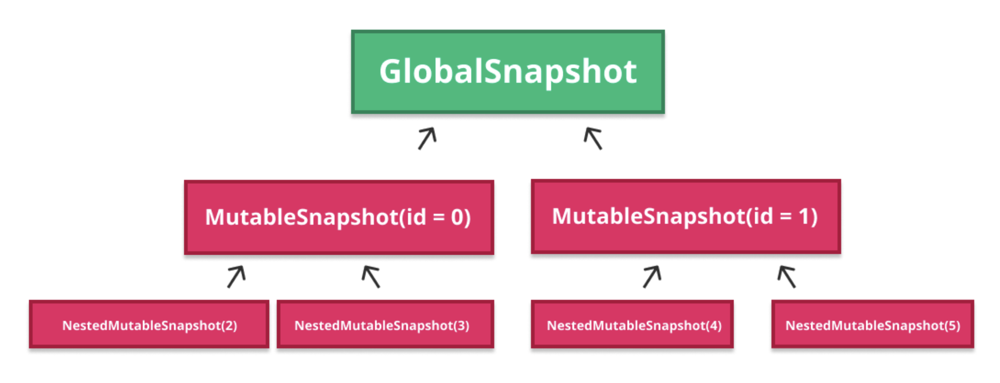
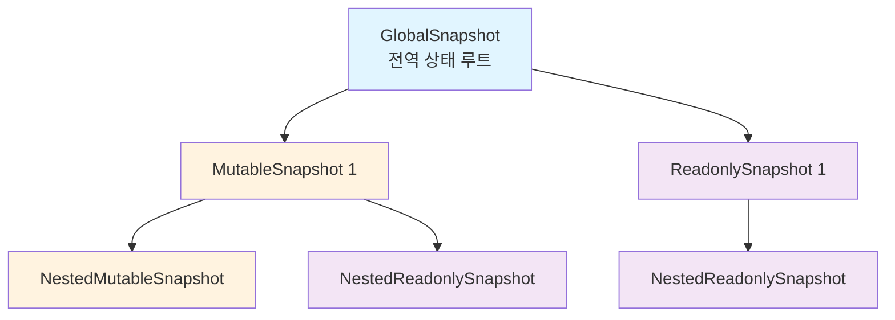
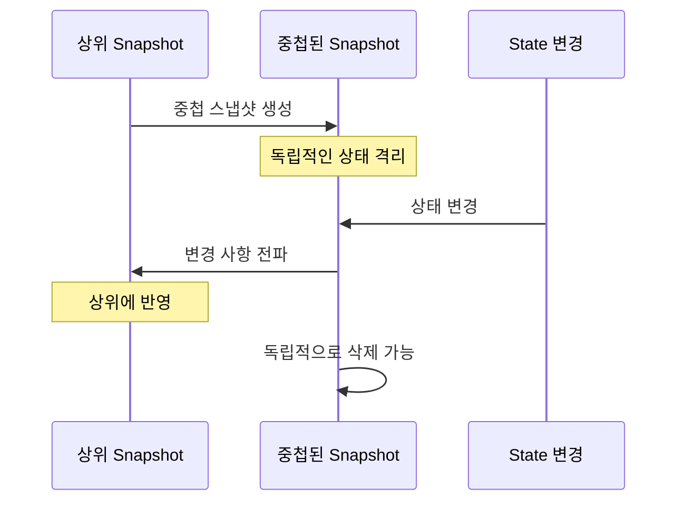

# 스냅샷 트리 (The Snapshot Tree)

## 개요

이전 섹션에서 설명했듯이 **스냅샷은 트리 구조를 형성**합니다. 이러한 이유로 `NestedReadonlySnapshot` 및 `NestedMutableSnapshot` 등과 같은 유형의 스냅샷이 있습니다. 모든 스냅샷에는 중첩된 스냅샷이 개수 제한 없이 포함될 수 있습니다. 트리의 **루트는 전역 상태를 보유하는 `GlobalSnapshot`** 입니다.



## 스냅샷 트리 구조



## 중첩된 스냅샷 (Nested Snapshots)

**중첩된 스냅샷은 독립적으로 삭제할 수 있는 스냅샷의 독립적인 복사본**과 같습니다. 상위 스냅샷을 활성 상태로 유지하면서 이를 삭제할 수 있습니다. 가령, `subcomposition`을 처리할 때 Compose에서 자주 사용됩니다.

> **📌 참고**: `subcomposition`은 독립적 무효화(invalidation)를 지원하려는 유일한 의도로 인라인(상위 구성 내에서)으로 구현된 composition이라고 설명했습니다. `Composition`과 `subcomposition` 또한 하위 트리로서 연결됩니다.

### Subcomposition 사용 예시

중첩된 스냅샷이 생성되는 `subcomposition`의 몇 가지 예는 다음과 같습니다:

- `LazyList` 타입의 아이템
- `BoxWithConstraints`
- `SubcomposeLayout`
- `VectorPainter`

## 중첩된 스냅샷의 생명주기

`Subcomposition`이 필요한 경우 **중첩된 스냅샷이 생성되어 해당 상태를 저장하고 격리**하므로, 상위 composition과 상위 스냅샷은 활성 상태로 유지하면서 subcomposition이 사라지면 스냅샷을 삭제할 수 있습니다. 

**중첩된 스냅샷에 변경 사항이 발생하면 해당 내용이 상위 스냅샷에 전파됩니다.**



## 스냅샷 생성 API

모든 유형의 스냅샷은 중첩된 스냅샷을 만들어 상위 스냅샷에 연결하는 기능을 제공합니다:

| 스냅샷 타입 | 생성 메서드 | 설명 |
|------------|------------|------|
| 읽기 전용 | `Snapshot#takeNestedSnapshot()` | 중첩된 읽기 전용 스냅샷 생성 |
| 가변 | `MutableSnapshot#takeNestedMutableSnapshot()` | 중첩된 가변 스냅샷 생성 |

### 스냅샷 생성 규칙

- **읽기 전용 스냅샷**: 모든 유형의 스냅샷으로부터 생성될 수 있습니다
- **가변 스냅샷**: 다른 가변 스냅샷(또는 가변 스냅샷으로 간주될 수 있는 전역 스냅샷)에서만 생성할 수 있습니다

```kotlin
// 읽기 전용 중첩 스냅샷 생성
val nestedReadonlySnapshot = currentSnapshot.takeNestedSnapshot()

// 가변 중첩 스냅샷 생성 (가변 스냅샷에서만 가능)
val nestedMutableSnapshot = mutableSnapshot.takeNestedMutableSnapshot()
```

## 요약

- 스냅샷은 **트리 구조**를 형성하며, 루트는 `GlobalSnapshot`입니다
- **중첩된 스냅샷**은 독립적으로 삭제 가능한 독립적인 복사본으로, 상위 스냅샷과 독립적으로 동작합니다
- `LazyList`, `BoxWithConstraints`, `SubcomposeLayout` 등에서 `subcomposition`을 위해 중첩된 스냅샷이 사용됩니다
- 중첩된 스냅샷의 변경 사항은 **상위 스냅샷으로 전파**됩니다
- 읽기 전용 스냅샷은 모든 타입에서 생성 가능하지만, 가변 스냅샷은 다른 가변 스냅샷에서만 생성 가능합니다
- 스냅샷 트리 구조는 **상태 격리와 독립적인 무효화**를 지원하여 효율적인 recomposition을 가능하게 합니다