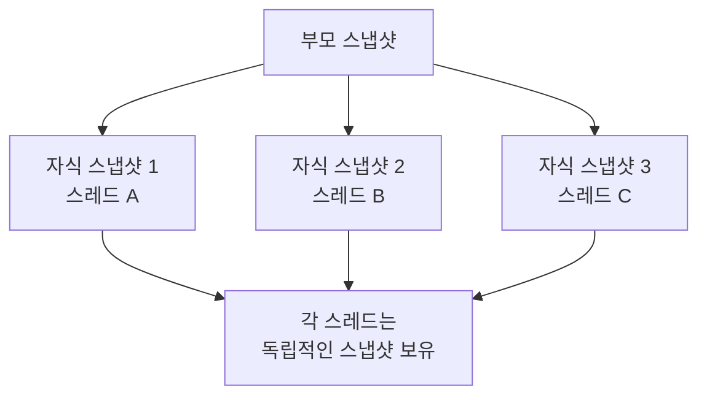
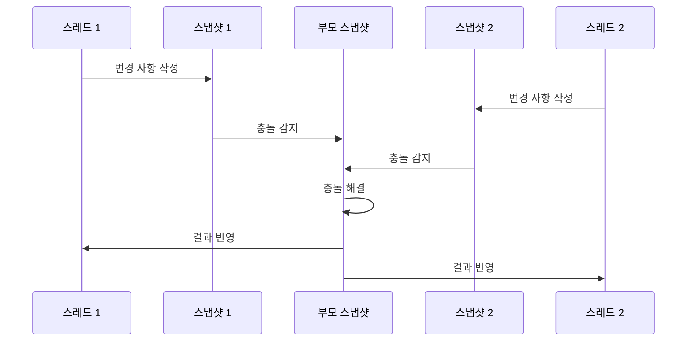
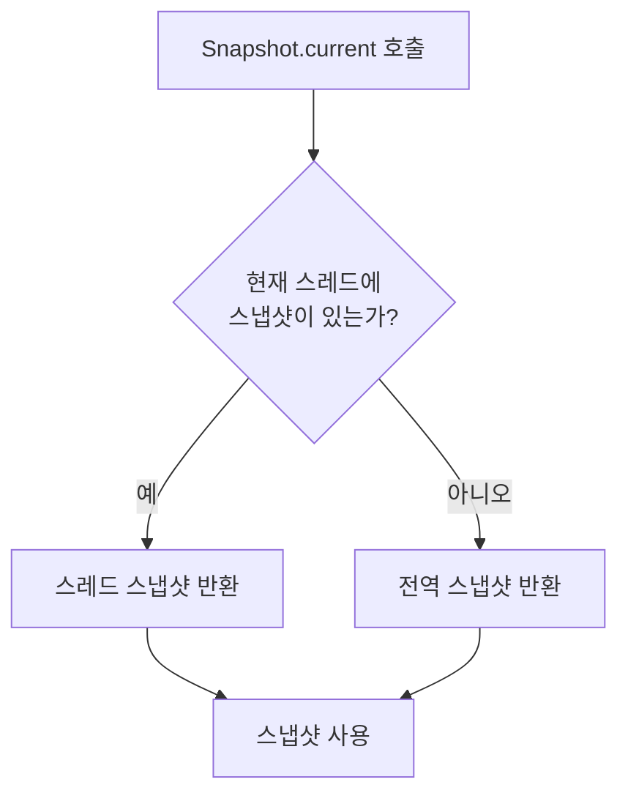

# 스냅샷과 쓰레딩 (Snapshots and Threading)

## 개요

**스냅샷**은 스레드 범위 외부에 있는 별도의 독립적인 구조입니다. Jetpack Compose의 스냅샷 시스템은 스레드와 느슨하게 결합되어 있으며, 이를 통해 유연한 병렬 처리가 가능합니다.

## 스냅샷과 스레드의 관계

### 독립적인 구조

스냅샷과 스레드의 관계를 이해하는 것이 중요합니다:

- **스레드는 현재 스냅샷을 가질 수 있음**: 스레드가 특정 스냅샷 컨텍스트에서 작업할 수 있습니다
- **스냅샷이 스레드에 바인딩될 필요는 없음**: 스냅샷은 스레드와 독립적으로 존재합니다
- **자유로운 진입/탈출**: 스레드는 임의로 스냅샷에 들어오고 나갈 수 있습니다
- **다른 스레드에서의 접근**: 자식 스냅샷은 별도의 스레드에 의해 들어갈 수 있습니다

### 병렬 작업 지원

스냅샷 시스템은 **병렬 작업을 위해 설계**되었습니다:



여러 하위 스레드가 생성될 수 있으며, 각 스레드는 자체적인 스냅샷을 보유합니다.

## 가변 스냅샷과 일관성

### 변경 사항의 전파

가변적인 스냅샷을 정의한 후에는 일관성을 유지하기 위해 다음 사항을 고려해야 합니다:

| 특징 | 설명 |
|------|------|
| **변경 사항 알림** | 하위 스냅샷이 변경 사항을 상위 스냅샷에 알리는 메커니즘 |
| **독립적인 변경** | 모든 스레드의 변경 사항은 서로 독립적으로 처리됨 |
| **충돌 감지** | 서로 다른 스레드에 의한 업데이트 충돌이 자동으로 감지되고 해결됨 |
| **중첩 지원** | 중첩된 스냅샷을 사용하여 작업 분류를 반복적으로 수행 가능 |

### 병렬 Composition

이러한 메커니즘을 통해 **병렬 composition**과 같은 고급 기능이 가능합니다:



## 현재 스냅샷 검색

### `Snapshot.current`

언제든지 스레드의 현재 스냅샷을 검색할 수 있습니다:

```kotlin
val currentSnapshot = Snapshot.current
```

이 함수의 동작 방식:

- **현재 스레드 스냅샷이 있는 경우**: 해당 스냅샷을 반환
- **현재 스레드 스냅샷이 없는 경우**: 전역 스냅샷(전역 상태를 유지함)을 반환



## 요약

- **스냅샷은 스레드와 독립적인 구조**로 설계되어 있으며, 스레드가 반드시 스냅샷에 바인딩될 필요는 없습니다
- **병렬 작업이 의도된 사용 사례**로, 여러 스레드가 각자의 스냅샷을 가지고 독립적으로 작업할 수 있습니다
- **하위 스냅샷은 변경 사항을 상위 스냅샷에 알리며**, 서로 다른 스레드의 업데이트 충돌은 자동으로 감지되고 해결됩니다
- **중첩된 스냅샷을 통해 병렬 composition**과 같은 고급 기능이 가능합니다
- **`Snapshot.current`를 통해 현재 스레드의 스냅샷을 검색**할 수 있으며, 없으면 전역 스냅샷이 반환됩니다