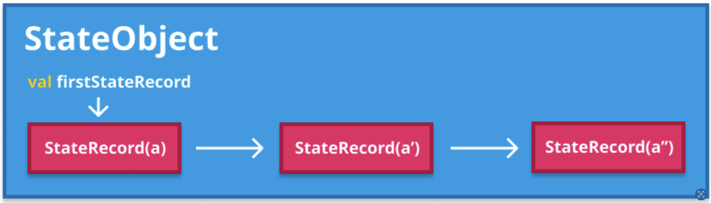
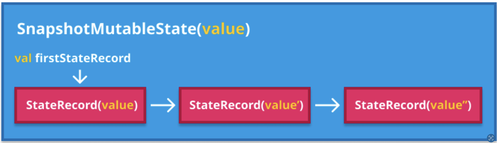
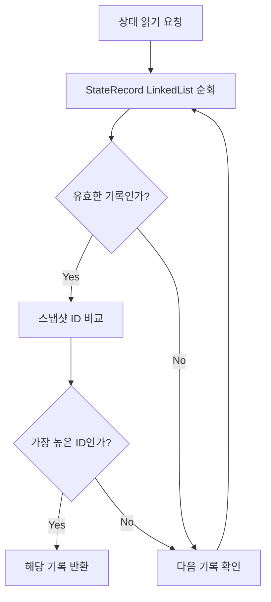
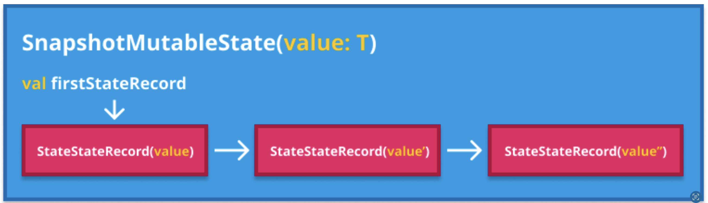
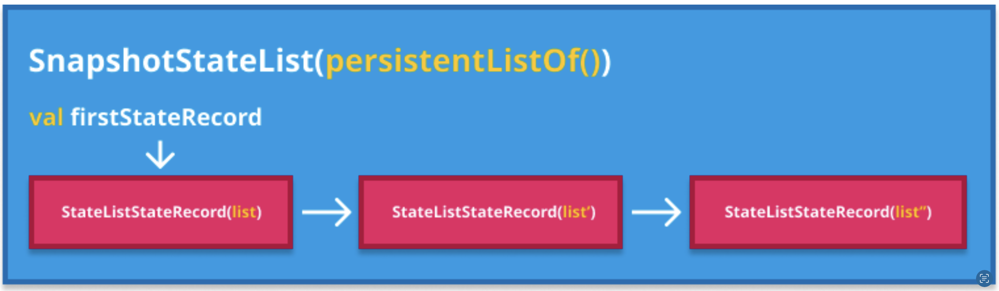

# 상태 객체 및 상태 기록 (StateObjects and StateRecords)

## 개요

**다중 버전 동시성 제어(MVCC)** 는 상태가 기록될 때마다 새 버전이 생성되도록 보장합니다. Jetpack Compose의 **상태 스냅샷 시스템**은 이를 준수하므로 동일한 스냅샷 상태 객체의 여러 버전이 저장될 수 있습니다.

### 성능상의 이점

이 디자인은 세 가지 측면에서 성능에 중요한 역할을 합니다:

| 측면 | 시간 복잡도 | 설명 |
|------|-------------|------|
| 스냅샷 생성 비용 | **O(1)** | 상태 객체 수(N)에 관계없이 일정한 비용 |
| 스냅샷 커밋 비용 | **O(N)** | 변경된 객체 수(N)에 비례 |
| 가비지 컬렉션 | 자유로움 | 스냅샷 시스템에 알리지 않고도 상태 객체 수집 가능 |

> 스냅샷에는 스냅샷 데이터 목록이 어디에도 없으므로(수정된 객체의 임시 목록만 보유), 가비지 컬렉터가 자유롭게 상태 객체를 수집할 수 있습니다.

## StateObject와 StateRecord

내부적으로 스냅샷의 상태 객체는 `StateObject`로 모델링되며, 해당 객체에 대해 저장된 각각의 여러 버전은 `StateRecord`로 모델링됩니다.

- 모든 **기록(Record)** 은 **단일 버전의 상태**에 대한 데이터를 보유
- 각 스냅샷에 표시되는 버전(기록)은 스냅샷이 생성되었을 때 사용 가능한 **가장 최신의 유효한 버전**을 나타냄



## 상태 기록의 유효성

### 유효한 기록의 조건

**"유효함"** 은 항상 특정 스냅샷과 관련이 있습니다. 다음 조건을 만족하면 **유효한 상태 기록**으로 간주됩니다:

- 기록된 ID가 스냅샷 ID보다 **작거나 같음** (현재 또는 이전 스냅샷에서 생성됨)
- 스냅샷의 **유효하지 않은 객체 Set**에 속해있지 않음
- 명시적으로 유효하지 않은 것으로 표시되지 않음

> 이전 스냅샷의 유효한 기록은 자동으로 새 스냅샷에 복사됩니다.

### 유효하지 않은 기록의 경우

다음 세 가지 경우에 기록은 **유효하지 않은 것으로 간주**됩니다:

1. **현재 스냅샷 이후**에 생성된 기록
   - 생성된 스냅샷이 현재 스냅샷 이후에 생성되었기 때문

2. **이미 열려 있던 스냅샷**에 대해 생성된 기록
   - 해당 스냅샷이 생성될 당시 이미 열려 있던 스냅샷에 대한 기록은 유효하지 않은 Set에 추가됨

3. **적용되기 전에 폐기**된 스냅샷에서 생성된 기록
   - 명시적으로 유효하지 않은 것으로 플래그가 지정됨

> 유효하지 않은 기록은 어떤 스냅샷에서도 볼 수 없는 기록이므로 읽을 수 없습니다. Composable 함수에서 스냅샷 상태를 읽을 때, 해당 기록은 유효한 최신 상태를 반환하는 데 고려되지 않습니다.

## StateObject 인터페이스

상태 스냅샷 시스템에서 `StateObject`는 다음과 같이 모델링됩니다:

```kotlin
// Snapshot.kt
interface StateObject {
  val firstStateRecord: StateRecord
  
  fun prependStateRecord(value: StateRecord)
  
  fun mergeRecords(
    previous: StateRecord,
    current: StateRecord,
    applied: StateRecord
  ): StateRecord? = null
}
```

**가변적인 스냅샷 상태 객체**는 `StateObject` 인터페이스를 구현합니다. 예를 들어:

- `mutableStateOf`
- `mutableStateListOf`
- `derivedStateOf`

등 Compose Runtime 라이브러리에서 제공하는 함수들이 반환하는 상태 인스턴스들입니다.

### StateObject의 주요 기능

- `firstStateRecord`: 기록들을 담고 있는 **LinkedList의 첫 번째 요소**에 대한 포인터
- `prependStateRecord`: LinkedList에 **새 기록을 추가** (새 기록이 추가되면 새로운 `firstStateRecord`가 됨)
- `mergeRecords`: 시스템이 자동으로 충돌을 병합하기 위한 함수

## mutableStateOf 예시

### 함수 정의

```kotlin
// SnapshotState.kt
fun <T> mutableStateOf(
  value: T,
  policy: SnapshotMutationPolicy<T> = structuralEqualityPolicy()
): MutableState<T> = createSnapshotMutableState(value, policy)
```

### 내부 동작

이 함수는 **관찰 가능한 가변적인 상태**인 `SnapshotMutableState` 인스턴스를 반환합니다:

- 업데이트할 수 있고 관찰자에게 자동으로 알릴 수 있는 상태 객체
- `StateObject`를 구현하고 있어 다양한 버전의 상태를 저장하는 기록 정보를 **LinkedList 자료구조**로 유지
- 상태를 읽을 때마다 기록된 목록을 순회하여 **가장 최근 값 중 유효한 항목**을 찾아서 반환



## StateRecord 추상 클래스

```kotlin
// Snapshot.kt
abstract class StateRecord {
  internal var snapshotId: Int = currentSnapshot().id // 연관된 스냅샷 ID
  
  internal var next: StateRecord? = null // 다음 기록을 가리킴
  
  abstract fun assign(value: StateRecord)
  
  abstract fun create(): StateRecord
}
```

### StateRecord의 핵심 특징

- 각 기록은 **생성된 스냅샷의 ID**와 연결됨
- 특정 스냅샷에 대해 기록이 **유효한지 여부를 결정**하는 데 사용
- 객체를 읽을 때마다 `StateRecord` LinkedList 목록을 순회하여 **가장 최근에 유효한 것**(가장 높은 스냅샷 ID)을 찾음

### 기록 읽기 프로세스



> 스냅샷이 생성되면 모든 스냅샷 상태 객체의 가장 최근의 유효한 상태가 캡처되며, 이는 새 스냅샷의 전체 수명 동안 사용될 상태가 됩니다. (가변적인 스냅샷이고 상태가 내부적으로 변경되지 않는 한)

## StateRecord의 구현

`StateRecord`도 **추상 클래스**입니다. 사용 가능한 다양한 구현은 `StateObject`의 구체적인 유형에 따라 정의됩니다.

### StateStateRecord (mutableStateOf)

`mutableStateOf`는 `StateObject`인 `SnapshotMutableState`를 반환합니다. 이는 `StateStateRecord`의 기록에 대한 **LinkedList**를 유지 관리합니다.

- 이 기록은 **T 타입의 값**에 대한 래퍼
- 기록마다 저장해야 하는 모든 정보는 해당 타입에 속함



### StateListStateRecord (mutableStateListOf)

`mutableStateListOf`는 `StateObject`의 또 다른 구현인 `SnapshotStateList`를 생성합니다.

- 관찰할 수 있는 가변적인 List를 모델링 (`MutableList` Kotlin 컬렉션 인터페이스의 구현체)
- 기록은 자체적으로 정의된 `StateListStateRecord` 타입을 가짐
- 상태 목록 버전을 보유하기 위해 **PersistentList** 사용
  - 참조: [kotlinx.collections.immutable](https://github.com/Kotlin/kotlinx.collections.immutable)



## 요약

- **StateObject**는 Jetpack Compose의 스냅샷 상태 객체를 모델링하며, 각 버전은 **StateRecord**로 저장됩니다
- 스냅샷 생성 비용은 **O(1)**, 커밋 비용은 **O(N)**(변경된 객체 수에 비례)으로 효율적입니다
- 기록의 **유효성**은 스냅샷 ID와 유효하지 않은 객체 Set을 기준으로 판단됩니다
- **StateObject**는 LinkedList 구조로 기록을 관리하며, 가장 최근의 유효한 기록을 빠르게 찾을 수 있습니다
- `mutableStateOf`, `mutableStateListOf` 등은 각각 고유한 StateRecord 구현을 사용하여 상태를 관리합니다
- **mergeRecords** 함수를 통해 시스템이 자동으로 충돌을 병합할 수 있습니다
- 유효하지 않은 기록은 읽을 수 없으며, 가비지 컬렉터에 의해 자동으로 수집될 수 있습니다