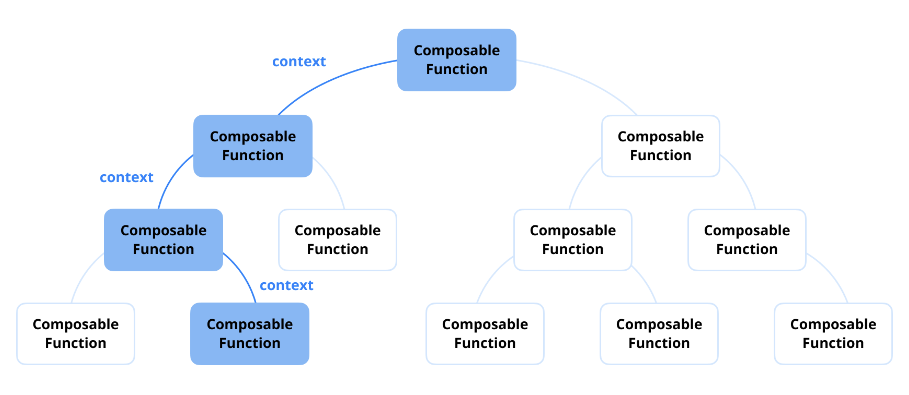
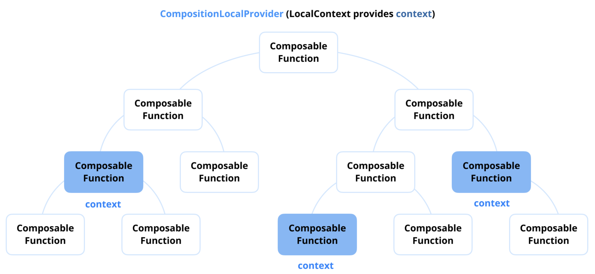

# `CompositionLocal`의 역할은 무엇인가요?

`CompositionLocal`은 UI 트리 아래로 데이터를 명시적으로 전달하지 않고도 암시적으로 공유할 수 있게 해주는 Jetpack Compose의 메커니즘입니다. 이는 테마, 로깅, 또는 사용자 인증 정보와 같이 여러 컴포저블에서 필요하지만 모든 함수에 파라미터로 전달하기에는 번거로운 '주변(ambient)' 데이터를 제공하는 데 사용됩니다.

**`CompositionLocal`** 은 Jetpack Compose에서 컴포저블 함수들을 통해 명시적으로 전달하지 않고도 데이터를 **컴포지션 트리 아래로 암시적으로 전달**하는 메커니즘입니다. 이는 여러 계층에 걸쳐 수동으로 파라미터를 전달해야 하는 필요성을 줄여, 깔끔하고 확장 가능한 UI 아키텍처를 유지하는 데 도움을 줍니다.

공유 데이터가 필요할 때마다 각 컴포저블이 이를 파라미터로 받고 다시 하위로 전달하도록 요구하는 대신, `CompositionLocal`은 UI 계층 구조의 어느 수준에서든 이 데이터에 접근할 수 있는 더 유연한 접근 방식을 제공합니다. 이는 텍스트 스타일, 색상 구성표, 내비게이션 핸들러와 같은 **전역 설정, 테마 또는 의존성**에 특히 유용합니다.

## 왜 `CompositionLocal`을 사용해야 하나요? 🤔

Jetpack Compose는 선언적 접근 방식을 따르므로 UI 개발이 매우 재사용 가능하고 직관적입니다. 그러나 레이아웃의 최상단에서 제공된 데이터가 컴포저블 계층 구조 깊숙한 곳에서 필요할 때 문제가 발생합니다. 단순한 UI 구조에서는 이를 쉽게 처리할 수 있지만, 10단계 이상 깊게 중첩된 컴포저블과 같은 복잡한 레이아웃에서는 과도한 파라미터 전달 없이 효율적으로 데이터를 전달하는 것이 매우 중요해집니다.



이러한 문제를 해결하기 위해 Jetpack Compose는 Compose 트리를 통해 암시적인 데이터 전파를 가능하게 하는 `CompositionLocal` 메커니즘을 제공합니다. 이를 통해 어떤 수준의 컴포저블이든 명시적으로 파라미터를 전달받지 않고도 필요한 정보에 접근할 수 있어, 특히 깊게 중첩되고 복잡한 UI 계층 구조에서 제한된 범위 내의 데이터를 더 깔끔하고 쉽게 꺼내 쓸 수 있습니다.



대부분의 경우, `CompositionLocal`은 일단 초기화되면 변경되지 않는 비교적 정적인 정보를 전달하는 데 사용됩니다. 일반적인 예는 Compose UI 컴포넌트 전반에 걸쳐 일관된 디자인을 유지하는 데 도움이 되는 `MaterialTheme` 객체입니다. 그 구현을 살펴보겠습니다.

```kotlin
@Composable
fun MaterialTheme(
    // ...
) {
    // ...
    // CompositionLocalProvider를 사용하여 테마 관련 값들을 하위 컴포저블에 제공
    CompositionLocalProvider(
        LocalColors provides rememberedColors,
        LocalContentAlpha provides ContentAlpha.high,
        LocalIndication provides rippleIndication,
        LocalRippleTheme provides MaterialRippleTheme,
        LocalShapes provides shapes,
        LocalTextSelectionColors provides selectionColors,
        LocalTypography provides typography
    ) {
        // ...
    }
}
```

-----

## 사용 예시

`CompositionLocal`이 여러 컴포저블에 걸쳐 사용자 객체를 관리하는 데 어떻게 사용되는지 보여주는 예시입니다.

```kotlin
// 1. CompositionLocal 인스턴스 생성 및 기본값 제공
val LocalUser = compositionLocalOf { "skydoves" }

@Composable
fun UserProfile() {
    Column {
        // 3. LocalUser.current를 통해 암시적으로 데이터에 접근
        Text(text = "User: ${LocalUser.current}")
        UserDetails()
    }
}

@Composable
fun UserDetails() {
    // UserDetails 또한 파라미터 없이 데이터에 접근 가능
    Text(text = "Welcome, ${LocalUser.current}!")
}

@Composable
fun App() {
    // 2. CompositionLocalProvider를 사용하여 특정 범위에 값을 제공
    CompositionLocalProvider(LocalUser provides "Android") {
        UserProfile()
    }
}
```

이 예시에서 `LocalUser` 객체는 더 높은 수준(`App` 컴포저블)에서 제공되며, `UserProfile`과 `UserDetails`에서는 파라미터로 명시적으로 전달받지 않고도 암시적으로 접근합니다.

-----

## 요약

`CompositionLocal`은 Compose 트리 전체에 걸쳐 명시적으로 파라미터를 전달할 필요 없이 암시적인 데이터 공유를 가능하게 합니다. 이는 테마, 사용자 세션, 내비게이션 핸들러와 같은 전역 설정을 관리하는 데 특히 유용합니다.

-----

## 💡 프로 팁: 왜 `CompositionLocal`을 신중하게 사용해야 하나요?

`CompositionLocal`은 명시적으로 파라미터를 제공하지 않고 UI 트리 아래로 데이터를 암시적으로 전달하는 메커니즘입니다. 재사용성을 향상시키고 데이터 전파를 단순화하지만, 부적절하게 사용하면 과도한 리컴포지션을 유발하여 성능에 영향을 줄 수 있습니다. Jetpack Compose는 `CompositionLocal`을 생성하기 위해 **`compositionLocalOf`** 와 **`staticCompositionLocalOf`** 라는 두 가지 API를 제공합니다. 효율적인 상태 관리를 위해서는 이 둘의 차이점을 이해하는 것이 매우 중요합니다.

### `compositionLocalOf`: 동적 상태와 세분화된 리컴포지션

`compositionLocalOf`는 **동적인(dynamic) `CompositionLocal`** 입니다. 즉, 그 값이 변경되면 해당 값을 **읽는(read) 컴포저블만** 리컴포지션을 트리거합니다. 이는 자주 변경될 수 있지만 범위가 지정된 업데이트가 필요한 상태에 적합합니다.

```kotlin
val LocalUser = compositionLocalOf { "skydoves" }

@Composable
fun UserScreen() {
    var user by remember { mutableStateOf("skydoves") }

    Column {
        Button(onClick = { user = "android" }) {
            Text("Change User")
        }
        // user 상태가 변경되면 LocalUser의 값이 변경됨
        CompositionLocalProvider(LocalUser provides user) {
            UserProfile() // UserProfile만 리컴포지션됨
        }
    }
}

@Composable
fun UserProfile() {
    // LocalUser.current를 읽고 있으므로, 값이 변경되면 이 컴포저블만 다시 그려짐
    Text("User: ${LocalUser.current}")
}
```

#### 작동 방식:

  * `LocalUser`는 리컴포지션 중에 변경될 수 있는 동적 값을 보유합니다.
  * 버튼이 클릭되면 `UserScreen`은 `user` 값을 업데이트하고, `UserProfile`만 리컴포지션되어 성능을 최적화합니다.

### `staticCompositionLocalOf`: 정적 값에 대한 효율성

`compositionLocalOf`와 달리, **`staticCompositionLocalOf`** 는 컴포지션에서 누가 값을 읽는지 추적하지 않습니다. 대신, 제공된 값이 변경되면 Compose는 **프로바이더가 설정된 전체 콘텐츠 블록을 무효화**하여 더 광범위한 리컴포지션을 트리거합니다.

```kotlin
val LocalThemeColor = staticCompositionLocalOf { Color.Black }

@Composable
fun ThemedScreen() {
    var themeColor by remember { mutableStateOf(Color.Blue) }

    Column {
        Button(onClick = { themeColor = Color.Green }) {
            Text("Change Theme")
        }
        // themeColor가 업데이트되면 이 CompositionLocalProvider 블록 전체가 리컴포지션됨
        CompositionLocalProvider(LocalThemeColor provides themeColor) {
            ThemedContent()
        }
    }
}

@Composable
fun ThemedContent() {
    Box(modifier = Modifier.background(LocalThemeColor.current).size(100.dp))
}
```

#### 작동 방식:

  * `LocalThemeColor`는 정적인 테마 색상을 보유합니다.
  * `themeColor`가 업데이트되면 `CompositionLocalProvider` 블록 전체가 리컴포지션됩니다.
  * `compositionLocalOf`와 달리, 특정 소비 컴포저블로 리컴포지션을 제한하지 않으므로, 테마와 같이 **거의 변경되지 않는 전역 값**에 적합합니다.

### 리컴포지션 고려 사항

`CompositionLocal`을 잘못 사용하면 불필요한 리컴포지션을 유발하여 성능에 영향을 줄 수 있습니다. `compositionLocalOf`와 `staticCompositionLocalOf`의 주요 차이점은 다음과 같습니다.

| API | 리컴포지션 동작 | 적합한 사용 사례 |
| :--- | :--- | :--- |
| `compositionLocalOf` | `current`에 접근하는 곳만 재계산 | 자주 변경되는 상태 (예: 사용자 환경설정, 지역화된 UI 업데이트) |
| `staticCompositionLocalOf` | 전체 프로바이더 블록에 대해 리컴포지션을 트리거 | 전역적인 정적 값 (예: 테마, 설정) |

#### 성능 최적화를 위해:

  * 거의 변경되지 않는 전역 값에는 **`staticCompositionLocalOf`** 를 사용하여 불필요한 리컴포지션을 피하세요.
  * 업데이트가 특정 컴포저블에만 영향을 주어야 하는 범위가 지정되고 자주 변경되는 상태에는 **`compositionLocalOf`** 를 선호하세요.
  * 매우 동적인 데이터에는 `CompositionLocal`을 사용하지 말고, 대신 `remember`나 `State`를 사용하여 로컬 UI 상태를 효율적으로 관리하세요.

### 요약

`CompositionLocal`은 Compose 계층 구조 내에서 데이터를 전달하는 유용한 도구이지만, 불필요한 리컴포지션을 방지하기 위해 신중하게 사용해야 합니다. `compositionLocalOf`는 자주 변경되는 값에 대해 세분화된 제어를 제공하는 반면, `staticCompositionLocalOf`는 안정적인 전역 설정에 더 적합합니다. 올바른 시나리오에 맞는 올바른 API를 선택함으로써 더 효율적이고 성능이 좋은 Compose 애플리케이션을 구축할 수 있습니다.

-----

## Q. `CompositionLocal`은 무엇이며, 어떤 시나리오에서 컴포저블 함수를 통해 파라미터를 전달하는 대신 사용하겠습니까?

`CompositionLocal`은 UI 트리 전체에 걸쳐 **암시적으로 데이터를 전달**하는 메커니즘입니다. 여러 단계의 중첩된 컴포저블을 거쳐 파라미터를 명시적으로 전달하는 **'프로퍼티 드릴링(property drilling)'** 의 번거로움을 피하고 싶을 때, 특히 **테마, 현재 사용자 정보, 또는 분석 로거**와 같이 많은 컴포저블에서 필요하지만 모든 함수 시그니처에 포함시키기는 비실용적인 데이터를 제공하는 시나리오에서 사용합니다.

-----

## 1. `CompositionLocal`이란 무엇인가?

**`CompositionLocal`** 은 Jetpack Compose에서 데이터를 UI 계층 구조 아래로 **암시적으로 전파**할 수 있게 해주는 도구입니다.

일반적으로 부모 컴포저블에서 자식 컴포저블로 데이터를 전달하려면 함수 파라미터를 사용해야 합니다. 하지만 UI 트리가 깊어질 경우, 최상위 컴포저블의 데이터를 아주 깊숙한 곳에 있는 하위 컴포저블에 전달하려면 그 사이의 모든 중간 컴포저블들이 해당 데이터를 받아서 다시 전달해주는 역할을 해야 합니다. 이는 코드의 복잡성을 높이고 유지보수를 어렵게 만듭니다.

`CompositionLocal`은 이러한 문제를 해결합니다. 특정 범위(`CompositionLocalProvider` 블록) 내에서 값을 제공하면, 그 범위 안의 어떤 하위 컴포저블이든 중간 단계를 거치지 않고 `.current` 프로퍼티를 통해 해당 값에 직접 접근할 수 있습니다.

-----

## 2. 파라미터 전달 대신 `CompositionLocal`을 사용하는 시나리오

명시적인 파라미터 전달이 컴포저블의 의존성을 명확하게 하여 더 선호되는 일반적인 방법이지만, 다음과 같은 특정 시나리오에서는 `CompositionLocal`을 사용하는 것이 훨씬 더 효율적입니다.

### 2.1. 깊게 중첩된 UI 계층 구조에서 데이터 전달 (프로퍼티 드릴링 방지) 🔽

  * **시나리오:** 앱의 최상위 레벨에 있는 데이터(예: 현재 로그인한 사용자 정보)가 5~10단계 이상 깊숙이 중첩된 하위 컴포저블에서 필요한 경우.
  * **문제점:** 파라미터를 통해 전달하려면, 중간에 있는 모든 컴포저블들이 자신은 사용하지도 않는 사용자 정보를 단지 아래로 전달하기 위해 파라미터로 받아야 합니다. 이를 '프로퍼티 드릴링(Property Drilling)'이라고 하며, 코드의 가독성을 해치고 리팩토링을 어렵게 만듭니다.
  * **해결책:** 최상위 레벨에서 `CompositionLocalProvider`로 사용자 정보를 제공하면, 데이터를 필요로 하는 하위 컴포저블에서 `LocalUser.current`와 같이 직접 접근하여 중간 단계의 번거로움을 없앨 수 있습니다.

### 2.2. 앱 전체의 테마(Theming) 및 스타일링 🎨

  * **시나리오:** 앱 전체의 색상, 타이포그래피, 모양 등 디자인 시스템을 일관되게 적용해야 할 때.
  * **이유:** 이것이 `CompositionLocal`의 가장 대표적인 사용 사례입니다. `MaterialTheme`은 내부적으로 `CompositionLocal`을 사용하여 `ColorScheme`, `Typography`, `Shapes` 등을 하위 모든 컴포저블에 제공합니다. 만약 `CompositionLocal`이 없다면, 모든 `Text`, `Button`, `Card` 컴포저블에 색상과 폰트 정보를 일일이 파라미터로 전달해야 했을 것입니다.
    ```kotlin
    // MaterialTheme은 내부적으로 CompositionLocal을 사용한다.
    Text(
        text = "Hello",
        color = MaterialTheme.colorScheme.primary, // LocalColorScheme.current에 접근
        style = MaterialTheme.typography.bodyLarge // LocalTypography.current에 접근
    )
    ```

### 2.3. 전역적인(Scoped) 의존성 제공 🌐

  * **시나리오:** 특정 범위 내에서 공유되어야 하는 객체나 서비스를 제공할 때.
  * **예시:**
      * **분석 로거:** 특정 화면 범위 내에서 동일한 분석 로거 인스턴스를 사용하여 이벤트를 기록할 때.
      * **이미지 로더:** Coil이나 Glide의 `ImageLoader` 인스턴스를 하위 컴포저블들이 공유하여 사용할 때.
      * **현재 사용자 정보:** 앱의 여러 부분에서 현재 로그인한 사용자의 이름이나 프로필 사진 URL에 접근해야 할 때.

### 2.4. 암시적인 주변(Ambient) 정보 전달

  * **시나리오:** 명시적으로 전달하기보다는 주변 환경의 일부로 간주되는 데이터를 제공할 때.
  * **예시:**
      * **`LocalContext.current`:** 현재 안드로이드 `Context`에 접근.
      * **`LocalLayoutDirection.current`:** 현재 레이아웃이 좌에서 우로(LTR) 쓰이는지, 우에서 좌로(RTL) 쓰이는지에 대한 정보.
      * 이러한 정보들은 거의 모든 컴포저블에서 필요할 수 있으므로, 파라미터로 일일이 전달하는 것은 매우 비실용적입니다.

-----

## 3. 결론

**`CompositionLocal`** 은 일반적인 파라미터 전달을 대체하는 것이 아니라, 그것이 비효율적이거나 부적절할 때 사용하는 보완적인 도구입니다.

  * **일반 파라미터 전달:** 컴포저블의 **핵심적인 의존성**을 전달하는 데 사용합니다. 이는 함수의 역할을 명확하게 하고 재사용성을 높이는 가장 좋은 방법입니다.
  * **`CompositionLocal` 사용:** 여러 계층에 걸쳐 사용되며 자주 변경되지 않는 **주변(ambient) 데이터나 전역적인 설정**을 전달하는 데 사용합니다. 이를 통해 중간 컴포저블들의 API를 깔끔하게 유지하고 코드의 복잡성을 줄일 수 있습니다.


## Q. `CompositionLocalProvider`는 어떻게 작동하며, 값을 제공하지 않고 `CompositionLocal`에 접근하려고 하면 어떻게 되나요?

`CompositionLocalProvider`는 특정 `CompositionLocal`에 새로운 값을 설정하고, 자신의 콘텐츠 람다(**하위 컴포저블 트리**)에만 그 값을 적용하는 역할을 합니다. 만약 값을 제공하는 `CompositionLocalProvider` 없이 `CompositionLocal`에 접근하면, 컴포지션 트리를 거슬러 올라가 가장 가까운 `Provider`를 찾으며, 최상단까지 값을 찾지 못할 경우 **`CompositionLocal`을 생성할 때 지정한 기본값(default value)** 이 사용됩니다.

-----

## 1. `CompositionLocalProvider`의 작동 방식

### 1.1. 값의 범위 지정 (Scoping the Value) 🎯

`CompositionLocalProvider`는 하나 이상의 `ProvidedValue`를 받아, 자신의 후행 람다(trailing lambda)로 감싸진 콘텐츠 블록에만 해당 값을 제공하는 컴포저블 함수입니다. `ProvidedValue`는 `CompositionLocal` 키와 제공할 값을 `provides` 중위(infix) 함수로 연결하여 만듭니다.

```kotlin
val LocalContentColor = staticCompositionLocalOf { Color.Black }

@Composable
fun MyApp() {
    // 여기서 Text는 LocalContentColor의 기본값인 Black을 사용
    Text("기본 색상 텍스트")

    CompositionLocalProvider(LocalContentColor provides Color.Red) {
        // 이 블록 내부에서는 LocalContentColor.current의 값이 Red가 됩니다.
        Text("빨간색 텍스트")
        MyInnerComponent()
    }
    
    // 이 블록을 벗어나면 다시 기본값인 Black을 사용
    Text("다시 기본 색상 텍스트")
}
```

`CompositionLocalProvider` 블록을 벗어나면, `CompositionLocal`의 값은 이전에 가지고 있던 값으로 다시 복원됩니다.

### 1.2. 계층적 구조 (Hierarchical Structure)

`CompositionLocalProvider`는 중첩될 수 있습니다. 하위 컴포저블에서 `CompositionLocal`의 `.current` 값에 접근하면, Compose 런타임은 현재 위치에서부터 컴포지션 트리를 위로 거슬러 올라가면서, 해당 `CompositionLocal`에 대한 값을 제공하는 **가장 가까운 `CompositionLocalProvider`** 를 찾습니다.

-----

## 2. 값을 제공하지 않고 `CompositionLocal`에 접근할 경우

### 2.1. 기본값(Default Value) 사용

컴포지션 트리의 최상단까지 거슬러 올라갔음에도 불구하고 해당 `CompositionLocal`에 대한 값을 제공하는 `CompositionLocalProvider`를 찾지 못하면, **해당 `CompositionLocal`이 처음 생성될 때 지정되었던 기본값**이 사용됩니다.

```kotlin
// 기본값으로 "Guest"를 제공하는 CompositionLocal 생성
val LocalActiveUser = compositionLocalOf { "Guest" }

@Composable
fun SomeDeeplyNestedComponent() {
    // 주변에 CompositionLocalProvider(LocalActiveUser provides ...)가 없다면,
    // LocalActiveUser.current는 기본값인 "Guest"가 됩니다.
    Text("현재 사용자: ${LocalActiveUser.current}")
}
```

### 2.2. 예외 발생: 기본값이 없는 경우

만약 `CompositionLocal`을 생성할 때 기본값을 제공하지 않으면(드문 경우), 값을 제공하는 `CompositionLocalProvider`가 없는 상태에서 해당 `CompositionLocal`에 접근하려고 하면 **`IllegalStateException`이 발생**합니다. 따라서 `CompositionLocal`을 만들 때는 항상 의미 있는 기본값을 제공하는 것이 안전합니다.

-----

## 3. 구현 예시

다음은 `CompositionLocalProvider`의 범위와 기본값 동작을 보여주는 예시입니다.

```kotlin
// 1. 기본값과 함께 CompositionLocal 생성
private val LocalElevation = staticCompositionLocalOf { 1.dp }

@Composable
fun MyComposableLayout() {
    Column {
        // 2. Provider 외부: 기본값(1.dp)이 사용됨
        Card(elevation = CardDefaults.cardElevation(defaultElevation = LocalElevation.current)) {
            Text("기본 고도(Elevation) 카드")
        }

        Spacer(Modifier.height(16.dp))

        // 3. Provider 내부: 새로운 값(8.dp)으로 재정의됨
        CompositionLocalProvider(LocalElevation provides 8.dp) {
            // 이 블록 안의 모든 Card는 LocalElevation.current 값으로 8.dp를 사용
            Card(elevation = CardDefaults.cardElevation(defaultElevation = LocalElevation.current)) {
                Text("높은 고도(Elevation) 카드")
            }
            
            // 중첩된 Provider: 더 구체적인 값이 우선됨
            CompositionLocalProvider(LocalElevation provides 16.dp) {
                Card(elevation = CardDefaults.cardElevation(defaultElevation = LocalElevation.current)) {
                    Text("더 높은 고도(Elevation) 카드") // 여기서는 16.dp가 사용됨
                }
            }
            
            // 중첩된 Provider 범위를 벗어남: 다시 8.dp 값이 적용됨
            Card(elevation = CardDefaults.cardElevation(defaultElevation = LocalElevation.current)) {
                Text("다시 높은 고도(Elevation) 카드")
            }
        }
    }
}
```

-----

## 4. 결론

`CompositionLocalProvider`는 `CompositionLocal`에 **특정 범위(scope)를 지정하여 새로운 값을 제공**하는 핵심적인 메커니즘입니다. 이를 통해 UI 트리의 특정 하위 영역에만 다른 테마나 설정을 적용하는 등 유연한 데이터 전달이 가능해집니다. 만약 값을 제공하는 `Provider`를 찾지 못하면, `CompositionLocal`은 **자신이 생성될 때 정의된 기본값**을 안전하게 사용하므로, `NullPointerException`과 같은 오류 없이 안정적으로 값을 참조할 수 있습니다.