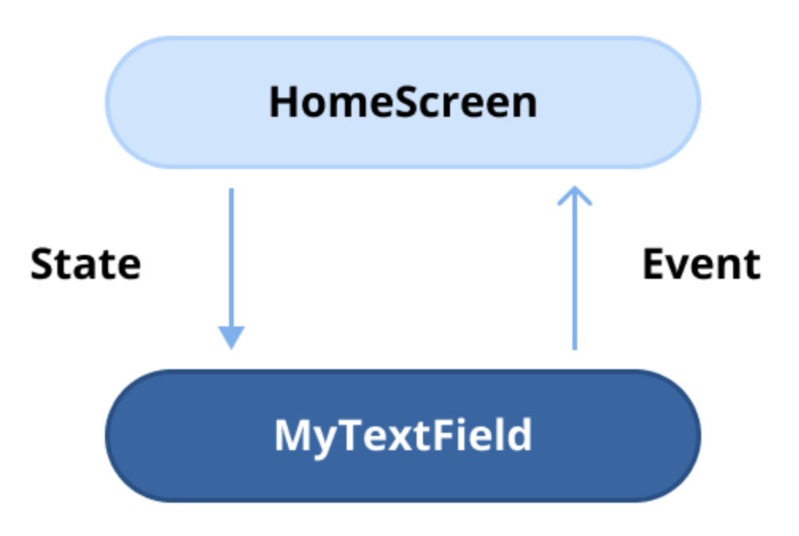

# 상태 호이스팅(State Hoisting)으로 얻을 수 있는 장점은 무엇인가요?

[**상태 호이스팅(State hoisting)**](https://developer.android.com/develop/ui/compose/state-hoisting) 은 컴포저블(composable)의 상태를 더 높은 수준의 컴포넌트나 부모로 **끌어올리는(moving)** 것을 의미합니다. 이 패턴은 현재 상태 값과 상태를 업데이트하는 람다를 컴포저블에 파라미터로 전달하는 것을 포함합니다. 상태 호이스팅은 **단방향 데이터 흐름(unidirectional data flow)** 원칙을 따르므로, UI를 더 쉽게 관리하고 확장 가능하게 만듭니다.

상태 호이스팅에서는:

  * 상태는 **부모 컴포저블**에서 관리됩니다.
  * 이벤트나 트리거(예: `onClick`, `onValueChange`)는 자식에서 부모로 다시 전달되며, 부모가 상태를 업데이트합니다.
  * 업데이트된 상태는 다시 자식에게 파라미터로 전달되어 단방향 데이터 흐름을 만듭니다.

### 예시

```kotlin
@Composable
fun Parent() {
    // 1. 상태는 부모에서 관리됨
    var sliderValue by remember { mutableStateOf(0f) }

    // 2. 자식에게 상태 값과 상태 업데이트 람다를 전달
    SliderComponent(
        value = sliderValue,
        onValueChange = { sliderValue = it }
    )
}

@Composable
fun SliderComponent(value: Float, onValueChange: (Float) -> Unit) {
    // 3. 자식은 상태를 소유하지 않고, 전달받은 값과 이벤트 핸들러를 사용
    Slider(value = value, onValueChange = onValueChange)
}
```

-----

## 상태 호이스팅의 주요 장점

### 1. 향상된 재사용성

상태 호이스팅은 컴포저블을 **상태가 없는(stateless)** 형태로 만들어 재사용 가능하게 합니다. 상태와 이벤트 콜백을 외부에서 주입받음으로써, 동일한 컴포저블이 특정 구현에 얽매이지 않고 여러 다른 화면이나 컨텍스트에서 사용될 수 있습니다.

### 2. 단순화된 테스트

상태가 없는 컴포저블은 그 동작이 전적으로 파라미터로 전달된 상태에 의존하기 때문에 테스트하기가 더 쉽습니다. 이는 컴포저블을 예측 가능하게 만들고 명확한 테스트 시나리오를 가능하게 합니다.

### 3. 더 나은 관심사 분리 (Separation of Concerns)

상태 관리 로직을 부모 컴포저블이나 ViewModel로 이동시킴으로써, 상태 호이스팅은 UI 요소가 인터페이스 렌더링에만 집중하도록 보장합니다. 이러한 분리는 비즈니스 로직과 UI 코드를 명확히 구분하여 유지보수성을 향상시킵니다.

### 4. 단방향 데이터 흐름 지원

상태 호이스팅은 Jetpack Compose의 단방향 데이터 흐름 아키텍처와 일치하며, 상태가 **단일 진실 공급원(single source of truth)** 으로부터 흐르도록 보장합니다. 이는 여러 소스가 동일한 상태를 관리하려 할 때 발생할 수 있는 예기치 않은 동작의 가능성을 줄여줍니다.

### 5. 향상된 상태 관리

상태 호이스팅을 통해 ViewModel이나 부모 컴포저블과 같은 더 높은 수준의 컨테이너에서 상태를 중앙에서 관리할 수 있습니다. 이는 복잡한 UI 흐름을 관리하고, 인스턴스 상태 저장이나 상태 복원과 같은 작업을 더 쉽게 처리할 수 있게 합니다.

-----

## 요약

상태 호이스팅은 더 깔끔하고, 모듈식이며, 테스트하기 쉬운 코드를 촉진합니다. 이는 단방향 데이터 흐름을 지원하여 재사용성과 유지보수성을 모두 향상시킵니다. 컴포저블을 상태가 없는 상태로 유지함으로써, 개발자는 변화하는 애플리케이션 요구 사항에 적응하는 유연한 UI 컴포넌트를 만들 수 있습니다.

-----

## 💡 프로 팁: Stateful vs. Stateless, 코드로 이해하는 상태 호이스팅

**상태 호이스팅**은 상태 관리를 호출 위치(call site)로 이동시켜 **상태를 갖는(stateful) 컴포저블**을 **상태가 없는(stateless) 컴포저블**로 변환하는 데 사용되는 디자인 패턴입니다. 이 접근 방식은 일반적으로 `remember`를 사용하여 관리되던 내부 상태 변수를 **현재 상태 값**과 **상태 업데이트 콜백 함수**라는 두 개의 파라미터로 대체합니다. 이러한 관심사 분리는 더 깔끔하고, 재사용 가능하며, 테스트하기 쉬운 컴포저블 함수를 촉진합니다.

상태 관리 책임을 호출자에게 넘김으로써, 컴포저블은 상태가 없어지고 재사용, 테스트 및 유지보수가 더 쉬워집니다. 예를 들어, `MyTextField` 컴포저블은 텍스트 값과 사용자 입력을 처리하기 위한 콜백을 부모로부터 직접 받아 명확한 데이터 흐름을 보장할 수 있습니다. 이러한 분리는 컴포저블이 오직 UI 렌더링에만 집중하게 하고 상태 관리는 호출 컴포넌트에 맡겨 모듈성을 향상시키고 복잡성을 줄입니다.



다음에는 예시 코드 예제를 통해 Stateful과 Stateless 컴포저블 함수의 차이점을 살펴보겠습니다. 명확성을 높이기 위해 위의 그림을 참조하세요. 사용자 입력을 처리하도록 설계된 사용자 정의 텍스트 필드 MyTextField를 예로 들어보겠습니다. MyTextField를 스테이트풀 컴포저블 함수로 구현하는 방법은 다음과 같습니다.

### Stateful 컴포저블 함수 예시

```kotlin
@Composable
fun HomeScreen() {
    MyTextField()
}

@Composable
fun MyTextField() {
    // MyTextField가 자신의 상태를 내부적으로 관리함
    val (value, onValueChanged) = remember { mutableStateOf("") }

    TextField(value = value, onValueChange = onValueChanged)
}
```

위 예시 코드에서 `MyTextField`는 `remember` 컴포저블 함수를 사용하여 내부 상태를 관리하며, 이는 상태를 메모리에 저장하고 입력 변경을 추적합니다. 이 디자인은 `MyTextField`가 자체 상태를 독립적으로 처리하므로 **Stateful** 컴포저블이 되게 합니다.

이 접근 방식에는 장단점이 있습니다. 긍정적인 측면은 호출 위치(`HomeScreen`)가 상태를 관리할 필요가 없어 구현이 단순화된다는 것입니다. 그러나 단점은 **유연성이 감소**한다는 것입니다. `MyTextField`가 내부적으로 상태를 관리하기 때문에 외부에서 그 동작을 제어하거나 사용자 정의하기가 더 어려워집니다. 이는 컴포저블을 다른 컨텍스트에서 재사용하기 어렵게 만들 수 있습니다.

### Stateless 컴포저블 함수 예시 (상태 호이스팅 적용)

이러한 한계를 해결하면서 동일한 기능을 달성하는 대안적인 접근 방식을 탐색해 보겠습니다.

```kotlin
@Composable
fun HomeScreen() {
    // 상태는 호출 위치인 HomeScreen에서 관리됨
    val (value, onValueChanged) = remember { mutableStateOf("") }

    MyTextField(
        value = value,
        onValueChanged = onValueChanged
    )
}

@Composable
fun MyTextField(
    value: String,
    onValueChanged: (String) -> Unit
) {
    // MyTextField는 상태를 소유하지 않고, 파라미터를 통해 UI를 그림
    TextField(value = value, onValueChange = onValueChanged)
}
```

이 예시에서 `MyTextField`는 **Stateless** 컴포저블로 구현되어, 파라미터를 통해 변경 사항을 반영하면서 상태 관리는 호출 위치(`HomeScreen`)에 위임합니다. 이 접근 방식은 이전의 stateful 구현에 비해 코드가 약간 더 길어질 수 있지만, **향상된 재사용성**이라는 중요한 이점을 제공합니다. `MyTextField`를 상태가 없게 유지함으로써, 다른 컨텍스트에서 쉽게 재사용하고 다양한 사용 사례에 맞게 조정할 수 있어 더 깔끔하고 모듈화된 코드를 촉진합니다.

이 접근 방식은 **상태 호이스팅(State Hoisting)** 으로 알려져 있으며, 상태 관리가 피호출자(`MyTextField` 등)에서 호출자(`HomeScreen` 등)로 끌어올려집니다. UI 계층 구조의 더 높은 곳에서 상태를 관리함으로써, 이 기술은 여러 다른 컴포넌트에 걸쳐 더 유연하고, 재사용 가능하며, 제어된 상태 관리를 가능하게 합니다.

#### 상태 호이스팅의 유연성: 기능 확장 예시

위의 stateless 예시를 기반으로, 사용자가 숫자를 입력하는 것을 제한하는 텍스트 필드를 만들고 싶은 시나리오를 생각해 보세요. 이는 stateless 접근 방식의 적응성을 보여주며, 원래 컴포저블을 수정하지 않고도 쉽게 사용자 정의할 수 있게 합니다. 아래 예시와 같이 이 기능을 구현할 수 있습니다.

```kotlin
@Composable
fun HomeScreen() {
    val (value, onValueChanged) = remember { mutableStateOf("") }
    // 입력값에서 숫자를 필터링한 파생 상태
    val processedValue by remember(value) { derivedStateOf { value.filter { !it.isDigit() } } }

    MyTextField(
        value = processedValue,
        onValueChanged = onValueChanged
    )
}

@Composable
fun MyTextField(
    value: String,
    onValueChanged: (String) -> Unit
) {
    TextField(value = value, onValueChange = onValueChanged)
}
```

또한, `MyTextField`는 특정 요구에 맞게 사용자 정의되어 다양한 방식으로 재사용될 수 있습니다. 이러한 유연성은 상태 호이스팅의 핵심 장점을 강조합니다. 즉, 외부 제어 및 사용자 정의를 가능하게 하여 컴포저블 함수의 재사용성을 향상시킵니다. 결과적으로, 컴포넌트는 내부 변경 없이도 다른 컨텍스트에 적응할 수 있게 되어 코드베이스를 더 깔끔하고 유지보수하기 쉽게 만듭니다.

-----

## Q. 상태 호이스팅은 컴포저블 함수의 재사용성과 테스트 용이성을 어떻게 향상시키나요?

**상태 호이스팅(State Hoisting)** 은 컴포저블(Composable) 함수에서 상태(state)를 분리하여 상위 컴포넌트로 끌어올리는 디자인 패턴입니다. 이 간단한 원칙은 Jetpack Compose 코드의 **재사용성**과 **테스트 용이성**을 획기적으로 향상시키는 데 결정적인 역할을 합니다.

-----

### 1. 서론: 상태 호이스팅과 관심사 분리

상태 호이스팅의 핵심은 **관심사 분리(Separation of Concerns)** 입니다.

  * **상태를 갖는(Stateful) 컴포저블:** 상태를 **소유**하고 직접 수정합니다. "어떻게 보일지"와 "어떤 데이터를 가질지"를 모두 알고 있습니다.
  * **상태가 없는(Stateless) 컴포저블:** 상태를 **소유하지 않습니다.** 오직 외부에서 파라미터로 전달받은 데이터를 화면에 **어떻게 보일지**만 결정하고, 사용자 이벤트가 발생하면 이를 상위로 전달(호출)할 뿐입니다.

상태 호이스팅은 컴포저블을 **Stateful**에서 **Stateless**로 변환하는 과정이며, 이 과정에서 다음과 같은 장점을 얻게 됩니다.

-----

### 2. 재사용성(Reusability) 향상 방식

#### 2.1. 상태가 없는(Stateless) 컴포저블의 탄생

상태 호이스팅을 통해 상태 관리 로직이 컴포저블 외부로 이동하면, 해당 컴포저블은 더 이상 특정 데이터나 상태에 묶이지 않는 범용적인 UI 조각이 됩니다.

#### 2.2. 컨텍스트 독립성 확보

상태가 없는 컴포저블은 자신의 상태를 직접 관리하지 않으므로, 어떤 데이터 소스나 비즈니스 로직에도 의존하지 않습니다. 오직 전달받은 파라미터를 기반으로 UI를 그릴 뿐입니다.

  * **예시:** `CustomTextField(value: String, onValueChange: (String) -> Unit)` 라는 stateless 컴포저블을 만들었다고 가정해 봅시다.
      * **A 화면:** 사용자 이름(`userName`)을 입력받기 위해 이 컴포저블을 사용할 수 있습니다. (`value = viewModel.userName`, `onValueChange = viewModel::onUserNameChanged`)
      * **B 화면:** 검색어(`searchQuery`)를 입력받기 위해 **동일한 `CustomTextField`** 를 재사용할 수 있습니다. (`value = viewModel.searchQuery`, `onValueChange = viewModel::onQueryChanged`)
      * 만약 `CustomTextField`가 내부적으로 `remember { mutableStateOf("") }`를 통해 상태를 직접 관리했다면, A 화면과 B 화면에서 서로 다른 로직을 위해 재사용하기가 매우 까다로웠을 것입니다.

#### 2.3. 단일 진실 공급원(Single Source of Truth) 촉진

상태를 상위 컴포넌트나 ViewModel로 끌어올리면, 여러 stateless 컴포저블들이 동일한 상태를 공유하고 반응할 수 있게 됩니다. 이는 앱 전체의 상태를 일관되게 유지하고, 여러 UI 조각들이 동일한 데이터 소스를 기반으로 조화롭게 작동하도록 합니다.

-----

### 3. 테스트 용이성(Testability) 향상 방식

#### 3.1. 예측 가능한 순수 함수(Pure Function)에 가까운 동작

상태가 없는 컴포저블은 동일한 입력(파라미터)에 대해 항상 동일한 UI를 출력합니다. 외부 요인이나 숨겨진 내부 상태에 의해 결과가 달라지지 않으므로 동작이 매우 예측 가능합니다. 이는 순수 함수의 특징과 유사하여 테스트를 단순하고 명확하게 만듭니다.

#### 3.2. 테스트의 단순성 및 명확성

Stateful 컴포저블을 테스트하려면, 특정 UI 상태를 만들기 위해 사용자 상호작용(클릭, 입력 등)을 시뮬레이션하여 내부 상태를 변경해야 할 수 있습니다. 반면, Stateless 컴포저블은 테스트하려는 상태를 파라미터로 직접 전달하기만 하면 됩니다.

  * **예시:** 오류 메시지를 표시하는 UI를 테스트한다고 가정해 봅시다.
    ```kotlin
    // Stateless 컴포저블 테스트
    @Test
    fun whenErrorStateIsTrue_errorTextIsDisplayed() {
        composeTestRule.setContent {
            MyComponent(
                isError = true, // 테스트하려는 상태를 직접 전달
                data = "Some data",
                onButtonClick = {}
            )
        }
        
        // 오류 텍스트가 표시되는지 바로 검증
        composeTestRule.onNodeWithText("오류가 발생했습니다.").assertIsDisplayed()
    }
    ```
    이처럼 복잡한 사전 설정 없이 특정 UI 상태를 직접 테스트할 수 있어 테스트 코드가 매우 간결해집니다.

#### 3.3. 관심사 분리를 통한 독립적 테스트

상태 호이스팅은 UI 렌더링 로직(컴포저블)과 상태 관리 및 비즈니스 로직(ViewModel 등)을 명확하게 분리합니다.

  * **UI 테스트:** 컴포저블 함수는 ViewModel 없이도 가짜(mock) 데이터를 전달하여 다양한 시나리오에 대한 UI 표시를 독립적으로 테스트할 수 있습니다.
  * **유닛 테스트:** ViewModel은 안드로이드 UI 프레임워크에 대한 의존성 없이, 비즈니스 로직과 상태 변경 로직을 독립적으로 유닛 테스트할 수 있습니다.

이러한 분리는 테스트의 범위를 좁히고, 각 부분의 정확성을 더 쉽게 검증할 수 있게 합니다.

-----

### 4. 결론

**상태 호이스팅**은 UI 렌더링 로직을 상태 관리 로직으로부터 **분리(decouple)** 하는 핵심적인 디자인 패턴입니다. 이 분리를 통해 컴포저블 함수는 **컨텍스트에 독립적인 재사용 가능한 부품**이 되고, **예측 가능하고 격리된 환경에서 쉽게 테스트**할 수 있게 됩니다. 이는 Jetpack Compose를 사용하여 확장 가능하고 유지보수하기 쉬우며 견고한 애플리케이션을 구축하는 데 있어 근본적인 전략입니다.


## Q. 어떤 시나리오에서 상태 호이스팅을 피하고 컴포저블 내부에 상태를 유지하겠습니까?

**상태 호이스팅(State hoisting)** 은 재사용 가능하고, 테스트하기 쉬우며, 단방향 데이터 흐름을 따르는 컴포저블(Composable) 함수를 만들기 위한 핵심적인 디자인 패턴이자 **일반적인 모범 사례**입니다. 대부분의 경우 상태는 컴포저블 외부(주로 상위 컴포저블이나 ViewModel)로 끌어올려져야 합니다.

하지만 모든 상태를 무조건 호이스팅하는 것이 항상 최선은 아닙니다. 특정 시나리오에서는 **상태 호이스팅을 피하고 컴포저블 내부에 상태를 유지하는 것**이 오히려 더 효율적이고 코드 구조를 깔끔하게 만들 수 있습니다.

-----

### 1. 상태 호이스팅을 피하고 컴포저블 내부에 상태를 유지하는 시나리오

#### 1.1. 상태가 순수하게 UI에만 관련되고 일시적일 때 (가장 일반적인 경우) 🖼️

  * **설명:**
    컴포저블의 동작 방식이나 비즈니스 로직이 아닌, **오직 시각적인 표현(애니메이션, UI 효과 등)에만 영향을 미치는 상태**는 외부에 노출할 필요가 없습니다. 이러한 상태는 해당 컴포저블의 **내부 구현 세부사항(internal implementation detail)** 이므로, 내부에 두는 것이 캡슐화 원칙에 더 부합합니다.

  * **예시:**

      * **애니메이션 상태:** 특정 컴포저블 내부에서만 실행되는 복잡한 애니메이션의 진행 상태(예: 로딩 중 반짝이는 효과(shimmering)의 알파 값, 터치 피드백으로 인한 물결 효과(ripple)의 퍼지는 정도). 상위 컴포넌트는 "로딩 중"이라는 전체적인 상태만 알면 될 뿐, 세부적인 애니메이션 값을 알거나 제어할 필요가 없습니다.
      * **확장/축소 상태:** "자세히 보기/접기" 기능이 있는 카드(Card) 컴포저블에서, 카드가 현재 펼쳐져 있는지 여부를 나타내는 `isExpanded` 상태. 상위 컴포넌트는 카드의 확장 여부에 관심이 없을 수 있습니다.
      * **내부 스크롤 위치:** 큰 컴포저블의 일부 영역만 스크롤될 때, 그 내부 스크롤 위치(`rememberScrollState`)는 상위에서 제어할 필요가 없는 대표적인 UI 상태입니다.

  * **이유:**
    이러한 UI 관련 상태를 상위로 호이스팅하면, 상위 컴포저블은 자신이 직접 사용하지도 않는 상태를 불필요하게 관리하고 아래로 전달해야 합니다. 이는 **상용구 코드(boilerplate code)를 늘리고, 부모 컴포저블의 역할을 복잡하게 만듭니다.** 상태를 내부에 유지함으로써 컴포저블은 자체적으로 완결된(self-contained) 하나의 부품이 되어 사용하기 더 쉬워집니다.

#### 1.2. 매우 단순하고 독립적인 컴포넌트의 복잡성 감소를 위해 🤔

  * **설명:**
    컴포저블이 매우 단순하고, 그 상태가 다른 곳에서 전혀 사용되지 않으며, 앞으로도 그럴 가능성이 매우 낮다고 확신할 수 있는 경우입니다.
  * **예시:**
    오직 자기 자신을 위해서만 카운트하고 그 값을 표시하는 간단한 `CounterButton`. 이 버튼의 카운트 값이 다른 컴포넌트나 ViewModel의 로직에 전혀 영향을 주지 않는다면, 상태를 내부에 두는 것이 호출부 코드를 `CounterButton()` 하나로 매우 간결하게 만들 수 있습니다.
    ```kotlin
    @Composable
    fun StatefulCounterButton() {
        // 이 카운트 값은 오직 이 버튼 내부에서만 사용됨
        var count by remember { mutableStateOf(0) }
        Button(onClick = { count++ }) {
            Text("Clicked: $count")
        }
    }
    ```
  * **주의점:**
    이 방식은 **재사용성과 테스트 용이성을 희생**하는 대가로 호출부의 간결함을 얻는 것입니다. 나중에 요구사항이 변경되어 "카운트 값을 외부에서 초기화하거나 읽어야 한다"는 필요가 생기면 결국 상태 호이스팅으로 리팩토링해야 합니다. 따라서 **매우 신중하게, 그리고 제한적으로 사용**해야 하는 접근 방식입니다.

#### 1.3. 고빈도 상태 변경에 대한 성능 최적화 ⚡

  * **설명:**
    사용자의 드래그 제스처에 따른 좌표 값이나 복잡한 애니메이션의 매 프레임별 값처럼, **매우 빈번하게(초당 수십 번 이상) 변경되는 상태**가 있을 경우입니다.
  * **이유:**
    만약 이러한 고빈도 변경 상태를 상위로 호이스팅하면, 상태가 변경될 때마다 부모 컴포저블과 그 상태를 알 필요가 없는 다른 자식 컴포저블들까지 불필요하게 리컴포지션될 수 있습니다. 이는 심각한 성능 저하를 유발합니다.
  * **해결 전략:**
    이러한 고빈도 상태는 해당 상태를 직접 사용하는 컴포저블 내부에 지역적으로 유지하고, **상호작용이 끝났을 때 그 최종 결과만** 람다 콜백을 통해 상위로 전달합니다.
      * **예시:** 드래그 가능한 컴포넌트에서, 드래그하는 동안의 실시간 좌표(`offset`)는 내부 상태로 관리하고, 드래그가 끝났을 때만 `onDragFinished(finalOffset)` 콜백을 호출하여 최종 위치를 상위에 알립니다. 이렇게 하면 드래그하는 매 순간마다 부모가 리컴포지션되는 것을 막을 수 있습니다.

-----

### 2. 결정 가이드: 언제 상태를 호이스팅해야 하는가?

컴포저블 내부에 상태를 둘지, 아니면 호이스팅할지 결정할 때 다음 질문들을 고려해볼 수 있습니다.

  * **다른 컴포저블이 이 상태를 읽거나 수정해야 하는가?** → 그렇다면, 호이스팅해야 합니다.
  * **이 상태를 기반으로 비즈니스 로직을 수행해야 하는가?** → 그렇다면, `ViewModel`로 호이스팅해야 합니다.
  * **UI 테스트에서 이 상태를 특정 값으로 설정하고 검증해야 하는가?** → 그렇다면, 테스트 용이성을 위해 호이스팅해야 합니다.
  * **구성 변경(화면 회전 등) 후에도 이 상태가 유지되어야 하는가?** → 그렇다면, `rememberSaveable`을 사용하거나 `ViewModel`으로 호이스팅해야 합니다.

위 질문들에 모두 "아니오"라고 답할 수 있다면, 해당 상태는 컴포저블 내부에 두는 것을 고려해볼 수 있습니다.

-----

### 3. 결론

**상태 호이스팅**은 재사용 가능하고 테스트하기 쉬운 컴포저블을 만들기 위한 기본 원칙이자 매우 강력한 패턴입니다. 따라서 **대부분의 경우 상태는 호이스팅하는 것이 맞습니다.** 하지만 위에서 언급된 시나리오들처럼, 순전히 UI 표현에만 국한된 일시적인 상태이거나, 성능 최적화를 위해 리컴포지션 범위를 의도적으로 제한해야 하는 경우에는 상태를 컴포저블 내부에 유지하는 것이 더 실용적이고 효율적인 설계가 될 수 있습니다.