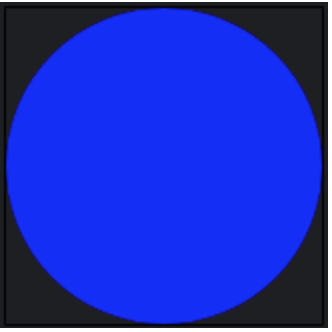

## Canvas란 무엇인가?

**Canvas(캔버스)** 는 개발자가 사용자 정의 그래픽, 애니메이션, 시각 효과를 만들 수 있도록 **그리기 표면(drawing surface)에 직접적인 접근을 제공**합니다. 표준 UI 컴포넌트와 달리, Canvas는 `DrawScope` 인터페이스 내에서 그리기 명령어를 사용하여 렌더링에 대한 세밀한 제어권을 부여합니다.

`Canvas`는 Jetpack Compose의 그리기 시스템 내에서 작동하며, `drawRect`, `drawCircle`, `drawPath`, `drawText`, `drawImage`와 같은 함수 사용을 가능하게 합니다. 이러한 함수들을 통해 개발자는 사용자 정의 모양, 이미지, 벡터 그래픽을 렌더링하고 색상, 크기, 선 스타일 및 변환을 효율적으로 제어할 수 있습니다.

-----

## 사용 예시

다음 예시는 `Canvas` 컴포저블 내부에 간단한 원을 그리는 방법을 보여줍니다.

```kotlin
@Composable
fun DrawCircleCanvas() {
    Canvas(modifier = Modifier.size(200.dp)) {
        drawCircle(
            color = Color.Blue,
            radius = size.minDimension / 2,
            center = center
        )
    }
}
```

이 예시에서:

  * `Canvas` 컴포저블에는 고정된 크기가 주어졌습니다.
  * `drawCircle`은 캔버스의 중앙에 파란색 원을 렌더링하는 데 사용됩니다.
  * `size.minDimension / 2`는 원이 캔버스 경계 내에 맞도록 보장합니다.

위 코드를 실행하면 아래와 같은 결과를 볼 수 있습니다.



-----

## 기본 변환 (Basic Transformations)

`Canvas` 컴포저블은 개발자가 동적이고 인터랙티브한 UI 요소를 만들 수 있도록 다양한 변환 및 그리기 함수를 제공합니다. 주요 작업은 다음과 같습니다.

  * **크기 조절 (scale):** 지정된 비율로 그리기 요소를 확대하거나 축소합니다.
  * **이동 (translate):** 그리기 영역 내에서 요소를 X축 및 Y축을 따라 이동시킵니다.
  * **회전 (rotate):** 기준점(pivot point)을 중심으로 요소를 회전시킵니다.
  * **인셋 (inset):** 패딩을 적용하여 그리기 경계를 조정합니다.
  * **다중 변환 (withTransform):** 더 나은 성능을 위해 여러 변환을 단일 작업으로 결합합니다.
  * **텍스트 그리기 (drawText):** 정밀한 위치 지정 및 사용자 정의로 텍스트를 수동으로 렌더링합니다.

> **참고:** 이러한 변환은 [컴포저블 생명주기의 **그리기 단계(draw phase)에만 적용**](https://developer.android.com/develop/ui/compose/phases)됩니다. 즉, 요소의 **레이아웃 크기나 위치 지정에는 영향을 주지 않습니다.** 결과적으로, 변환을 사용하여 크기나 위치를 수정해도 실제 레이아웃 경계는 변경되지 않으며, 요소들이 겹치거나 지정된 레이아웃 공간을 벗어날 수 있습니다.

-----

## 요약

`Canvas`는 화면에 사용자 정의 그래픽을 렌더링하는 매우 유연한 방법을 제공합니다. 모양, 텍스트, 이미지 그리기를 위한 메서드와 변환을 활용하여 개발자는 풍부한 시각적 및 맞춤형 경험을 만들 수 있습니다. 고급 그래픽 기능이 필요한 사용자 정의 뷰를 만드는 데 널리 사용됩니다.

더 깊은 이해를 원한다면 공식 문서인 [Compose의 그래픽](https://developer.android.com/develop/ui/compose/graphics/draw/overview#draw-image)을 참조하세요.

-----

## Q. `Canvas`를 사용하여 애니메이션이 적용된 사용자 정의 원형 프로그레스 바를 어떻게 구현하겠습니까?

`Canvas`를 사용하여 애니메이션이 적용된 사용자 정의 원형 프로그레스 바를 구현하려면, **`animateFloatAsState`** API를 사용하여 진행률(progress) 값을 부드럽게 애니메이션화하고, **`Canvas`** 컴포저블 내에서 이 애니메이션 값을 사용하여 **`drawArc`** 함수로 원호를 그립니다. 배경 원호와 진행 상태를 나타내는 원호를 겹쳐 그리는 방식으로 시각적 효과를 만듭니다.

-----

## 1. 구현 전략: 애니메이션과 `Canvas`의 결합

1.  **애니메이션 상태 관리:** `animateFloatAsState` 컴포저블을 사용하여 목표 진행률 값까지 부드럽게 전환되는 애니메이션 `State`를 만듭니다. 이 API는 타겟 값이 변경될 때마다 현재 값에서 새로운 값으로 애니메이션을 자동으로 처리해 줍니다.
2.  **`Canvas`를 이용한 그리기:** `Canvas` 컴포저블을 사용하여 그리기 영역을 만듭니다. `Canvas`의 `onDraw` 람다는 `DrawScope`를 제공하여 다양한 그리기 명령을 사용할 수 있게 합니다.
3.  **원호(Arc) 그리기:** `drawArc` 함수를 사용하여 두 개의 원호를 그립니다.
      * **배경 원호:** 프로그레스 바의 전체 트랙을 나타내는 옅은 색상의 완전한 원호(360도)를 그립니다.
      * **진행 원호:** 애니메이션화된 진행률 값에 따라 각도(`sweepAngle`)가 변하는 주 색상의 원호를 배경 위에 겹쳐 그립니다.
4.  **스타일링:** `style = Stroke(...)`를 사용하여 원의 내부를 채우지 않고 선 형태로 그리도록 설정하고, `strokeWidth`로 두께를, `strokeCap = StrokeCap.Round`로 선의 끝을 둥글게 처리하여 미려한 디자인을 만듭니다.

-----

## 2. 코드 구현 예시

아래는 위 전략을 바탕으로 구현한 전체 코드 예시입니다.

### 2.1. 1단계: 사용자 정의 컴포저블 생성

먼저, `AnimatedCircularProgressBar`라는 이름의 재사용 가능한 컴포저블을 만듭니다.

```kotlin
import androidx.compose.animation.core.animateFloatAsState
import androidx.compose.animation.core.tween
import androidx.compose.foundation.Canvas
import androidx.compose.foundation.layout.Box
import androidx.compose.foundation.layout.size
import androidx.compose.material3.Text
import androidx.compose.runtime.Composable
import androidx.compose.runtime.LaunchedEffect
import androidx.compose.runtime.getValue
import androidx.compose.runtime.mutableStateOf
import androidx.compose.runtime.remember
import androidx.compose.runtime.setValue
import androidx.compose.ui.Alignment
import androidx.compose.ui.Modifier
import androidx.compose.ui.graphics.Color
import androidx.compose.ui.graphics.StrokeCap
import androidx.compose.ui.graphics.drawscope.Stroke
import androidx.compose.ui.unit.Dp
import androidx.compose.ui.unit.dp
import androidx.compose.ui.unit.sp

@Composable
fun AnimatedCircularProgressBar(
    progress: Float, // 0.0f ~ 1.0f 사이의 진행률
    modifier: Modifier = Modifier,
    size: Dp = 100.dp,
    strokeWidth: Dp = 8.dp,
    backgroundColor: Color = Color.LightGray,
    progressColor: Color = Color.Blue,
    animationDuration: Int = 1000 // 애니메이션 지속 시간 (밀리초)
) {
    // 1. 목표 progress 값으로 부드럽게 애니메이션되는 값을 생성
    val animatedProgress by animateFloatAsState(
        targetValue = progress,
        animationSpec = tween(durationMillis = animationDuration),
        label = "progressAnimation"
    )

    // Box를 사용하여 프로그레스 바 중앙에 텍스트 등을 배치할 수 있음
    Box(
        modifier = modifier.size(size),
        contentAlignment = Alignment.Center
    ) {
        Canvas(modifier = Modifier.size(size)) {
            // 2. 배경 원호 그리기
            drawArc(
                color = backgroundColor,
                startAngle = -90f, // 12시 방향에서 시작
                sweepAngle = 360f,
                useCenter = false, // 호의 중심을 채우지 않음
                style = Stroke(width = strokeWidth.toPx(), cap = StrokeCap.Round)
            )

            // 3. 진행 상태 원호 그리기
            drawArc(
                color = progressColor,
                startAngle = -90f,
                sweepAngle = 360 * animatedProgress, // 애니메이션 값에 따라 각도 계산
                useCenter = false,
                style = Stroke(width = strokeWidth.toPx(), cap = StrokeCap.Round)
            )
        }

        // (선택 사항) 중앙에 진행률 텍스트 표시
        Text(
            text = "${(animatedProgress * 100).toInt()}%",
            fontSize = (size.value / 4).sp
        )
    }
}
```

### 2.2. 2단계: 컴포저블 사용하기

이제 위에서 만든 `AnimatedCircularProgressBar`를 화면에서 사용하고, 버튼 클릭 등으로 진행률을 동적으로 변경하여 애니메이션을 확인할 수 있습니다.

```kotlin
@Composable
fun ProgressBarExampleScreen() {
    var progress by remember { mutableStateOf(0.1f) }

    // 화면이 나타날 때 progress 값을 변경하여 애니메이션 시작 (예시)
    LaunchedEffect(Unit) {
        progress = 0.75f
    }

    Column(
        modifier = Modifier.fillMaxSize(),
        horizontalAlignment = Alignment.CenterHorizontally,
        verticalArrangement = Arrangement.Center
    ) {
        AnimatedCircularProgressBar(
            progress = progress,
            size = 200.dp,
            progressColor = Color.Magenta
        )

        Spacer(modifier = Modifier.height(32.dp))

        Button(onClick = {
            // 버튼 클릭 시 랜덤한 값으로 진행률 변경
            progress = (0..100).random() / 100f
        }) {
            Text("랜덤 진행률")
        }
    }
}
```

-----

## 3. 결론

`Canvas`를 사용하면 Jetpack Compose에서 제공하는 기본 컴포넌트를 넘어서는 완전히 사용자 정의된 시각적 요소를 만들 수 있습니다. **`animateFloatAsState`** 와 같은 Compose의 강력한 애니메이션 API와 `Canvas`의 **`drawArc`** 와 같은 그리기 함수를 결합하면, 위와 같이 부드럽고 동적인 애니메이션이 적용된 원형 프로그레스 바를 매우 간결하고 선언적인 방식으로 구현할 수 있습니다.