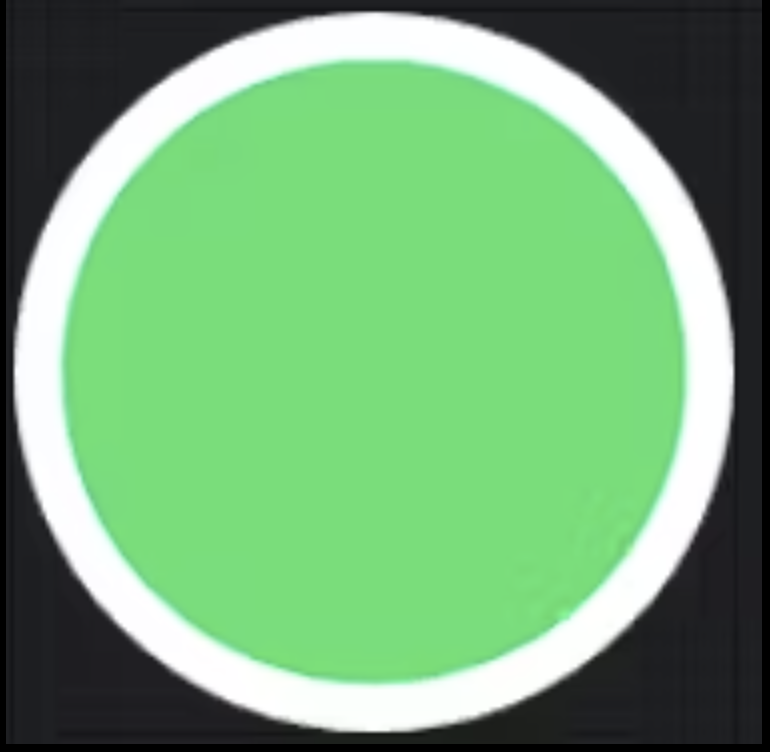

# Modifier란 무엇인가?

[**Modifier(모디파이어)**](https://developer.android.com/develop/ui/compose/modifiers) 는 Jetpack Compose의 초석(cornerstone)으로, 컴포저블을 **체이닝(chaining) 방식**으로 꾸미고, 동작을 추가하며, 수정할 수 있게 합니다. 이는 패딩, 크기, 정렬, 클릭 동작, 배경, 상호작용과 같은 변환을 UI 요소에 적용하는 유연한 방법을 제공합니다. Compose는 선언형 UI 패러다임을 따르므로, Modifier는 컴포저블의 핵심 로직을 수정하지 않고도 재사용 가능하고 유지보수하기 쉬운 UI 컴포넌트를 만드는 데 중요한 역할을 합니다.

Modifier는 여러 함수를 함께 연결하여 적용되며, 이는 여러 변환을 구성하는 구조적인 접근 방식을 가능하게 합니다. 체인의 각 함수는 이전에 적용된 수정을 보존하면서 새로운 Modifier 인스턴스를 반환합니다. 이는 **불변성(immutability)** 을 보장하고 Compose가 UI 업데이트를 처리하는 방식을 최적화하여 성능을 향상시킵니다.

일반적으로 Modifier는 레이아웃 계층 구조를 통해 원활하게 전파되어, 루트 컴포저블에서 정의된 속성이 UI 전체에 걸쳐 확장되고 유지될 수 있게 합니다. 이 접근 방식은 효율성을 향상시키면서 레이아웃 구성 및 스타일링의 일관성을 높입니다. 또한, Modifier는 상태가 없고(stateless) 표준 코틀린 객체로 구현되므로, 아래와 같이 함수 체이닝을 사용하여 쉽게 생성하고 구성할 수 있습니다.

```kotlin
@Composable
fun Greeting(name: String) {
    Column(
        modifier = Modifier
            .padding(24.dp) // Column 주위에 간격 추가
            .fillMaxWidth() // Column이 사용 가능한 최대 너비를 채우도록 함
    ) {
        Text(text = "Hello,")
        Text(text = name)
    }
}
```

이 예시에서:

  * `padding(24.dp)`는 `Column` 주위에 간격을 추가하여 화면 가장자리에 닿지 않도록 합니다.
  * `fillMaxWidth()`는 `Column`이 사용 가능한 최대 너비로 확장되도록 하여 레이아웃의 일관성을 보장합니다.

-----

## Modifier 순서의 중요성

Modifier를 사용하는 또 다른 중요한 측면은 **적용되는 순서**입니다. Modifier는 순차적으로 연결되므로, 각 함수는 이전 함수를 감싸고 그 위에 빌드되어, 컴포넌트의 최종 모양과 동작에 직접적인 영향을 미치는 복합 구조를 형성합니다.

이러한 레이어링 과정은 각 Modifier가 제어되고 예측 가능한 방식으로 효과를 발휘하도록 보장합니다. 이는 수정 사항이 위에서 아래로 단계별로 적용되어 UI의 최종 레이아웃 및 상호작용 속성에 영향을 미치는 트리 순회와 유사하게 작동합니다.

예를 들어, `padding`보다 먼저 `clickable`을 적용하면 패딩을 포함한 전체 영역이 클릭 가능하게 되지만, `padding`을 먼저 적용하면 클릭 가능한 영역이 내부 콘텐츠로만 제한됩니다.

**`clickable`을 먼저 적용한 경우:**

```kotlin
@Composable
fun ArtistCard(onClick: () -> Unit) {
    Column(
        modifier = Modifier
            .clickable(onClick = onClick) // clickable이 padding을 감쌈
            .padding(21.dp)
            .fillMaxWidth()
    ) {
        // ...
    }
}
```


이 버전에서는 패딩 영역도 클릭 가능합니다. 순서를 바꾸면 다음과 같습니다.

**`padding`을 먼저 적용한 경우:**

```kotlin
@Composable
fun ArtistCard(onClick: () -> Unit) {
    Column(
        modifier = Modifier
            .padding(21.dp) // padding이 먼저 적용됨
            .clickable(onClick = onClick) // clickable은 패딩이 적용된 후의 영역에만 적용됨
            .fillMaxWidth()
    ) {
        // ...
    }
}
```

이제 내부 콘텐츠만 클릭 가능하며, 패딩은 클릭에 반응하지 않습니다. 이는 Modifier 순서가 Compose에서 동작에 어떻게 영향을 미치는지 보여줍니다.


다음은 Modifier 함수 순서가 레이아웃에 어떻게 영향을 미치는지 보여주는 또 다른 예시입니다. 이 구현은 Modifier의 순서를 신중하게 구성하여 간단한 온라인 표시기를 보여줍니다.

```kotlin
@Composable
fun OnlineIndicator(modifier: Modifier = Modifier) {
    Box(
        modifier = modifier
            .size(60.dp) // 1. 인디케이터의 전체 크기를 설정
            .background(VideoTheme.colors.appBackground, CircleShape) // 2. 바깥쪽 배경 적용
            .padding(4.dp) // 3. 안쪽 콘텐츠 주위에 간격 추가
            .background(VideoTheme.colors.infoAccent, CircleShape), // 4. 안쪽 배경 적용
    )
}
```

컴포저블 함수를 정의하고 Android Studio에서 미리보기를 설정한 후, Modifier의 스타일링과 레이어링이 의도한 대로 작동하는지 결과를 시각적으로 확인할 수 있습니다.



-----

## 일반적으로 사용되는 Modifier

Jetpack Compose는 UI 레이아웃, 모양 및 상호작용을 조정하기 위한 여러 내장 Modifier를 제공합니다.

### 크기 지정 및 제약 조건

기본적으로 Compose 레이아웃은 자식을 감싸지만, `size`, `fillMaxSize`, `fillMaxWidth` 또는 `fillMaxHeight`를 사용하여 제약 조건을 지정할 수 있습니다.

```kotlin
@Composable
fun ArtistCard() {
    Row(
        modifier = Modifier.size(width = 400.dp, height = 100.dp)
    ) {
        Text(text = "skydoves")
    }
}
```

경우에 따라 부모의 규칙에 따라 제약 조건이 무시될 수 있습니다. 부모의 제약 조건에 관계없이 고정된 크기를 강제해야 하는 경우 `requiredSize()`를 사용합니다.

```kotlin
@Composable
fun ArtistCard() {
    Row(
        modifier = Modifier.size(400.dp, 100.dp)
    ) {
        Text(
            text = "skydoves",
            modifier = Modifier.requiredSize(150.dp)
        )
    }
}
```

여기서 부모 높이가 `100.dp`로 설정되어 있어도, 텍스트는 `requiredSize()`로 인해 여전히 `150.dp`가 됩니다.

> 💡 프로 팁: Compose에서 레이아웃은 부모가 제약 조건을 설정하고 자식이 이를 따를 것으로 예상하는 제약 조건 기반 시스템을 따릅니다. 그러나 `requiredSize`와 같은 Modifier는 이러한 제약 조건을 재정의할 수 있으며, 또는 사용자 정의 레이아웃을 사용할 수도 있습니다. 자식이 제약 조건을 무시하면, 시스템은 기본적으로 이를 중앙에 배치하지만, 이 동작은 `wrapContentSize`로 조정할 수 있습니다.

### 레이아웃 위치 지정

요소를 원래 위치에 상대적으로 이동시키려면 `offset()`을 사용합니다. `padding`과 달리, `offset`은 컴포넌트의 크기를 변경하지 않고 시각적으로만 이동시킵니다.

```kotlin
@Composable
fun ArtistCard() {
    Column {
        Text(text = "skydoves")
        Text(
            text = "Last seen online",
            modifier = Modifier.offset(x = 10.dp)
        )
    }
}
```

이는 두 번째 `Text` 컴포넌트를 오른쪽으로 `10.dp` 이동시킵니다.

### 스코프가 지정된 Modifier

일부 Modifier는 특정 컴포저블 스코프 내에서만 사용할 수 있습니다. 예를 들어, `matchParentSize()`는 `Box` 내부에서만 사용할 수 있으며, 자식 컴포넌트가 부모의 정확한 크기를 차지하도록 보장합니다.

```kotlin
@Composable
fun MatchParentSizeExample() {
    Box(modifier = Modifier.fillMaxWidth()) {
        Spacer(
            modifier = Modifier
                .matchParentSize()
                .background(Color.LightGray)
        )
        Text(text = "skydoves")
    }
}
```

여기서 `Spacer`는 부모 `Box`의 전체 크기를 채워 `Text`의 배경 역할을 합니다.

유사하게, `weight()` Modifier는 `Row`와 `Column` 내부에서만 사용할 수 있습니다. 이는 자식이 형제 요소에 상대적으로 유연한 양의 공간을 차지하도록 합니다.

```kotlin
@Composable
fun WeightedRow() {
    Row(modifier = Modifier.fillMaxWidth()) {
        Box(modifier = Modifier.weight(2f).background(Color.Red))
        Box(modifier = Modifier.weight(1f).background(Color.Blue))
    }
}
```

이 예시에서 첫 번째 빨간색 `Box`는 두 번째 파란색 `Box`의 두 배 공간을 차지합니다.


-----

## 요약: Modifier

`Modifier`는 개발자가 크기, 레이아웃 및 상호작용 동작을 적용하여 컴포저블을 사용자 정의할 수 있게 하는 Jetpack Compose의 필수적인 API입니다. Modifier가 적용되는 순서는 그 동작에 영향을 미치며, 스코프가 지정된 Modifier는 각각의 부모 컴포저블에 따라 신중하게 사용되어야 합니다. `Modifier`를 효율적으로 이해하고 적용하면 개발자는 유연하고, 성능이 좋으며, 재사용 가능한 UI 컴포넌트를 만들 수 있습니다.

-----

## 💡 프로 팁: Modifier 사용 규칙

`Modifier`는 Jetpack Compose의 초석으로, 컴포저블 함수를 쉽게 꾸미고 설정하는 데 중요한 역할을 합니다. 그러나 "Modifier 순서의 중요성" 섹션에서 논의한 바와 같이, 부적절하게 사용하면 예기치 않거나 다른 동작을 유발할 수 있습니다. 따라서 오용을 방지하고 Compose 프로젝트의 일관성을 보장하기 위해 `Modifier` 사용에 대한 명확한 규칙이나 가이드라인을 설정하는 것이 필수적입니다.

### 1. 가장 바깥쪽 레이아웃에 Modifier 적용하기

Modifier는 레이아웃 계층 내 임의의 수준이 아닌, **컴포넌트 내의 가장 상위 컴포저블에 적용**되어야 합니다. 잘못 적용하면 예기치 않은 동작을 유발하고 컴포넌트를 사용자에게 덜 직관적으로 만들 수 있습니다.

예를 들어, 둥근 모양을 갖도록 설계된 `RoundedButton` 컴포넌트를 생각해 보세요.

```kotlin
// 좋은 예시
@Composable
fun RoundedButton(
    modifier: Modifier = Modifier,
    onClick: () -> Unit
) {
    Button(
        modifier = modifier.clip(RoundedCornerShape(32.dp)), // modifier가 최상위 요소인 Button에 적용됨
        onClick = onClick
    ) {
        Text(
            modifier = Modifier.padding(10.dp),
            text = "Rounded"
        )
    }
}
```

여기서 `modifier`는 컴포넌트의 가장 바깥쪽 요소인 `Button`에 올바르게 적용되었습니다. 그러나 Modifier를 `Text`에 직접 적용하면 문제가 발생할 수 있습니다.

```kotlin
// 잘못된 예시
@Composable
fun RoundedButton(
    modifier: Modifier = Modifier,
    onClick: () -> Unit
) {
    Button(
        modifier = Modifier.clip(RoundedCornerShape(32.dp)),
        onClick = onClick
    ) {
        Text(
            modifier = modifier.padding(10.dp), // 잘못된 사용법: 외부에서 전달된 modifier가 Text에 적용됨
            text = "Rounded"
        )
    }
}
```

`RoundedButton`은 `Button`을 나타내므로, 주요 스타일링은 버튼 수준에서 적용되어야 합니다. 계층 내에서 Modifier를 일관성 없게 적용하면 사용자를 혼란스럽게 하고 의도치 않은 결과를 초래할 수 있습니다.

### 2. 단일 Modifier 파라미터 사용하기

컴포저블 내의 다른 요소들을 제어하기 위해 여러 Modifier 파라미터를 제공하는 것이 논리적으로 보일 수 있지만, 이 접근 방식은 불필요한 복잡성을 유발하고 명확성을 감소시킬 수 있습니다.

```kotlin
// 비권장 예시
@Composable
fun RoundedButton(
    modifier: Modifier = Modifier,
    textModifier: Modifier = Modifier, // 여러 modifier 파라미터
    onClick: () -> Unit
) {
    Button(
        modifier = modifier.clip(RoundedCornerShape(32.dp)),
        onClick = onClick
    ) {
        Text(
            modifier = textModifier.padding(10.dp),
            text = "Rounded"
        )
    }
}
```

여러 Modifier 파라미터를 사용하는 대신, **슬롯 기반(slot-based) 접근 방식**을 통해 유연성을 제공하는 것이 더 좋습니다. 이를 통해 사용자는 외부 사용자 정의를 위한 단일 Modifier를 유지하면서 내부 콘텐츠를 정의할 수 있습니다.

```kotlin
// 권장 예시
@Composable
fun RoundedButton(
    modifier: Modifier = Modifier,
    onClick: () -> Unit,
    content: @Composable RowScope.() -> Unit // content를 람다로 받음
) {
    Button(
        modifier = modifier.clip(RoundedCornerShape(32.dp)),
        onClick = onClick
    ) {
        content() // 전달받은 content를 렌더링
    }
}
```

이 접근 방식은 API를 더 깔끔하게 유지하고 Jetpack Compose의 유연성 및 예측 가능성 원칙과 일치합니다.

### 3. 여러 컴포넌트에 걸쳐 Modifier 파라미터 재사용 피하기

경우에 따라 [동일한 Modifier 체인을 여러 컴포저블에 걸쳐 재사용](https://developer.android.com/develop/ui/compose/modifiers#reusing-modifiers)하는 것이 변수로 추출하여 상위 스코프로 끌어올림(hoisting)으로써 유익할 수 있습니다. 그러나 흔한 실수는 **동일한 Modifier 파라미터 인스턴스**를 레이아웃 내 여러 컴포저블에 걸쳐 재사용하는 것입니다. 효율적으로 보일 수 있지만, 이는 의도치 않은 부작용과 예측 불가능한 동작으로 이어질 수 있습니다.

예를 들어, 다음 구현을 고려해 보세요.

```kotlin
// 잘못된 예시: 동일한 modifier 파라미터 인스턴스 재사용
@Composable
fun MyButtons(
    modifier: Modifier = Modifier,
    onClick: () -> Unit
) {
    Column(modifier = modifier) { // 1. Column에 modifier 적용
        Button(
            modifier = modifier, // 2. Button에 동일한 modifier 인스턴스 적용
            onClick = onClick
        ) {
            Text(
                modifier = modifier.padding(10.dp), // 3. Text에 동일한 modifier 인스턴스에 체이닝하여 적용
                text = "Rounded"
            )
        }
        
        Button(
            modifier = modifier, // 4. 다른 Button에도 동일한 modifier 인스턴스 적용
            onClick = onClick
        ) {
            // ...
        }
    }
}
```

언뜻 보기에는 괜찮아 보이지만, 호출 위치에서 `modifier`를 수정하면 예기치 않은 결과가 발생할 수 있습니다.

```kotlin
MyButtons(
    modifier = Modifier
        .clip(RoundedCornerShape(32.dp))
        .background(Color.Blue)
) {}
```

동일한 `modifier` 인스턴스가 모든 중첩된 컴포저블에 적용되고 있으므로, 최상위 수준의 변경 사항이 의도치 않은 방식으로 전체 계층에 영향을 미칩니다.

### 요약: 사용 규칙

Jetpack Compose에서 Modifier를 효과적으로 사용하면 컴포넌트가 예측 가능하고, 유지보수하기 쉬우며, 사용하기 쉽게 유지됩니다. 올바른 수준에서 적용하고, API를 단순하게 유지하며, 의도치 않은 동작을 방지하는 것이 깔끔하고 견고한 UI 컴포넌트를 구축하는 핵심이며, 잘 정의된 Modifier 가이드라인을 필수적으로 만듭니다. 이 주제에 대해 더 깊이 파고들고 싶다면 [Compose 컴포넌트 API 가이드라인](https://github.com/advocacies/androidx/blob/6bcf9447694395f39462f000cc77949d13e607c6/compose/docs/compose-component-api-guidelines.md#parameters-vs-modifier-on-the-component)과 트위터의 [Jetpack Compose 규칙](https://mrmans0n.github.io/compose-rules/rules/#modifiers)을 확인해 보세요.

-----

## 💡 프로 팁: 사용자 정의 Modifier는 어떻게 만드나요?

Modifier는 개발자가 스타일을 체이닝 가능한 방식으로 원활하게 적용할 수 있게 하여, 사용자 정의를 위한 강력한 도구입니다. 사용자 정의 Modifier를 만들면 여러 사용 사례에 걸쳐 재사용 가능한 스타일링을 가능하게 하여 코드 유지보수성과 일관성을 향상시킵니다. 사용자 정의 Modifier를 만드는 세 가지 주요 방법이 있습니다: **Modifier 팩토리 사용, `composed {}`, 그리고 `Modifier.Node`** 입니다.

### 1. 컴포저블 Modifier 팩토리

[**컴포저블 Modifier 팩토리**](https://developer.android.com/develop/ui/compose/custom-modifiers#create_a_custom_modifier_using_a_composable_modifier_factory)는 Compose API와 통합되는 사용자 정의 Modifier를 만들 수 있게 하여, 애니메이션 및 테마 설정과 같은 고수준 기능을 가능하게 합니다. 이 접근 방식은 컴포저블 함수를 활용하여 Modifier를 정의하며, 이것이 컴포지션 내에서 원활하게 작동하도록 보장합니다.

예를 들어, 다음 함수는 컴포넌트가 활성화되거나 비활성화될 때 페이드 효과를 만듭니다.

```kotlin
@Composable
fun Modifier.fade(enable: Boolean): Modifier {
    val alpha by animateFloatAsState(if (enable) 0.5f else 1.0f)
    return this.then(Modifier.graphicsLayer { this.alpha = alpha })
}
```

이 접근 방식은 Compose 상태 및 애니메이션과 직접 통합할 수 있어, 동적 UI 동작에 특히 유용합니다.

### 2. `composed {}`

`composed {}` 함수는 이전에 컴포지션에 의존하는 사용자 정의 Modifier를 만드는 데 권장되었지만, **성능 문제로 인해 현재는 사용이 권장되지 않습니다.** 단순한 Modifier 팩토리와 달리, `composed {}`는 컴포지션 내에서 초기화되고 업데이트되어 추가적인 리컴포지션과 오버헤드를 유발합니다.

`composed {}`의 예는 다음과 같습니다.

```kotlin
// 비권장 방식
fun Modifier.customPadding(value: Dp) = composed {
    padding(value)
}
```

비록 이 접근 방식이 컴포지션 내에서 동적 변경을 허용하지만, 상태를 갖는(stateful) Modifier에 대해 더 효율적인 대안을 제공하는 `Modifier.Node`를 선호하여 피해야 합니다.

### 3. `Modifier.Node` (권장)

[**`Modifier.Node`**](https://developer.android.com/develop/ui/compose/custom-modifiers#implement-custom) 는 효율성과 생명주기 관리 능력으로 인해 사용자 정의 Modifier를 구현하는 **권장 방법**입니다. 이를 통해 개발자는 성능을 유지하면서 레이아웃, 그리기 및 상호작용에 대한 저수준 제어를 가진 Modifier를 정의할 수 있습니다.

`Modifier.Node` 구현은 세 가지 구성 요소로 이루어집니다.

1.  **`Modifier.Node`**: Modifier의 동작을 정의합니다.
2.  **`ModifierNodeElement`**: 노드를 생성하거나 업데이트하는 상태 없는(stateless) 팩토리를 제공합니다.
3.  **Modifier 팩토리**: UI에서 사용될 Modifier를 노출하는 확장 함수입니다.

아래는 `Modifier.Node`를 사용하여 원을 그리는 Modifier를 만드는 예시입니다.

```kotlin
// 1. Modifier 팩토리
fun Modifier.circle(color: Color) = this.then(CircleElement(color))

// 2. ModifierNodeElement
private data class CircleElement(val color: Color) : ModifierNodeElement<CircleNode>() {
    override fun create(): CircleNode = CircleNode(color)

    override fun update(node: CircleNode) {
        node.color = color
    }
}

// 3. Modifier.Node
private class CircleNode(var color: Color) : DrawModifierNode, Modifier.Node() {
    override fun ContentDrawScope.draw() {
        // 원을 그림
        drawCircle(color)
    }
}

// 사용 예시
// 사용자 정의 `circle` Modifier를 사용하여 원 그리기
Box(modifier = Modifier.size(150.dp).circle(Color.Blue))
```

이 접근 방식은 `composed {}`를 사용하는 것보다 훨씬 효율적입니다. `Modifier.Node`는 리컴포지션 간에 유지되며 더 나은 생명주기 인식을 제공하기 때문입니다.

### 요약: 사용자 정의 Modifier

사용자 정의 Modifier를 만들면 미리 정의된 스타일과 동작의 재사용성이 증가합니다. **컴포저블 Modifier 팩토리**는 Compose 상태와 통합하는 쉬운 방법을 제공하는 반면, **`Modifier.Node`** 는 복잡한 동작에 최적의 성능을 제공합니다. 이전에 권장되었던 `composed {}` 접근 방식은 비효율성으로 인해 피해야 합니다. `Modifier.Node`를 활용함으로써, 개발자는 부드러운 성능을 유지하면서 고효율, 재사용 가능, 구성 가능한 UI 요소를 만들 수 있습니다.

-----

## Q. 왜 Modifier의 순서가 중요한가요? 순서를 바꿀 때 다른 동작이 발생하는 예시를 제시해줄 수 있나요?

Modifier의 순서가 중요한 이유는 각 Modifier가 **순차적으로 적용되는 래퍼(wrapper)처럼 작동**하기 때문입니다. 체인에서 먼저 선언된 Modifier가 나중에 선언된 Modifier를 감싸는 구조이므로, 적용 순서에 따라 뷰의 크기, 패딩, 클릭 가능 영역 등이 완전히 달라집니다.

예를 들어, `padding`을 먼저 적용하고 `clickable`을 적용하면 패딩을 제외한 안쪽 영역만 클릭 가능해지지만, 순서를 바꾸면 패딩 영역까지 포함하여 클릭할 수 있게 됩니다.

-----

## 1. Modifier의 작동 원리: 순차적인 래핑(Wrapping) 구조

`Modifier`는 단순히 속성들의 집합이 아니라, **순서가 있는 명령어들의 체인(chain)** 입니다. 코드를 작성한 순서대로 각 Modifier가 이전 단계의 결과물을 감싸고(wrapping) 새로운 속성을 부여하는 방식으로 작동합니다.

`Modifier.A().B()` 와 같은 코드는 다음과 같이 생각할 수 있습니다.

1.  가장 안쪽에 컴포저블(예: `Box`)이 있습니다.
2.  `B` Modifier가 먼저 컴포저블을 감싸서 수정합니다. (`Box`를 수정한 `B`가 됨)
3.  `A` Modifier가 그 결과물을 다시 감싸서 수정합니다. (`Box`를 수정한 `B`를 다시 수정한 `A`가 됨)

이러한 "감싸기" 원칙 때문에, Modifier를 어떤 순서로 연결하는지에 따라 레이아웃의 크기, 그리기, 그리고 사용자 입력 처리 방식이 모두 달라집니다.

-----

## 2. 순서에 따라 동작이 달라지는 예시

Modifier 순서의 중요성을 가장 명확하게 보여주는 예시는 **`padding`** 과 **`clickable`** 또는 **`background`** 의 조합입니다.

### 예시 1: `padding`과 `clickable`의 순서

#### `padding`을 먼저 적용한 경우 (클릭 영역이 작아짐)

```kotlin
Box(
    modifier = Modifier
        .padding(32.dp) // 1. 먼저 Box 안쪽으로 32dp의 여백(패딩)을 만듭니다.
        .clickable { Log.d("Compose", "Box Clicked!") } // 2. 패딩이 적용된 후의 '안쪽 영역'에만 클릭 이벤트를 적용합니다.
        .background(Color.LightGray) // 클릭 가능한 영역을 시각적으로 보여주기 위한 배경색
        .size(200.dp)
)
```

  * **결과:** 회색으로 칠해진 안쪽 영역만 클릭에 반응합니다. 바깥쪽 투명한 패딩 영역은 클릭되지 않습니다.

#### `clickable`을 먼저 적용한 경우 (클릭 영역이 넓어짐)

```kotlin
Box(
    modifier = Modifier
        .clickable { Log.d("Compose", "Box Clicked!") } // 1. 먼저 Box의 전체 200dp 영역에 클릭 이벤트를 적용합니다.
        .padding(32.dp) // 2. 클릭 가능한 영역 '안쪽'으로 32dp의 여백을 만듭니다.
        .background(Color.LightGray) // 패딩 안쪽의 영역만 시각적으로 보여주기 위한 배경색
        .size(200.dp)
)
```

  * **결과:** 회색 영역뿐만 아니라 그 주변의 투명한 패딩 영역까지 **모두 클릭에 반응**합니다. `clickable`이 `padding`보다 바깥쪽 레이어에 적용되었기 때문입니다.

### 예시 2: `padding`과 `background`의 순서

#### `padding`을 먼저 적용한 경우

```kotlin
Box(
    modifier = Modifier
        .padding(16.dp) // 1. 패딩으로 안쪽으로 공간을 축소
        .background(Color.Blue) // 2. 축소된 안쪽 공간에 배경색 적용
        .size(150.dp)
)
```

  * **결과:** 150dp 크기의 `Box`가 있고, 그 안쪽에 16dp의 투명한 패딩 영역이 있으며, 가장 안쪽 영역만 파란색으로 칠해집니다.

#### `background`를 먼저 적용한 경우

```kotlin
Box(
    modifier = Modifier
        .background(Color.Blue) // 1. 150dp 전체 영역에 배경색 적용
        .padding(16.dp) // 2. 배경이 칠해진 후 안쪽으로 패딩 적용
        .size(150.dp)
)
```

  * **결과:** 150dp 크기의 `Box` 전체가 파란색으로 칠해집니다. 만약 이 `Box` 내부에 다른 자식 컴포저블이 있다면, 그 자식은 파란색 배경의 가장자리로부터 16dp 안쪽에 위치하게 됩니다.

-----

## 3. 결론

**Modifier의 순서는 매우 중요하며, UI의 최종 결과에 결정적인 영향을 미칩니다.** 각 Modifier는 독립적인 속성들의 모음이 아니라, 순차적으로 적용되는 **계층적인 명령어**입니다. 따라서 원하는 UI 모양과 동작을 정확하게 구현하려면, 각 Modifier가 어떤 순서로 서로를 감싸고 영향을 미치는지 이해하고 신중하게 순서를 결정해야 합니다. 이는 "안쪽부터 바깥쪽으로" 또는 "바깥쪽부터 안쪽으로" 수정 사항이 적용되는 과정을 상상하면 더 쉽게 이해할 수 있습니다.