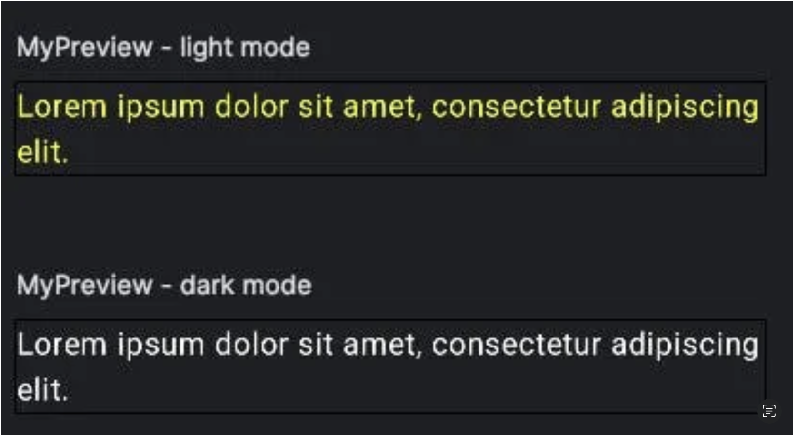
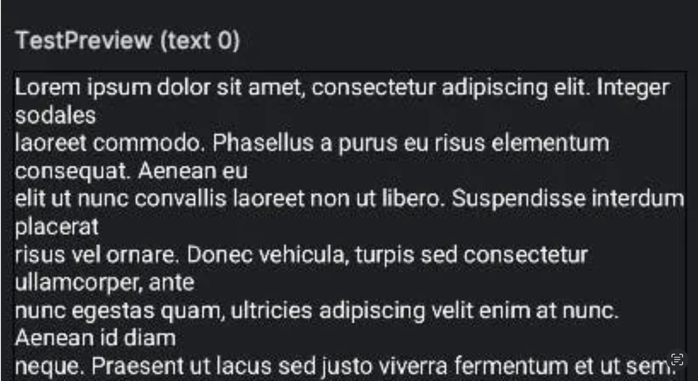
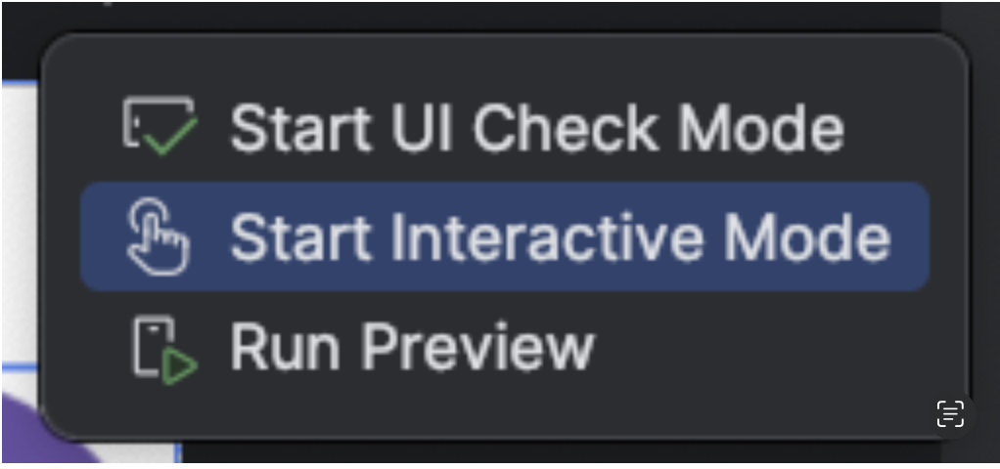
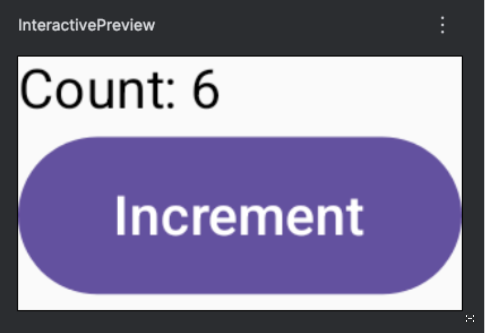
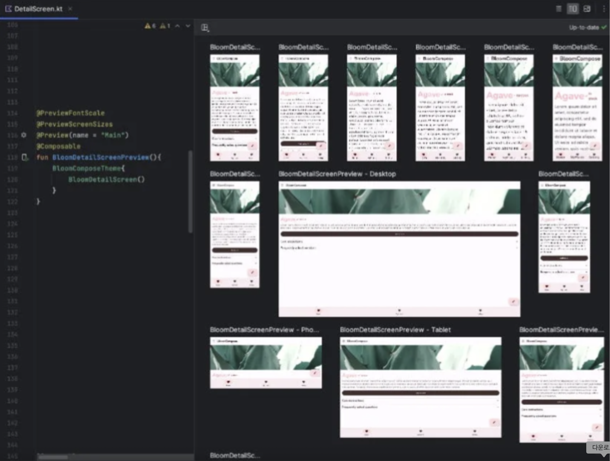

# 프리뷰(Preview)는 어떻게 작동하며 어떻게 처리하나요?

Jetpack Compose의 주요 장점 중 하나는 Android Studio의 [**프리뷰(Previews)**](https://developer.android.com/develop/ui/compose/tooling/previews) 기능입니다. 이 기능은 개발자가 전체 프로젝트를 컴파일하지 않고도 UI 컴포넌트를 점진적으로 빌드하고 시각화할 수 있게 합니다. 컴포저블 함수를 프리뷰 창에 직접 렌더링함으로써, Compose 프리뷰는 개발 워크플로우를 간소화하고, UI 변경 사항을 확인하는 데 필요한 시간을 줄이며, 생산성을 향상시킵니다.

[Compose UI 툴링 프리뷰 라이브러리](https://developer.android.com/develop/ui/compose/tooling)는 Android Studio에서의 프리뷰 경험을 향상시키는 여러 어노테이션을 제공하여, 컴포저블을 더 쉽게 시각화하고 테스트할 수 있게 합니다. 이 섹션에서는 이러한 어노테이션들과 그것들이 어떻게 개발 프로세스를 간소화하여 Compose 프리뷰 작업 시 효율성을 향상시키는지 탐색합니다.

-----

## `@Preview`를 사용하여 컴포저블 렌더링하기

`@Preview` 어노테이션은 Jetpack Compose 프리뷰 시스템의 근본적인 부분입니다. 이는 모든 컴포저블 함수에 적용될 수 있으며 여러 인스턴스를 지원하여, 아래 예시와 같이 동일한 함수에 여러 `@Preview` 어노테이션을 붙여 다양한 설정이나 기기에서 시각화할 수 있습니다.

```kotlin
@Preview(name = "light mode")
@Preview(name = "dark mode", uiMode = Configuration.UI_MODE_NIGHT_YES)
@Composable
private fun MyPreview() {
    MaterialTheme {
        Text(
            text = "Lorem ipsum dolor sit amet, consectetur adipiscing elit.",
            color = if (isSystemInDarkTheme()) {
                Color.White
            } else {
                Color.Yellow
            }
        )
    }
}
```

  * `@Preview` 어노테이션은 Android Studio에게 `MyPreview` 컴포저블을 프리뷰 창에 렌더링하도록 지시합니다.
  * 여러 프리뷰를 생성하여 다양한 UI 상태를 시각화할 수 있습니다.

Android Studio에서 아래와 같은 결과를 보게 될 것입니다.



-----

## 프리뷰 사용자 정의하기

Jetpack Compose는 다양한 파라미터를 사용하여 `@Preview`를 사용자 정의할 수 있게 합니다.

```kotlin
@Preview(
    name = "Dark Mode Preview",
    showBackground = true,
    backgroundColor = 0xFF000000, // ARGB 형식의 Long 값
    uiMode = Configuration.UI_MODE_NIGHT_YES,
    device = Devices.PIXEL_4_XL,
)
@Composable
fun DarkModePreview() {
    Greeting(name = "skydoves")
}
```

  * **`name`**: 더 나은 구성을 위해 프리뷰에 이름을 할당합니다.
  * **`showBackground`**: 컴포저블 뒤에 배경을 표시합니다.
  * **`backgroundColor`**: 사용자 정의 배경색을 정의합니다.
  * **`uiMode`**: 다크 모드와 같은 다른 시스템 모드를 시뮬레이션합니다.
  * **`device = Devices.PIXEL_4_XL`**: Pixel 4 XL 화면을 시뮬레이션합니다.

-----

## `@PreviewParameter`를 사용한 다중 프리뷰

`@PreviewParameter` 어노테이션은 **`PreviewParameterProvider`** 를 활용하여 컴포저블 함수에 프리뷰 인스턴스를 주입할 수 있게 합니다. [`PreviewParameterProvider`](https://developer.android.com/reference/kotlin/androidx/compose/ui/tooling/preview/PreviewParameterProvider) 인터페이스를 구현하는 사용자 정의 클래스를 정의하고 이를 사용하여 컴포저블에 다른 데이터 세트를 공급할 수 있습니다. 이 접근 방식은 아래 예시와 같이 다양한 입력을 가진 동적 프리뷰를 가능하게 합니다.

```kotlin
public data class User(
    val name: String,
)

public class UserPreviewParameterProvider: PreviewParameterProvider<User> {
    override val values: Sequence<User>
        get() = sequenceOf(
            User("user1"),
            User("user2"),
        )
}

@Preview(name = "UserPreview")
@Composable
private fun UserPreview(
    @PreviewParameter(provider = UserPreviewParameterProvider::class) user: User) {
    Text(text = user.name, color = Color.White)
}
```

이는 제공된 값들을 기반으로 여러 프리뷰 변형을 생성합니다. 또 다른 팁으로, Jetpack Compose UI 툴링 라이브러리에는 아래 프리뷰 이미지와 같이 미리 정의된 샘플 텍스트 문자열을 제공하는 [**`LoremIpsum`**](https://cs.android.com/androidx/platform/frameworks/support/+/androidx-main:compose/ui/ui-tooling-preview/src/androidMain/kotlin/androidx/compose/ui/tooling/preview/datasource/LoremIpsum.android.kt;l=49?q=LoremIpsum%20compose) 이라는 `PreviewParameterProvider`가 포함되어 있습니다.



아래 코드에서 본 것처럼 일반 `PreviewParameterProvider`처럼 이 클래스를 사용할 수 있습니다.

```kotlin
@Preview
@Composable
private fun TestPreview(@PreviewParameter(provider = LoremIpsum::class) text: String) {
    Text(text = text, color = Color.White)
}
```

-----

## 프리뷰의 대화형 모드 (Interactive Mode)

Android Studio는 사용자가 앱을 실행하지 않고도 컴포저블과 상호작용할 수 있는 **대화형 프리뷰**를 지원합니다.

```kotlin
@Preview
@Composable
@Preview(showBackground = true)
fun InteractivePreview() {
    var count by remember { mutableStateOf(0) }

    Column {
        Text("Count: $count")
        Button(onClick = { count++ }) {
            Text("Increment")
        }
    }
}
```

클릭 가능한 요소, 애니메이션, 상태 업데이트를 프리뷰 창에서 직접 테스트할 수 있습니다. 아래 그림과 같이 프리뷰 창에서 대화형 모드를 활성화할 수 있습니다.



이제 아래 스크린샷과 같이 프리뷰 창에서 컴포저블 함수와 직접 상호작용할 수 있습니다.



-----

## 다중 프리뷰 어노테이션 (MultiPreview Annotations)

앞서 언급했듯이, `@Preview` 어노테이션은 **반복 가능(repeatable)** 하여 동일한 컴포저블 함수에 여러 어노테이션을 적용할 수 있습니다. Jetpack Compose는 또한 **`@PreviewLightDark`**, **`@PreviewFontScale`**, **`@PreviewDynamicColors`**, **`@PreviewScreenSizes`** 와 같이 다양한 UI 조건을 효율적으로 테스트하는 데 도움이 되는 여러 내장 다중 프리뷰 어노테이션을 제공합니다.

예를 들어, 아래 코드와 같이 여러 프리뷰 어노테이션을 적용하여 라이트 모드와 다크 모드를 모두 렌더링할 수 있습니다.

```kotlin
@Preview(name = "light mode")
@Preview(name = "dark mode", uiMode = Configuration.UI_MODE_NIGHT_YES)
@Composable
private fun MyPreview() {
    // ..
}
```

이를 `@PreviewLightDark` 어노테이션으로 간단히 대체할 수 있습니다.

```kotlin
@PreviewLightDark
@Composable
private fun MyPreview() {
    // ..
}
```

아래 스크린샷에서 볼 수 있듯이, `@PreviewScreenSizes` 및 `@PreviewFontScale`과 같은 미리 정의된 프리뷰 어노테이션을 결합하여, Android Studio 내에서 여러 변형으로 컴포저블을 쉽게 시각화할 수 있습니다. 이 접근 방식은 수동으로 설정을 전환하지 않고도 다양한 화면 크기 및 글꼴 크기에 걸쳐 효율적인 테스트를 가능하게 합니다.



-----

## 요약

Jetpack Compose의 `@Preview`는 Android Studio 내에서 실시간 렌더링, 사용자 정의, 대화형 모드를 허용하여 UI 개발을 단순화합니다. 이는 테마, 기기 설정, 다크 모드 프리뷰 및 파라미터화된 입력을 지원하여, 전체 프로젝트를 컴파일하지 않고도 생산성을 향상시킵니다.

-----

## Q. `@Preview` 어노테이션은 개발 워크플로우를 어떻게 향상시키며, 이를 통해 사용해 본 주요 설정(다크 테마, 화면 크기, 다중 프리뷰 어노테이션 등)에는 어떤 것들이 있나요?

`@Preview` 어노테이션은 앱 전체를 빌드하고 실행할 필요 없이 **UI 변경 사항을 즉시 시각적으로 확인**할 수 있게 하여 개발 워크플로우를 획기적으로 개선합니다. 이는 빠른 반복(iteration)을 통한 개발 속도 향상으로 이어집니다. 제가 주로 사용하는 주요 설정으로는 **다크/라이트 테마**(`uiMode`) 테스트, **다양한 화면 크기**(`device`) 시뮬레이션, 그리고 여러 조건을 한 번에 보기 위한 **다중 프리뷰 어노테이션**(`@PreviewFontScale` 등)이 있습니다.

-----

### 1. `@Preview`가 개발 워크플로우를 향상시키는 방식

`@Preview`는 Jetpack Compose 개발 경험의 핵심적인 부분으로, 다음과 같은 방식으로 워크플로우를 크게 향상시킵니다.

#### 빠른 반복(Rapid Iteration) 및 즉각적인 피드백 🔄

전통적인 XML 방식에서는 UI를 약간만 수정해도 전체 앱을 다시 컴파일하고 기기나 에뮬레이터에 설치한 후, 해당 화면까지 이동해야 변경 사항을 확인할 수 있었습니다. 이 과정은 수십 초에서 수 분이 걸릴 수 있습니다.

반면, `@Preview`를 사용하면 코드 변경 사항이 Android Studio의 프리뷰 창에 **거의 실시간으로 반영**됩니다. 이를 통해 개발자는 UI를 만들고 수정하는 과정에서 즉각적인 시각적 피드백을 받으며 작업할 수 있어, 개발 주기가 극적으로 단축됩니다.

#### UI와 로직의 분리된 개발 🧩

`@Preview`를 사용하면 전체 애플리케이션의 비즈니스 로직이나 데이터 흐름이 완성되지 않았더라도 UI 컴포넌트를 독립적으로 개발하고 시각화할 수 있습니다. `@PreviewParameter`를 활용하여 가짜(mock) 데이터를 컴포저블에 주입함으로써, 개발자는 UI의 모양과 느낌에만 집중하여 작업할 수 있습니다.

#### 다양한 조건 동시 테스트 📱

하나의 컴포저블에 여러 `@Preview` 어노테이션을 붙이거나 다중 프리뷰 어노테이션을 사용하여, **다양한 기기, 화면 크기, 글꼴 크기, 다크/라이트 테마** 등 여러 조건을 **한 화면에서 동시에 확인**할 수 있습니다. 이는 기기 설정을 수동으로 변경하고 앱을 반복적으로 실행해야 했던 번거로움을 없애고, 다양한 환경에서의 UI 견고성을 쉽게 검증할 수 있게 합니다.

#### 대화형(Interactive) 테스트 👆

`@Preview`의 대화형 모드(Interactive Mode)를 사용하면, 앱을 실제로 실행하지 않고도 프리뷰 창 내에서 버튼 클릭, 상태 변경, 간단한 애니메이션과 같은 **사용자 상호작용을 직접 테스트**해 볼 수 있습니다. 이는 간단한 동작을 확인하기 위해 앱을 빌드하는 시간을 더욱 절약해 줍니다.

-----

### 2. 주로 사용하는 주요 `@Preview` 설정

다음은 제가 UI 컴포넌트의 완성도와 견고성을 높이기 위해 `@Preview`와 함께 자주 사용하는 주요 설정들입니다.

#### 다크/라이트 테마 테스트 (`uiMode`)

현대 앱에서 다크 모드 지원은 필수적입니다. `uiMode` 파라미터를 사용하거나 **`@PreviewLightDark`** 와 같은 다중 프리뷰 어노테이션을 사용하여 두 가지 테마에서 컴포저블이 어떻게 보이는지 동시에 확인하고 디자인 일관성을 유지합니다.

```kotlin
@Preview(name = "Light Mode")
@Preview(name = "Dark Mode", uiMode = Configuration.UI_MODE_NIGHT_YES)
// 또는 간단하게 @PreviewLightDark
@Composable
fun MyThemedComponentPreview() { /* ... */ }
```

#### 다양한 화면 크기 및 기기 테스트 (`device`, `widthDp`, `heightDp`)

반응형 UI를 구축하기 위해 다양한 폼 팩터(form factor)에서의 UI 동작을 확인하는 것은 매우 중요합니다. `device` 파라미터를 사용하여 특정 기기(예: `Devices.PIXEL_TABLET`, `Devices.FOLDABLE`)를 시뮬레이션하거나, `widthDp` 및 `heightDp`를 직접 설정하여 다양한 화면 크기를 테스트합니다. **`@PreviewScreenSizes`** 다중 프리뷰 어노테이션은 이를 더욱 편리하게 만들어 줍니다.

```kotlin
@PreviewScreenSizes
@Composable
fun MyResponsiveComponentPreview() { /* ... */ }
```

#### 글꼴 크기 접근성 테스트 (`fontScale`)

접근성은 매우 중요한 요소입니다. `fontScale` 파라미터를 사용하여 사용자가 시스템 글꼴 크기를 변경했을 때 텍스트가 레이아웃을 깨뜨리지 않고 올바르게 표시되는지 확인합니다. **`@PreviewFontScale`** 다중 프리뷰 어노테이션을 사용하면 여러 글꼴 배율을 한 번에 볼 수 있습니다.

```kotlin
@Preview(fontScale = 0.85f)
@Preview(fontScale = 1.15f)
// 또는 간단하게 @PreviewFontScale
@Composable
fun MyTextComponentPreview() { /* ... */ }
```

#### 동적 데이터 미리보기 (`@PreviewParameter`)

컴포저블이 다양한 입력 데이터에 따라 어떻게 보이는지 테스트하는 데 사용합니다. 예를 들어, 매우 긴 사용자 이름과 짧은 사용자 이름을 모두 테스트하거나, 프로필 이미지가 있는 경우와 없는 경우를 모두 시뮬레이션할 수 있습니다. 내장된 **`LoremIpsum`** 프로바이더는 긴 텍스트를 테스트할 때 특히 유용합니다.

-----

### 3. 결론

`@Preview`는 Jetpack Compose 개발의 패러다임을 바꾼 혁신적인 기능입니다. 느리고 반복적인 "실행 후 확인" 과정을 빠르고 즉각적인 **"디자인하면서 확인"** 워크플로우로 전환하여, 개발 생산성을 극대화하고 더 견고하며 적응성 높은 UI를 만드는 데 결정적인 역할을 합니다.