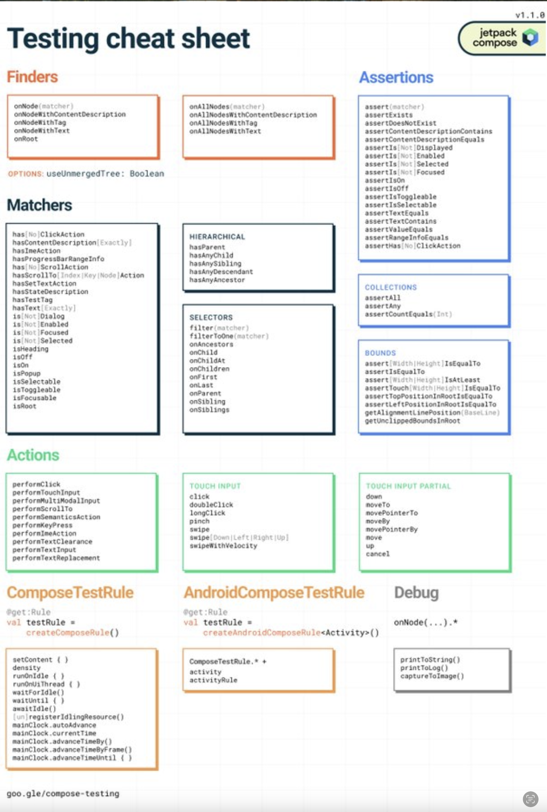

# Compose UI 컴포넌트 또는 화면에 대한 유닛 테스트는 어떻게 작성하나요?

Jetpack Compose UI 컴포넌트를 테스트하는 것은 UI의 정확성, 안정성, 그리고 사용성을 확인하게 해줍니다. Compose는 개발자가 UI 테스트를 효율적으로 작성할 수 있도록 [전용 테스트 라이브러리](https://developer.android.com/develop/ui/compose/testing)를 제공합니다. 이러한 라이브러리들은 Jetpack의 `ComposeTestRule`을 기반으로 구축되며, UI 상호작용, 동기화, 그리고 단언(assertion)을 위한 API를 제공합니다.

-----

## Compose UI 테스트 설정하기

Compose 테스트는 `AndroidJUnit4`를 사용하여 작성되며 테스트 환경 역할을 하는 `ComposeTestRule`이 필요합니다. 이는 UI와의 상호작용을 가능하게 하고 테스트 액션과 리컴포지션 간의 동기화를 보장합니다.

```kotlin
@get:Rule
val composeTestRule = createComposeRule()

@Test
fun verifyTextDisplayed() {
    composeTestRule.setContent {
        Text("Hello, skydoves!")
    }

    composeTestRule
        .onNodeWithText("Hello, skydoves!")
        .assertExists()
}
```

이 예시에서, `setContent`는 테스트를 위한 UI를 초기화하고, `onNodeWithText`는 일치하는 텍스트를 가진 컴포저블을 찾아 그 존재를 검증합니다.

-----

## UI 상호작용 테스트하기

Compose는 버튼 클릭, 텍스트 입력, 리스트 스크롤과 같은 사용자 상호작용을 시뮬레이션하는 API를 제공합니다.

```kotlin
@Test
fun clickButtonUpdatesText() {
    composeTestRule.setContent {
        var text by remember { mutableStateOf("Hello, skydoves!") }
        Column {
            Text(text)
            Button(onClick = { text = "Hello, Kotlin!" }) {
                Text("Click me")
            }
        }
    }

    composeTestRule.onNodeWithText("Click me").performClick()
    composeTestRule.onNodeWithText("Hello, Kotlin!").assertExists()
}
```

여기서 `performClick()`은 버튼 클릭을 시뮬레이션하여 텍스트를 업데이트하고, 이는 `assertExists()`로 검증됩니다.

-----

## 동기화 및 아이들링 리소스

Jetpack Compose UI 테스트는 단일 스레드에서 실행되므로, Compose는 아이들링 리소스(Idling Resources)를 통해 테스트 동기화를 보장합니다. 그러나 코루틴이나 애니메이션을 테스트할 때는 명시적인 동기화가 필요할 수 있습니다.

```kotlin
@Test
fun testLoadingState() {
    composeTestRule.setContent {
        var isLoading by remember { mutableStateOf(true) }
        LaunchedEffect(Unit) {
            delay(2000)
            isLoading = false
        }

        if (isLoading) {
            CircularProgressIndicator()
        } else {
            Text("Loaded")
        }
    }

    // "Loaded" 텍스트를 가진 노드가 정확히 하나 존재할 때까지 최대 3초간 기다림
    composeTestRule.waitUntilExactlyOneExists(hasText("Loaded"), 3000)
}
```

여기서 `waitUntil()`은 텍스트 업데이트를 검증하기 전에 로딩 상태가 완료되기를 기다립니다. 아래의 `waitUntil` 헬퍼 중 어떤 것이든 사용할 수 있습니다.

```kotlin
composeTestRule.waitUntilAtLeastOneExists(matcher, timeoutMs)

composeTestRule.waitUntilDoesNotExist(matcher, timeoutMs)

composeTestRule.waitUntilExactlyOneExists(matcher, timeoutMs)

composeTestRule.waitUntilNodeCount(matcher, count, timeoutMs)
```

Compose에서 유닛 테스트를 작성하고 특정 조건이 충족되기를 기다리는 것에 대해 더 배우고 싶다면, [Alternatives to Idling Resources in Compose tests: The waitUntil APIs](https://medium.com/androiddevelopers/alternatives-to-idling-resources-in-compose-tests-8ae71f9fc473)(영문)를 확인해 보세요.

-----

## 레이지 리스트(Lazy List) 테스트하기

`LazyColumn`과 같은 스크롤 가능한 콘텐츠의 경우, `assertIsDisplayed()`는 요소가 뷰포트(viewport) 내에 있는지 확인하고, `performScrollToNode()`는 화면 밖 요소를 테스트하는 데 도움이 됩니다.

```kotlin
@Test
fun scrollToItem() {
    val list = List(100) { "item$it" }

    composeTestRule.setContent {
        LazyColumn(modifier = Modifier.testTag("lazyColumn")) {
            items(items = list) { value ->
                Text(value, Modifier.testTag(value))
            }
        }
    }

    composeTestRule.onNodeWithTag("item50").assertDoesNotExist() // 처음에는 존재하지 않음
    composeTestRule.onNodeWithTag("lazyColumn").performScrollToNode(hasText("item50")) // item50으로 스크롤
    composeTestRule.onNodeWithTag("item50").assertIsDisplayed() // 이제 화면에 표시됨
}
```

이 테스트는 스크롤을 통해 초기에 숨겨져 있던 리스트 아이템이 나타나는 것을 보장합니다.

-----

## UI 시맨틱 및 접근성 검증하기

Compose의 테스트 프레임워크는 시맨틱 속성을 지원하여, 콘텐츠 설명과 같은 접근성 속성을 검증할 수 있게 합니다.

```kotlin
@Test
fun testContentDescription() {
    composeTestRule.setContent {
        Icon(imageVector = Icons.Default.Home, contentDescription = "Home Icon")
    }

    composeTestRule.onNodeWithContentDescription("Home Icon").assertExists()
}
```

`onNodeWithContentDescription`을 사용하여, 테스트는 접근성 레이블이 올바르게 할당되었는지 확인합니다.

Jetpack Compose를 위한 UI 테스트 작성은 노드 조회, UI 상호작용, 리소스 아이들링 등을 위한 효율적인 라이브러리 덕분에 전통적인 XML 기반 테스트보다 훨씬 쉽습니다. 포괄적인 개요를 원한다면, 아래에 유용한 시각적 가이드도 포함된 [Jetpack Compose 테스트 치트 시트](https://developer.android.com/develop/ui/compose/testing/testing-cheatsheet)를 확인해 보세요.




-----

## 요약

Compose UI를 테스트하는 것은 정확성, 안정성, 그리고 접근성을 보장합니다. 주요 기법으로는 UI 상호작용을 위한 `ComposeTestRule` 사용, 동기화 메커니즘 활용, 레이지 리스트 검증, 그리고 접근성 시맨틱 확인이 있습니다. 테스트를 효과적으로 구조화함으로써, Compose 앱은 다양한 상태와 설정에 걸쳐 신뢰할 수 있고 반응성이 뛰어나게 유지됩니다.

-----

## Q. 컴포저블이 올바른 UI 요소들을 표시하는지 검증하기 위해 유닛 테스트를 어떻게 작성하나요?

컴포저블이 올바른 UI 요소를 표시하는지 검증하려면, **`ComposeTestRule`** 내에서 **`setContent`** 를 사용하여 테스트할 컴포저블을 렌더링합니다. 그 다음, **`onNodeWithText`**, **`onNodeWithTag`** 와 같은 **파인더(Finder)** 를 사용하여 특정 UI 노드(요소)를 찾고, 마지막으로 **`assertIsDisplayed()`** 나 **`assertExists()`** 와 같은 **단언(Assertion)** 메서드를 호출하여 해당 요소가 화면에 존재하는지 또는 보이는지 확인합니다.

-----

### 1. 테스트 환경 설정 (`ComposeTestRule`) 🛠️

모든 Compose UI 테스트는 `ComposeTestRule`을 필요로 합니다. 이 규칙(Rule)은 테스트 환경을 설정하고, 컴포저블을 렌더링하며, UI와 상호작용할 수 있는 진입점을 제공합니다. `createComposeRule()`을 사용하여 생성하고 `@get:Rule` 어노테이션을 붙여 JUnit4 규칙으로 선언합니다.

```kotlin
import androidx.compose.ui.test.junit4.createComposeRule
import org.junit.Rule

class MyComposeTest {

    @get:Rule
    val composeTestRule = createComposeRule()
    
    // ... 테스트 코드 ...
}
```

-----

### 2. 테스트 대상 컴포저블 렌더링 (`setContent`) 🎨

`composeTestRule.setContent { ... }` 블록은 테스트를 위한 UI를 구성하는 데 사용됩니다. 이 블록 내에 검증하고자 하는 컴포저블을 배치합니다. 마치 액티비티에서 `setContent`를 사용하는 것과 같습니다.

```kotlin
@Test
fun myTest() {
    composeTestRule.setContent {
        // 여기에 테스트하고 싶은 컴포저블을 넣습니다.
        MyScreen(
            title = "Welcome!",
            isButtonEnabled = true
        )
    }
    // ... 파인더와 단언 코드 ...
}
```

-----

### 3. UI 요소 찾기 (Finders) 🔎

단언을 수행하기 전에, 먼저 검증하려는 UI 요소를 찾아야 합니다. Compose 테스트 라이브러리는 이를 위한 다양한 파인더 메서드를 제공합니다.

  * **`onNodeWithText("text")`**:
    화면에 표시되는 텍스트를 기반으로 노드를 찾습니다.
  * **`onNodeWithContentDescription("description")`**:
    접근성을 위해 설정된 `contentDescription`을 기반으로 노드를 찾습니다.
  * **`onNodeWithTag("testTag")` (권장):**
    `Modifier.testTag("myTestTag")`를 사용하여 설정한 테스트 태그를 기반으로 노드를 찾습니다. 이는 사용자에게 보이는 텍스트나 설명과 테스트를 분리할 수 있어 가장 견고하고 안정적인 방법입니다.
  * **`onNode(matcher)`**:
    더 복잡한 조건을 위해 커스텀 `SemanticsMatcher`를 사용하여 노드를 찾습니다.

-----

### 4. 상태 검증 (Assertions) ✅

파인더를 통해 원하는 UI 노드를 찾았다면(`SemanticsNodeInteraction` 객체 반환), 그 노드의 상태를 검증하기 위해 단언 메서드를 체이닝(chaining)하여 호출합니다.

  * **`assertExists()`**: 해당 노드가 컴포지션 트리 **내에 존재**하는지 확인합니다. (화면 밖으로 스크롤된 상태여도 존재하면 통과)
  * **`assertDoesNotExist()`**: 해당 노드가 컴포지션 트리에 **존재하지 않음**을 확인합니다.
  * **`assertIsDisplayed()`**: 노드가 존재할 뿐만 아니라, 현재 **화면에 실제로 보이고 있는지** 확인합니다.
  * **`assertIsEnabled()` / `assertIsNotEnabled()`**: 버튼과 같은 컴포넌트가 활성화/비활성화 상태인지 확인합니다.
  * **`assertIsOn()` / `assertIsOff()`**: `Switch`나 `Checkbox`가 켜짐/꺼짐 상태인지 확인합니다.
  * **`assertTextEquals("expected text")`**: 노드가 정확히 일치하는 텍스트를 포함하는지 확인합니다.

-----

### 5. 전체 테스트 코드 예시

사용자 이름과 온라인 상태를 표시하는 간단한 프로필 카드 컴포저블을 테스트하는 예시입니다.

**테스트 대상 컴포저블:**

```kotlin
@Composable
fun ProfileCard(name: String, isOnline: Boolean) {
    Row {
        Text(text = name)
        if (isOnline) {
            Icon(
                imageVector = Icons.Default.CheckCircle,
                contentDescription = "Online"
            )
        }
    }
}
```

**테스트 코드:**

```kotlin
@Test
fun profileCard_whenUserIsOnline_showsOnlineIcon() {
    // 1. 테스트할 컴포저블 렌더링
    composeTestRule.setContent {
        ProfileCard(name = "skydoves", isOnline = true)
    }

    // 2. 이름 텍스트가 존재하는지 확인
    composeTestRule.onNodeWithText("skydoves").assertExists()
    
    // 3. "Online" contentDescription을 가진 아이콘이 존재하는지 (그리고 보이는지) 확인
    composeTestRule.onNodeWithContentDescription("Online").assertIsDisplayed()
}

@Test
fun profileCard_whenUserIsOffline_onlineIconDoesNotExist() {
    // 1. 다른 상태로 컴포저블 렌더링
    composeTestRule.setContent {
        ProfileCard(name = "skydoves", isOnline = false)
    }
    
    // 2. 이름 텍스트는 여전히 존재
    composeTestRule.onNodeWithText("skydoves").assertExists()
    
    // 3. "Online" 아이콘은 존재하지 않음을 확인
    composeTestRule.onNodeWithContentDescription("Online").assertDoesNotExist()
}
```

이러한 단계를 통해 컴포저블이 주어진 상태에 따라 올바른 UI 요소들을 정확하게 표시하는지 체계적으로 검증할 수 있습니다.


## Q. `performClick()`과 같은 함수를 사용하여 사용자 액션을 어떻게 시뮬레이션하고, `assertExists()`나 `assertTextEquals()`와 같은 단언(assertion)으로 결과를 어떻게 검증하는지 설명해주세요.

사용자 액션을 시뮬레이션하고 결과를 검증하는 것은 **'찾기(Find) → 행동(Act) → 단언(Assert)'** 3단계 패턴을 따릅니다. 먼저 **`onNodeWithText`와 같은 파인더(Finder)로 상호작용할 UI 노드를 찾고**, **`performClick()`과 같은 액션(Action) 함수를 호출하여 사용자 입력을 시뮬레이션**합니다. 마지막으로, 상태 변경으로 인해 **UI가 어떻게 변했는지**를 다시 파인더를 사용하여 찾고 **`assertExists()`나 `assertTextEquals()`와 같은 단언(Assertion) 함수로 검증**합니다.

-----

### 1. 테스트 패턴: 찾기(Find) → 행동(Act) → 단언(Assert)

Compose UI 테스트에서 상호작용을 검증하는 과정은 다음과 같은 명확한 3단계 구조를 가집니다.

1.  **찾기 (Find):** 테스트하려는 UI 요소(노드)를 찾습니다. (예: "로그인" 텍스트를 가진 버튼)
2.  **행동 (Act):** 찾은 UI 요소에 사용자 액션을 시뮬레이션합니다. (예: 버튼을 클릭)
3.  **단언 (Assert):** 행동의 결과로 UI 상태가 예상대로 변경되었는지 검증합니다. (예: "로그인 성공" 텍스트가 나타났는지 확인)

이 패턴을 통해 테스트의 목적과 과정을 명확하고 읽기 쉽게 작성할 수 있습니다.

-----

### 2. 사용자 액션 시뮬레이션하기 (Actions) 👆

`ComposeTestRule`을 사용하여 UI 노드를 찾은 후(`onNode...` 사용), 다양한 `perform...()` 함수를 체이닝하여 사용자 액션을 시뮬레이션할 수 있습니다.

  * **`performClick()`**:
    가장 기본적인 액션으로, 노드를 클릭하는 것을 시뮬레이션합니다.
    ```kotlin
    composeTestRule.onNodeWithText("저장").performClick()
    ```
  * **`performTextInput("text")`**:
    `TextField`와 같은 입력 필드에 텍스트를 입력하는 것을 시뮬레이션합니다.
    ```kotlin
    composeTestRule.onNodeWithTag("email_field").performTextInput("test@example.com")
    ```
  * **`performScrollTo()` / `performScrollToIndex()`**:
    `LazyColumn`과 같은 스크롤 가능한 컨테이너에서 특정 아이템이 보일 때까지 스크롤합니다.
    ```kotlin
    composeTestRule.onNodeWithTag("my_lazy_column").performScrollToIndex(50)
    ```
  * **`performTouchInput { ... }`**:
    스와이프(`swipeUp()`, `swipeDown()`), 롱클릭(`longClick()`), 더블클릭(`doubleClick()`) 등 더 복잡한 터치 제스처를 시뮬레이션합니다.
    ```kotlin
    composeTestRule.onNodeWithTag("my_card").performTouchInput { swipeLeft() }
    ```

-----

### 3. 결과 검증하기 (Assertions) ✅

액션을 수행하여 상태가 변경되면, 리컴포지션이 일어난 후의 UI를 검증해야 합니다. 이때도 파인더를 사용하여 변경된 요소를 찾고 단언(assertion) 메서드를 호출합니다.

  * **`assertExists()`**:
    액션의 결과로 새로운 UI 요소가 컴포지션 트리에 **존재**하는지 검증합니다.
    ```kotlin
    // 클릭 후 "성공" 메시지가 나타났는지 확인
    composeTestRule.onNodeWithText("성공").assertExists()
    ```
  * **`assertDoesNotExist()`**:
    액션의 결과로 특정 UI 요소가 **사라졌는지** 검증합니다.
    ```kotlin
    // 로딩 완료 후 프로그레스 바가 사라졌는지 확인
    composeTestRule.onNodeWithTag("progress_bar").assertDoesNotExist()
    ```
  * **`assertTextEquals("expected text")`**:
    `Text` 또는 `TextField`와 같은 컴포저블의 텍스트가 **정확히 일치하는지** 검증합니다. 여러 개의 `Text`가 있을 때 유용합니다.
    ```kotlin
    // 카운터가 1 증가했는지 확인
    composeTestRule.onNodeWithTag("counter_text").assertTextEquals("Count: 1")
    ```
  * **`assertIsSelected()` / `assertIsOn()` / `assertIsEnabled()` 등**:
    컴포넌트의 특정 상태(선택 여부, 토글 상태, 활성화 여부 등)를 검증합니다.

-----

### 4. 전체 테스트 코드 예시

카운터 버튼을 클릭하면 텍스트가 변경되는 간단한 시나리오의 전체 테스트 과정입니다.

```kotlin
// 테스트 대상 컴포저블
@Composable
fun CounterComponent() {
    var count by remember { mutableStateOf(0) }

    Column {
        Text("Count: $count", modifier = Modifier.testTag("counterText"))
        Button(onClick = { count++ }) {
            Text("Increment")
        }
    }
}

// 테스트 코드
@Test
fun incrementButton_click_updatesCountText() {
    // 1. 테스트할 컴포저블 렌더링
    composeTestRule.setContent {
        CounterComponent()
    }

    // (선택적) 초기 상태 검증
    composeTestRule.onNodeWithTag("counterText").assertTextEquals("Count: 0")

    // 2. 행동(Act): "Increment" 버튼을 찾아 클릭
    composeTestRule.onNodeWithText("Increment").performClick()

    // 3. 단언(Assert): 텍스트가 "Count: 1"로 변경되었는지 검증
    composeTestRule.onNodeWithTag("counterText").assertTextEquals("Count: 1")
}
```