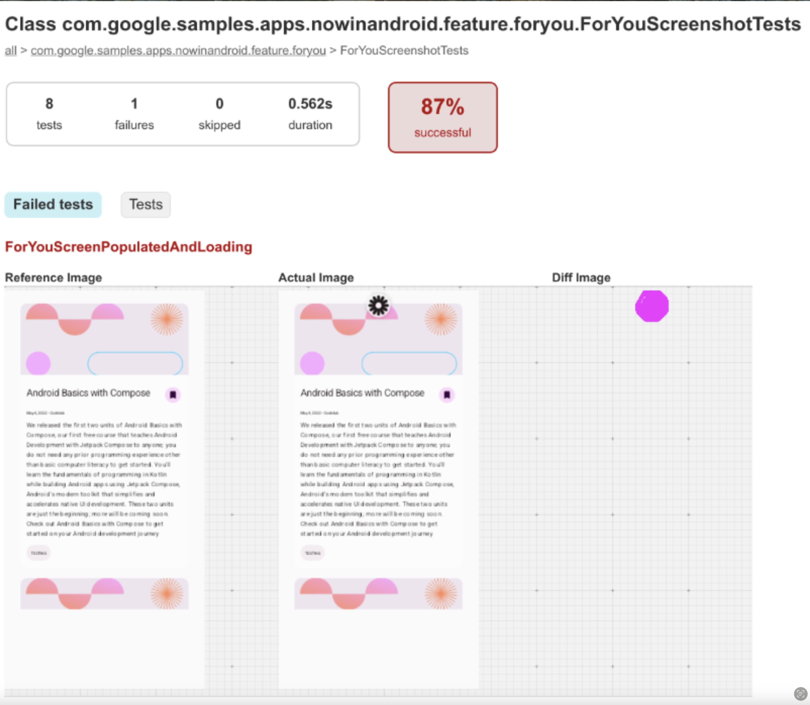

## 스크린샷 테스트란 무엇이며, 개발 중 UI 일관성을 보장하는 데 어떻게 도움이 되나요?

**스크린샷 테스트**는 실제 기기에서 앱을 실행하지 않고도 UI 모양을 검증하는 효과적인 방법입니다. 새로운 스크린샷을 이전 스크린샷과 비교하여 시각적 변경을 감지할 수 있게 하여, 수정을 쉽게 식별할 수 있습니다. 이 접근 방식은 또한 코드 리뷰를 향상시켜, 팀원들이 코드와 함께 UI 업데이트를 효율적으로 발견하고 평가할 수 있게 합니다.

Jetpack Compose에서 스크린샷 테스트를 수행하는 세 가지 방법이 있습니다: Google의 공식 Gradle 플러그인과 커뮤니티 주도 라이브러리인 **Paparazzi** 및 **Roborazzi**입니다. 각 접근 방식은 UI 스냅샷을 효율적으로 캡처하고 비교하기 위한 고유한 장점을 제공합니다.

-----

## Compose 스크린샷 테스팅 플러그인

Google에서 공식적으로 제공하는 [**Compose 스크린샷 테스팅 플러그인**](https://developer.android.com/studio/preview/compose-screenshot-testing)은 [Compose 프리뷰](https://developer.android.com/develop/ui/compose/tooling/previews)와 직접 통합되어 개발자가 UI 스냅샷을 원활하게 생성하고 비교할 수 있게 합니다. 이 방법은 UI 일관성을 검증하고 의도치 않은 레이아웃 변경을 감지하는 데 유용합니다.

스크린샷 테스트는 UI 스냅샷을 캡처하고 이전에 승인된 참조 이미지와 비교합니다. 차이점이 감지되면 테스트는 실패하고 변경 사항을 강조 표시하는 HTML 보고서를 생성합니다.

Compose 프리뷰 스크린샷 테스팅 도구를 사용하면 다음을 할 수 있습니다.

  * 스크린샷 테스트를 위한 컴포저블 프리뷰 선택.
  * 비교를 위한 참조 이미지 생성.
  * UI 변경 자동 감지 및 HTML 보고서 생성.
  * `@Preview` 파라미터(예: `uiMode`, `fontScale`)를 사용하여 테스트 커버리지 확장.
  * 모듈화를 위해 `screenshotTest` 소스 세트를 사용하여 테스트 구성.

이 접근 방식은 UI 일관성을 보장하고 시각적 퇴행(visual regression)을 효율적으로 감지하는 데 도움이 됩니다.



-----

## Paparazzi

[**Paparazzi**](https://github.com/cashapp/paparazzi)는 Cash App에서 개발한 오픈소스 라이브러리로, 에뮬레이터나 실제 기기 없이 스크린샷 테스트를 가능하게 합니다. 이는 전적으로 JVM 상에서 실행되므로 UI 스냅샷을 캡처하는 빠르고 효율적인 방법입니다. Paparazzi는 JVM에서 직접 Compose UI를 렌더링하고 비교를 위해 픽셀 단위로 완벽한 스크린샷을 캡처하는 방식으로 작동합니다.

다음 예제를 통해 실제 기기나 에뮬레이터 없이도 Android Studio에서 직접 애플리케이션 화면을 렌더링할 수 있습니다.

```kotlin
class LaunchViewTest {
    @get:Rule
    val paparazzi = Paparazzi(
        deviceConfig = PIXEL_5,
        theme = "android:Theme.Material.Light.NoActionBar"
        // ...더 많은 옵션은 문서를 참조하세요
    )

    @Test
    fun launchView() {
        val view = paparazzi.inflate<LaunchView>(R.layout.launch)
        // 또는...
        // val view = LaunchView(paparazzi.context)

        view.setModel(LaunchModel(title = "paparazzi"))
        paparazzi.snapshot(view)
    }

    @Test
    fun launchComposable() {
        paparazzi.snapshot {
            MyComposable()
        }
    }
}
```

-----

## Roborazzi

[**Roborazzi**](https://github.com/takahirom/roborazzi)는 Jetpack Compose를 포함한 안드로이드 스크린샷 테스트를 위해 설계된 또 다른 오픈소스 라이브러리입니다. UI 상태를 캡처하고 스냅샷 비교를 통해 UI 변경을 검증하기 위한 간단하고 유연한 API를 제공합니다.

Roborazzi는 [**Robolectric**](https://github.com/robolectric/robolectric)과 통합되어 테스트가 Hilt와 함께 실행되고 더 현실적인 환경에서 UI 컴포넌트와 상호작용할 수 있게 합니다. 이는 Robolectric을 활용하여 스크린샷을 캡처함으로써 Paparazzi의 기능을 효과적으로 확장하며, 의존성 주입 및 기타 시스템 수준 상호작용과의 호환성을 보장하면서 테스트 프로세스를 더 효율적이고 신뢰할 수 있게 만듭니다.

또한 [Compose 멀티플랫폼 지원](https://takahirom.github.io/roborazzi/compose-multiplatform.html), [Compose 프리뷰 통합](https://takahirom.github.io/roborazzi/preview-support.html), [AI 기반 이미지 단언(assertion)](https://takahirom.github.io/roborazzi/ai-powered-image-assertion.html) 등과 같은 유용한 기능도 포함합니다.

-----

## 요약

스크린샷 테스트는 UI 변경을 추적하고 디자인 일관성을 보장하는 신뢰할 수 있는 방법을 제공합니다. Google Compose 스크린샷 테스팅 플러그인, Paparazzi, Roborazzi는 각각 고유한 이점을 제공하여 개발 워크플로우에 스냅샷 테스트를 더 쉽게 통합할 수 있게 합니다. 스크린샷 테스트를 채택함으로써, 팀은 시각적 퇴행을 조기에 식별하고, 코드 리뷰 중 협업을 개선하며, 앱 버전 전반에 걸쳐 세련된 UI 경험을 유지할 수 있습니다.

-----

## Q. 팀의 워크플로우 일부로 스크린샷 테스트를 사용해 본 적이 있나요? 그것이 개발 또는 코드 리뷰 프로세스를 어떻게 개선했으며, 통합함으로써 어떤 구체적인 이점을 관찰했나요?

네, 팀 워크플로우에 스크린샷 테스트를 도입한 경험이 있으며, 이는 **UI의 시각적 퇴행(visual regression)을 자동으로 감지**하고 **코드 리뷰의 효율성을 획기적으로 향상**시키는 데 매우 효과적이었습니다. 가장 큰 이점은 개발자가 의도하지 않은 UI 변경을 커밋하기 전에 미리 발견하고, 리뷰어는 코드 변경이 UI에 미치는 영향을 **시각적인 '차이점(diff)' 이미지**로 한눈에 파악할 수 있게 된 점입니다.

---
### 1. 개발 프로세스 개선: 자동화된 시각적 퇴행 테스트 🤖

스크린샷 테스트를 도입하기 전에는, UI 변경 사항이 다른 화면에 미치는 영향을 파악하기 위해 여러 기기에서 수동으로 화면을 일일이 확인해야 했습니다. 이는 시간이 많이 걸리고, 실수가 잦으며, 모든 엣지 케이스를 확인하기 어렵다는 문제점이 있었습니다.

스크린샷 테스트를 도입한 후, 특히 CI(Continuous Integration, 지속적 통합) 파이프라인에 연동한 후 개발 프로세스는 다음과 같이 개선되었습니다.

* **자동화된 안전망:** 개발자가 코드를 푸시(push)하면 CI 서버가 자동으로 스크린샷 테스트를 실행합니다. 이때 기존에 승인된 "골든(golden)" 이미지와 현재 코드가 렌더링한 이미지를 비교합니다.
* **조기 버그 발견:** 만약 개발자의 변경 사항이 의도치 않게 다른 컴포넌트나 화면의 UI를 1픽셀이라도 변경했다면, 테스트가 실패하고 즉시 알림이 옵니다. 이를 통해 버그가 QA 단계나 사용자에게 도달하기 훨씬 전에, 개발 단계에서 문제를 발견하고 수정할 수 있습니다.
* **영향 범위 파악 용이:** 예를 들어, 공통으로 사용되는 `Padding` 값을 수정했을 때, 이 변경이 영향을 미치는 모든 화면의 스크린샷 테스트가 실패하게 됩니다. 이를 통해 개발자는 자신의 변경 사항이 앱 전체에 미치는 영향을 명확하게 파악할 수 있습니다.

---
### 2. 코드 리뷰 프로세스 개선: 명확한 시각적 근거 제공 🖼️

기존에는 UI 관련 코드 변경이 포함된 PR(Pull Request)을 리뷰할 때, 리뷰어는 코드를 보고 UI가 어떻게 변할지 상상하거나, 직접 해당 브랜치를 내려받아 빌드하고 실행해서 확인해야 했습니다. 이는 매우 비효율적인 과정이었습니다.

스크린샷 테스트를 통합한 후 코드 리뷰 프로세스는 다음과 같이 개선되었습니다.

* **시각적 변경 사항(Visual Diff) 자동 첨부:** CI와 연동된 스크린샷 테스트 시스템은 테스트 실패 시, **"이전 이미지", "현재 이미지", 그리고 "차이점만 강조한 이미지"** 를 포함한 보고서를 생성하여 PR에 댓글로 자동으로 첨부해 줍니다.
* **신속하고 정확한 리뷰:** 리뷰어는 더 이상 앱을 직접 실행해 볼 필요 없이, PR 설명과 코드, 그리고 스크린샷 테스트가 생성한 시각적 결과물만 보고도 변경 사항을 직관적으로 이해하고 승인 여부를 결정할 수 있습니다. 이는 코드 리뷰 시간을 극적으로 단축시켰습니다.
* **디자인 및 기획팀과의 원활한 소통:** 디자이너나 기획자도 PR에 첨부된 스크린샷을 보고 의도된 디자인이 정확하게 구현되었는지 쉽게 확인할 수 있어, 부서 간 협업이 원활해졌습니다.

---
### 3. 통합을 통해 관찰한 구체적인 이점들 ✨

* **UI 일관성 유지:** 공통 컴포넌트나 디자인 시스템(테마, 색상, 타이포그래피 등)에 대한 스크린샷 테스트를 작성함으로써, 앱 전체의 UI 일관성을 효과적으로 유지할 수 있었습니다.
* **다양한 환경 테스트 자동화:** 하나의 테스트 코드를 다크/라이트 모드, 여러 기기 해상도, 다양한 글꼴 크기 등 여러 환경 설정에 대해 실행할 수 있습니다. 이를 통해 수동 테스트로는 확인하기 어려운 다양한 환경에서의 UI 깨짐 현상을 자동으로 감지할 수 있었습니다.
* **리팩토링에 대한 자신감 증가:** 개발자들은 UI 관련 코드를 리팩토링할 때, 의도치 않은 시각적 부작용이 발생하더라도 스크린샷 테스트가 이를 즉시 감지해 줄 것이라는 믿음을 갖게 되어 더 자신감 있게 코드를 개선할 수 있었습니다.
* **버그 수정 시간 단축:** 대부분의 시각적 버그가 개발 및 리뷰 단계에서 발견되므로, QA 단계나 프로덕션 환경에서 발견되었을 때보다 훨씬 빠르고 저렴하게 수정할 수 있었습니다.

---
### 4. 결론

스크린샷 테스트는 수동적이고 주관적일 수 있는 UI 검증 과정을 **자동화되고 객관적인 프로세스**로 전환하는 매우 가치 있는 투자입니다. 이를 통해 개발 초기 단계에서 시각적 오류를 방지하고, 코드 리뷰의 질과 속도를 높이며, 최종적으로는 사용자에게 더 높은 품질의 일관된 UI를 제공하는 데 크게 기여했습니다.