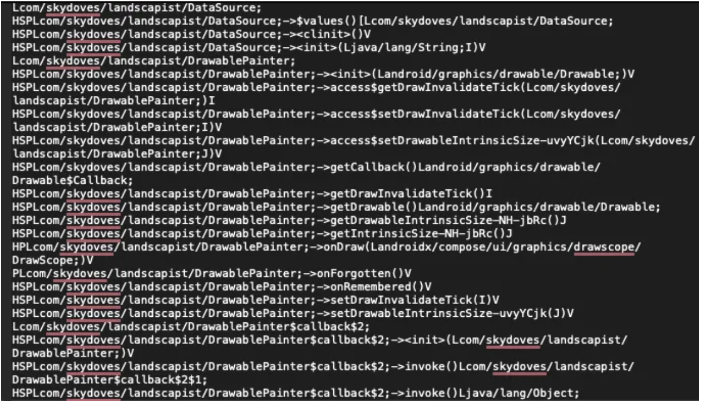

# 베이스라인 프로필(Baseline Profile)이란 무엇인가?

[**베이스라인 프로필(Baseline Profile)**](https://developer.android.com/topic/performance/baselineprofiles/overview) 은 **앱 시작 시간과 런타임 실행을 최적화**하는 것을 목표로 하는 안드로이드의 성능 향상 기능입니다. 미리 컴파일된 코드 정보를 제공함으로써, 베이스라인 프로필은 인터프리테이션(interpretation, 해석) 및 [**JIT(Just-in-Time) 컴파일**](https://source.android.com/docs/core/runtime/jit-compiler#flow) 단계를 건너뛰어 더 빠른 실행을 가능하게 합니다. 첫 실행부터 **20–30%의 잠재적인 속도 향상**을 통해 더 부드럽고 효율적인 사용자 경험을 보장합니다. 안드로이드 런타임(ART)은 이 프로필을 사용하여 앱 설치 중에 **핵심 코드 경로를 식별하고 미리 컴파일**함으로써 반응성을 개선하고 시작 지연 시간을 줄입니다.

베이스라인 프로필은 제공된 프로필에 정확한 코드 경로를 정의하여 [**AOT(Ahead-of-Time) 컴파일**](https://source.android.com/docs/core/runtime#AOT_compilation)을 활용합니다. 이 프로필에는 ART가 설치 단계에서 컴파일하는 클래스 및 메서드 정보가 포함됩니다. 라이브러리 작성자의 경우, 베이스라인 프로필을 통해 라이브러리와 함께 성능 최적화 정보를 전달하여, 이를 자신의 애플리케이션에 통합하는 개발자들에게 이점을 제공할 수 있습니다.

-----

## 베이스라인 프로필의 작동 방식

#### 1. 핵심 코드 경로 정의

개발자는 주요 실행 경로를 프로파일링하거나 애플리케이션 시작 순간부터 가장 빈번한 사용자 여정을 추적하여 성능에 중요한 메서드와 클래스를 정의할 수 있습니다.

#### 2. 프로필 생성

프로필은 **Jetpack Macrobenchmark 라이브러리**와 같은 도구를 사용하여 생성됩니다. 이를 통해 앱 동작을 기록하고 테스트하여 중요한 코드 경로를 식별할 수 있습니다.

#### 3. 프로필 포함

생성된 베이스라인 프로필은 APK 또는 AAB에 번들로 포함되어 사용자에게 전달됩니다.

#### 4. 설치 시 최적화

앱이 사용자 기기에 설치될 때, ART는 이 프로필을 사용하여 지정된 메서드와 클래스를 네이티브 코드로 미리 컴파일합니다.

-----

## 베이스라인 프로필 생성 및 확인

AGP(Android Gradle Plugin) 8.0 이상부터는 [**Baseline Profile 그래들 플러그인**](https://mvnrepository.com/artifact/androidx.benchmark/benchmark-baseline-profile-gradle-plugin?repo=google)을 편리하게 활용할 수 있습니다. 이 플러그인은 베이스라인 프로필 생성을 간소화하고, 패키지 필터링 옵션을 제공하며, 플레이버(flavor) 제어를 포함한 더 편리한 기능들을 제공합니다. [베이스라인 프로필 생성](https://developer.android.com/topic/performance/baselineprofiles/create-baselineprofile) 가이드라인에 따라 베이스라인 프로필을 생성하면, 각 모듈의 `/src/main/generated/baselineProfiles` 디렉터리 아래에 `baseline-prof.txt`라는 이름으로 생성된 베이스라인 프로필을 발견할 수 있습니다. 이 텍스트 파일을 클릭하면 아래와 같이 표시된 클래스 및 메서드 선언을 볼 수 있습니다.

Google 팀이 개발하고 유지보수하는 [Now-in-Android GitHub 저장소](https://github.com/advocacies/nowinandroid_/tree/main/benchmarks/src/main/kotlin/com/google/samples/apps/nowinandroid)에서 구현 세부 정보를 더 깊이 파고들 수 있습니다. 이 저장소는 각 화면에 대한 베이스라인 프로필 생성에 대한 종합적인 가이드를 제공하며, 다양한 사용자 행동 여정을 설명하고 성능을 효과적으로 최적화하는 방법을 자세히 설명합니다.

-----

## 요약

베이스라인 프로필은 핵심 코드 경로를 미리 컴파일하여 앱 시작 시간을 줄이고 원활한 런타임 실행을 보장함으로써 앱 성능을 최적화하는 훌륭한 도구입니다. Jetpack Macrobenchmark 라이브러리와 같은 도구를 활용하면 개발자가 이러한 핵심 경로를 식별하고 정의하는 데 도움이 되어, 사용자가 다양한 기기에서 더 빠르고 반응성이 뛰어난 앱을 경험할 수 있도록 보장합니다. 베이스라인 프로필과 이를 활용하여 앱 성능을 향상시키는 방법에 대한 더 깊은 이해를 원한다면, [베이스라인 프로필로 Android 앱 성능 개선](https://proandroiddev.com/improve-your-android-app-performance-with-baseline-profiles-297f388082e6) (영문) 글을 탐색해 보세요.

-----

## Q. 안드로이드 런타임(ART)은 베이스라인 프로필을 어떻게 활용하여 앱 성능을 향상시키며, 이 방식이 전통적인 JIT(Just-in-Time) 컴파일과 비교하여 가지는 주요 장점은 무엇인가요?

안드로이드 런타임(ART)은 베이스라인 프로필(Baseline Profile)을 **프로파일 기반 AOT(Ahead-of-Time) 컴파일**의 핵심적인 입력 자료로 사용하여 앱 성능을 향상시킵니다. 베이스라인 프로필은 앱의 핵심 코드 경로 목록을 제공하며, ART는 이 정보를 바탕으로 앱 설치 시점에 해당 코드들을 미리 네이티브 머신 코드로 컴파일합니다.

이 방식은 전통적인 JIT(Just-in-Time) 컴파일과 비교하여, 사용자가 앱을 처음 실행할 때 **인터프리테이션(interpretation, 해석)이나 JIT 컴파일 단계를 건너뛰게 해주므로** 앱 시작 시간을 대폭 단축하고 런타임 중 CPU 사용량을 줄여 훨씬 더 부드럽고 일관된 사용자 경험을 제공하는 주요 장점을 가집니다.

---
### 1. ART가 베이스라인 프로필을 활용하여 성능을 향상시키는 방식

#### 1.1. 프로파일 기반 AOT(Ahead-of-Time) 컴파일 ⚡️
* **핵심 코드 경로 식별:** 베이스라인 프로필은 개발자가 정의한, 앱의 성능에 가장 중요한 코드 경로(예: 앱 시작 시 실행되는 클래스 및 메서드, 사용자의 주요 상호작용 관련 코드) 목록을 담고 있는 텍스트 파일(`baseline-prof.txt`)입니다.
* **설치 시점 사전 컴파일:** 사용자가 Google Play 스토어에서 앱을 설치할 때, ART는 앱과 함께 제공된 이 베이스라인 프로필을 읽습니다. 그리고 프로필에 명시된 클래스와 메서드들을 해당 기기에 최적화된 **네이티브 머신 코드로 미리 컴파일(AOT 컴파일)**하여 저장합니다.

#### 1.2. 인터프리테이션 및 JIT 컴파일 단계 건너뛰기 ⏭️
* **프로필이 없는 경우:** 베이스라인 프로필이 없으면, 앱이 시작될 때 ART는 바이트코드를 한 줄씩 해석(interpeter)하거나, 자주 사용되는 코드를 발견하면 JIT 컴파일러를 사용하여 런타임 중에 머신 코드로 변환해야 합니다. 이 과정은 시간과 CPU 자원을 소모하여 앱 시작을 지연시키고 초기 상호작용 시 버벅임(jank)을 유발할 수 있습니다.
* **프로필이 있는 경우:** 베이스라인 프로필을 사용하면, 앱의 가장 중요한 부분들이 이미 네이티브 머신 코드로 준비되어 있습니다. 따라서 앱이 시작되면, ART는 이러한 핵심 코드 경로를 **컴파일 과정 없이 즉시 실행**할 수 있습니다. 이는 성능을 저하시키는 인터프리테이션 및 JIT 컴파일 단계를 건너뛰게 해줍니다.

---
### 2. 전통적인 JIT 컴파일과 비교한 주요 장점

| 구분 | JIT 컴파일 (전통 방식) | 베이스라인 프로필 (프로파일 기반 AOT) |
| --- | --- | --- |
| **컴파일 시점** | 앱 실행 중 (런타임) | 앱 설치 시 (사전) |
| **주요 장점** | 앱 설치 시간이 빠름 | **앱 시작 시간이 매우 빠르고, 런타임 성능이 일관됨** |
| **주요 단점** | **앱 시작 시간이 느리고 초기 실행 시 CPU 사용량이 높음** | 앱 설치 시간이 약간 더 길고, 설치 후 앱 용량이 조금 더 큼 |

#### 2.1. 🚀 앱 시작 시간 대폭 단축
* **JIT:** 앱이 시작된 후 코드를 실행하면서 컴파일이 일어나므로, 초기 구동에 시간이 더 걸립니다.
* **베이스라인 프로필:** 사용자가 앱을 처음 실행하는 순간부터 핵심 코드가 이미 컴파일되어 있으므로, JIT 컴파일 오버헤드 없이 즉시 실행되어 **앱 시작 시간이 평균적으로 20-30%까지 단축**됩니다. 이는 사용자 경험에 가장 직접적으로 긍정적인 영향을 미칩니다.

#### 2.2. 📉 런타임 CPU 사용량 및 배터리 소모 감소
* **JIT:** 런타임 중 코드를 컴파일하는 작업은 CPU를 많이 사용하며, 이는 배터리 소모로 이어집니다.
* **베이스라인 프로필:** 무거운 컴파일 작업을 앱 설치 시점으로 옮깁니다. 따라서 앱 실행 중에는 CPU가 컴파일에 소모하는 자원이 줄어들어, **더 부드러운 성능(컴파일로 인한 멈춤 현상 감소)과 향상된 배터리 효율성**을 제공합니다.

#### 2.3. ✨ 더 부드럽고 일관된 사용자 경험
* **JIT:** 앱을 처음 사용하거나 새로운 기능을 실행할 때 발생하는 "웜업(warm-up)" 기간 동안 JIT 컴파일로 인해 UI가 버벅이거나 끊기는 현상이 발생할 수 있습니다.
* **베이스라인 프로필:** 앱 시작 및 주요 상호작용에 사용되는 코드를 미리 컴파일함으로써, 앱이 **첫 실행부터 반응성이 뛰어나게 느껴집니다.** 사용자는 더 일관된 성능을 경험하게 됩니다.

#### 2.4. 🎯 정확한 타겟 최적화
* **JIT:** 앱이 실행되는 동안 "자주 사용된다"고 관찰된 코드를 최적화합니다.
* **베이스라인 프로필:** 개발자가 실제 **주요 사용자 여정(Critical User Journeys, CUJs)** (예: 앱 시작, 메인 화면으로 이동, 목록 스크롤)을 기반으로 어떤 코드가 중요한지 ART에게 **선제적으로 알려줄 수 있습니다.** 이는 첫 실행 시 JIT가 추측하는 것보다 더 정확한 최적화를 가능하게 합니다.

---
### 3. 요약: JIT, AOT, 그리고 베이스라인 프로필의 관계

현대의 ART는 단순히 하나의 방식만 사용하지 않고, AOT와 JIT를 모두 활용하는 **하이브리드(Hybrid) 방식**을 사용합니다. **베이스라인 프로필**은 이 하이브리드 방식에서 "헤드 스타트(head start)"를 제공하는 역할을 합니다.

즉, 베이스라인 프로필을 통해 가장 중요한 코드는 설치 시점에 AOT로 컴파일하여 초기 성능을 극대화하고, 프로필에 포함되지 않은 다른 코드들은 필요할 때 JIT로 컴파일하거나, 사용자의 실제 앱 사용 패턴을 바탕으로 기기가 유휴 상태일 때 추가적인 AOT 컴파일(프로파일 기반 최적화, PGO)을 수행하여 점진적으로 성능을 개선해 나갑니다. 베이스라인 프로필은 이 전체 최적화 과정의 첫 단계를 가속화하여 모든 사용자가 처음부터 쾌적한 앱 사용 경험을 누릴 수 있도록 보장하는 핵심적인 기술입니다.