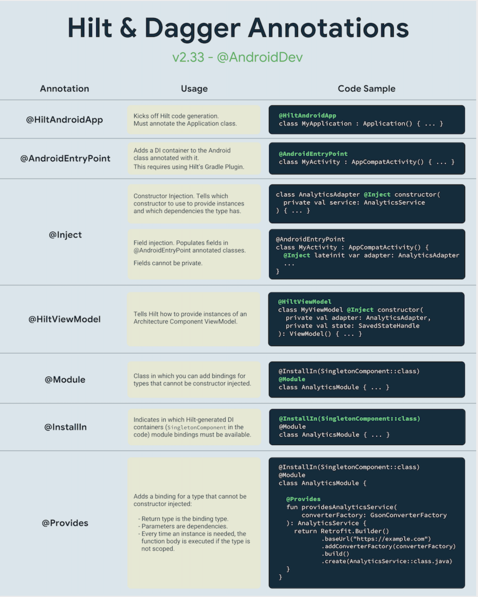
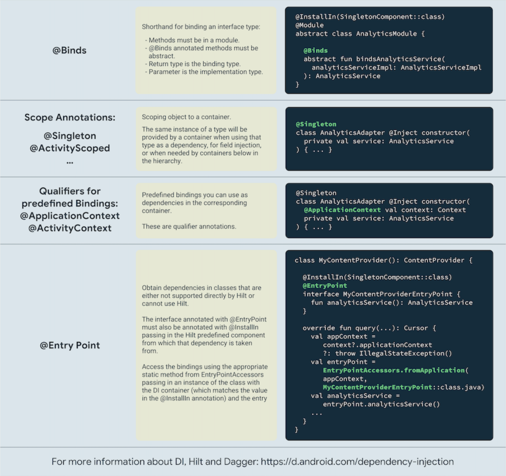

# Dagger 2와 Hilt란 무엇인가?

안드로이드에는 많은 의존성 주입(Dependency Injection, DI) 라이브러리가 있으며, 그중 **Dagger 2**와 **Hilt**가 대표적인 옵션으로 꼽힙니다. 두 라이브러리 모두 Google에서 개발하고 공식적으로 지원하므로, 대규모 프로젝트에서 사용하기에 신뢰할 수 있는 선택지입니다.

### Dagger 2란?

[**Dagger 2**](https://dagger.dev/)는 안드로이드 및 JVM 환경을 위한 **완전한 정적, 컴파일 타임 의존성 주입(DI) 프레임워크**입니다. 이는 객체 생성을 관리하고 의존성을 자동으로 제공하여 모듈성을 향상시키고 애플리케이션을 더 쉽게 테스트할 수 있도록 설계되었습니다. Dagger 2는 컴파일 타임에 코드를 생성하므로, 리플렉션 기반 DI 프레임워크에 비해 더 나은 성능을 보장합니다.

Dagger 2는 `@Module`, `@Provides`, `@Inject`와 같은 어노테이션을 사용하여 의존성을 선언하고 요청합니다. 개발자는 컴포넌트와 모듈을 통해 의존성 그래프를 생성하며, Dagger 2는 이를 런타임에 자동으로 해결합니다.

```kotlin
// 의존성을 제공하는 모듈
@Module
class NetworkModule {
    @Provides
    fun provideRetrofit(): Retrofit {
        return Retrofit.Builder()
            .baseUrl("https://example.com")
            .build()
    }
}

// 모듈과 주입 대상을 연결하는 컴포넌트
@Component(modules = [NetworkModule::class])
interface AppComponent {
    fun inject(activity: MainActivity)
}

// 의존성을 주입받는 클래스
class MainActivity : AppCompatActivity() {
    @Inject
    lateinit var retrofit: Retrofit

    override fun onCreate(savedInstanceState: Bundle?) {
        super.onCreate(savedInstanceState)
        // 컴포넌트를 생성하고 의존성 주입 실행
        DaggerAppComponent.create().inject(this)
    }
}
```

-----

### Hilt란?

[**Hilt**](https://dagger.dev/hilt/)는 **Dagger 2를 기반으로 구축된** 안드로이드용 의존성 주입 라이브러리입니다. 액티비티, 프래그먼트, ViewModel과 같은 안드로이드 생명주기 인식 클래스에 범위가 지정된 미리 정의된 컴포넌트를 제공하여, 안드로이드 프로젝트에 Dagger를 통합하는 과정을 단순화합니다.

Hilt는 `@HiltAndroidApp` 및 `@AndroidEntryPoint`와 같은 어노테이션을 제공하여 DI 설정을 간소화함으로써 Dagger 2에서 필요했던 많은 상용구 코드를 제거합니다. 또한 `@Singleton` 및 `@ActivityScoped`와 같은 스코프를 정의하여 의존성의 생명주기를 관리합니다.

```kotlin
// 애플리케이션 클래스에 Hilt 설정
@HiltAndroidApp
class MyApplication : Application()

// 액티비티에 Hilt 설정 (주입 대상)
@AndroidEntryPoint
class MainActivity : AppCompatActivity() {
    @Inject
    lateinit var retrofit: Retrofit

    override fun onCreate(savedInstanceState: Bundle?) {
        super.onCreate(savedInstanceState)
        setContentView(R.layout.activity_main)
        // Hilt가 자동으로 의존성을 주입함
    }
}

// Hilt 모듈 정의
@Module
@InstallIn(SingletonComponent::class) // 이 모듈을 애플리케이션 전체 스코프에 설치
object NetworkModule {
    @Provides
    fun provideRetrofit(): Retrofit {
        return Retrofit.Builder()
            .baseUrl("https://example.com")
            .build()
    }
}
```

-----

### Dagger 2와 Hilt의 주요 차이점

  * **통합 과정:**
    Dagger 2는 개발자가 수동으로 컴포넌트와 인젝터(injector)를 정의해야 하므로 장황한 상용구 코드가 발생할 수 있습니다. Hilt는 미리 정의된 컴포넌트와 생명주기 인식 어노테이션을 제공하여 이를 단순화합니다.
  * **안드로이드 생명주기 통합:**
    Hilt는 특별히 안드로이드용으로 맞춤 제작되었으며 액티비티, 프래그먼트, ViewModel과 같은 안드로이드 컴포넌트에 대한 내장 지원을 제공합니다. Dagger 2는 더 범용적이어서 생명주기 인식 컴포넌트를 위해서는 추가적인 설정이 필요합니다.
  * **스코핑 (Scoping):**
    Hilt는 `@Singleton`, `@ActivityScoped`, `@FragmentScoped`와 같이 안드로이드 생명주기 클래스와 긴밀하게 통합된 미리 정의된 스코프를 제공합니다. Dagger 2에서는 스코핑을 위해 수동 설정과 사용자 정의 어노테이션이 필요합니다.
  * **코드 단순성:**
    Hilt는 많은 상용구 코드를 추상화하여 DI 설정의 복잡성을 줄여 초보자에게 더 친숙합니다. Dagger 2는 유연하고 강력하지만, 개발자가 모든 컴포넌트와 관계를 수동으로 정의해야 합니다.
  * **사용 사례:**
    Dagger 2는 복잡하고 사용자 정의된 의존성 주입 그래프가 필요한 프로젝트에 적합합니다. Hilt는 사용 용이성과 안드로이드 컴포넌트와의 통합에 중점을 둔 안드로이드 프로젝트에 특별히 설계되었습니다.

-----

### Hilt와 Dagger 2에서 제공하는 어노테이션

Hilt는 Dagger를 기반으로 구축되었으므로 많은 어노테이션을 공유하면서 안드로이드 특정 기능을 도입합니다. 아래는 공유, Hilt 전용, Dagger 전용 기능들을 강조하며 어노테이션을 요약한 것입니다. 중복을 피하고 명확성을 보장하기 위해 구분했습니다.

#### 공유 어노테이션 (Dagger에서 제공하고 Hilt에서도 사용됨)

  * [**`@Inject`**](https://docs.oracle.com/javaee/6/api/javax/inject/Inject.html): 의존성 주입을 위해 생성자, 필드 또는 메서드를 표시합니다. 의존성이 어떻게 제공되거나 요청되어야 하는지를 나타내는 데 사용됩니다.
  * [**`@Provides`**](https://dagger.dev/api/latest/dagger/Provides.html): `@Module` 내에서 의존성 생성 메서드를 정의합니다. Hilt와 Dagger 모두 객체를 공급하기 위해 이 어노테이션에 의존합니다.
  * [**`@Module`**](https://dagger.dev/api/latest/dagger/Module.html): 클래스를 의존성 제공자(provider) 컨테이너로 선언합니다. 모듈은 관련된 의존성 생성 로직을 그룹화합니다.
  * [**`@Binds`**](https://dagger.dev/api/latest/dagger/Binds.html): `@Module` 내에서 인터페이스를 해당 구현체에 매핑하는 데 사용되어 의존성 정의 시 상용구 코드를 줄입니다.
  * [**`@Qualifier`**](https://docs.oracle.com/javaee/7/api/javax/inject/Qualifier.html): 사용자 정의 어노테이션을 사용하여 동일한 타입의 여러 바인딩을 구별합니다.
  * [**`@Scope`**](https://docs.oracle.com/javaee/6/api/javax/inject/Scope.html): 특정 의존성의 생명주기를 제어하기 위해 사용자 정의 스코핑 어노테이션을 정의할 수 있게 합니다.
  * [**`@Singleton`**](https://docs.oracle.com/javaee/7/api/javax/inject/Singleton.html): 의존성이 해당 스코프(보통 앱의 생명주기) 전체에서 단일 공유 인스턴스를 가져야 함을 지정합니다.
  * [**`@Component`**](https://dagger.dev/api/latest/dagger/Component.html): 의존성 그래프의 인터페이스를 정의합니다. `@Component`는 모듈을 주입 대상과 연결하고 의존성 생명주기를 제어합니다.
  * [**`@Subcomponent`**](https://dagger.dev/api/latest/dagger/Subcomponent.html): 스코프가 지정된 사용 사례를 위해 `@Component` 내에 더 작은 의존성 그래프를 생성합니다. 종종 자체 생명주기를 가진 자식 컴포넌트를 만드는 데 사용됩니다.

*(참고: `@Inject`, `@Qualifier`, `@Scope`, `@Singleton` 어노테이션은 Dagger 자체가 아닌 자바 명세(`javax.inject` 패키지)에서 유래했습니다.)*

#### Hilt 전용 어노테이션

  * [**`@HiltAndroidApp`**](https://dagger.dev/hilt/application): Hilt를 부트스트랩(초기 설정)하고 전체 앱을 위한 의존성 그래프를 생성하기 위해 `Application` 클래스에 적용됩니다.
  * [**`@AndroidEntryPoint`**](https://dagger.dev/hilt/android-entry-point): 안드로이드 컴포넌트(예: Activity, Fragment, Service)를 주입 대상으로 표시합니다. 사용자 정의 Dagger 컴포넌트를 정의할 필요를 없애줍니다.
  * [**`@InstallIn`**](https://dagger.dev/hilt/modules): `@Module`이 설치되어야 할 컴포넌트(예: `SingletonComponent`, `ActivityComponent`)를 지정합니다.
  * [**`@EntryPoint`**](https://dagger.dev/hilt/entry-points): Hilt에 의해 관리되지 않는 안드로이드 컴포넌트 외부에서 의존성에 접근하기 위한 진입점을 정의하는 데 사용됩니다.
  * [**`@HiltViewModel`**](https://dagger.dev/hilt/view-model): Jetpack ViewModel을 Hilt와 통합하기 위한 특화된 어노테이션입니다. ViewModel이 Hilt의 의존성 주입을 사용하면서 생명주기를 인식하도록 보장합니다. `@HiltViewModel` 어노테이션은 생성자에 `@Inject`와 함께 사용되어야 합니다.
  * **[스코프 어노테이션](https://dagger.dev/hilt/components) (`@ActivityRetainedScoped`, `@ViewModelScoped`, `@ActivityScoped`, `@FragmentScoped`, `@ViewScoped`, `@ServiceScoped`):**
    사용자가 컴포넌트를 수동으로 정의하고 인스턴스화해야 하는 전통적인 Dagger와 달리, Hilt는 자동으로 생성되는 미리 정의된 컴포넌트를 제공하여 이 과정을 단순화합니다. 이러한 컴포넌트들은 다양한 안드로이드 애플리케이션 생명주기에 원활하게 통합됩니다. Hilt는 또한 내장된 컴포넌트 및 스코프 어노테이션 세트를 포함하여 의존성 주입을 더 간소화하고 생명주기를 인식하도록 만듭니다.

Hilt는 `@HiltAndroidApp`, `@AndroidEntryPoint`, `@HiltViewModel`과 같은 어노테이션을 도입하여 안드로이드 애플리케이션의 의존성 주입을 단순화합니다. 이러한 추상화는 Dagger 컴포넌트를 수동으로 정의하는 것과 관련된 많은 상용구 코드를 제거합니다.

포괄적인 개요는 아래 시각적 가이드도 제공하는 [Hilt 및 Dagger 어노테이션 치트 시트](https://developer.android.com/training/dependency-injection/hilt-cheatsheet)를 참조할 수 있습니다.




-----

### 요약

Dagger 2와 Hilt는 모두 객체 생성 및 관리를 간소화하는 의존성 주입 프레임워크입니다. Dagger 2는 더 다목적이며 모든 자바 또는 안드로이드 프로젝트에서 사용할 수 있지만, 더 많은 수동 설정이 필요합니다. 반면에 Hilt는 Dagger 2를 기반으로 구축되었지만 생명주기 인식 컴포넌트와 통합하고 상용구 코드를 줄여 안드로이드의 DI를 단순화합니다. 대부분의 안드로이드 프로젝트에는 Hilt가 더 편리한 선택이며, Dagger 2는 비안드로이드 프로젝트나 매우 사용자 정의된 DI 요구 사항에 더 적합합니다.

-----

### 💡 프로 팁: 수동으로 의존성 주입을 구현할 수 있나요?

DI 프레임워크에 의존하지 않고 수동으로 의존성 주입을 구현하여 구현에 대한 완전한 제어권을 가질 수 있습니다. 그러나 이 접근 방식은 기존 DI 프레임워크를 사용하는 것과 비교하여 장단점을 모두 가집니다.

수동 의존성 주입(런타임 기반)은 스코핑, 그룹핑, 메모리 누수 방지를 위한 적절한 정리 등 객체의 전체 생명주기를 직접 관리해야 하므로 상당한 노력이 필요합니다. 종종 방대한 상용구 코드를 작성하게 되며, [서비스 로케이터 패턴](https://en.wikipedia.org/wiki/Service_locator_pattern)으로 변질되거나 전역 정적 접근자에 의존할 위험이 있습니다. 대조적으로 Dagger 2나 Hilt와 같은 프레임워크는 주입 관련 코드를 컴파일 타임에 생성하여 유지보수를 단순화하고 견고한 컴파일 타임 유효성 검사를 보장합니다.

반면에, Dagger 2나 Hilt(컴파일 타임 기반)와 같은 DI 프레임워크는 컴파일 중 어노테이션 처리 및 코드 생성으로 인해 빌드 시간을 증가시킵니다. 전적으로 런타임 초기화에만 의존하는 수동 DI는 빌드 시간을 줄일 수 있지만, 컴파일 타임에 최적화된 프레임워크에 비해 런타임 성능을 약간 저해할 수 있습니다. 궁극적으로, 수동 의존성 주입은 일반적으로 중소 규모 프로젝트에 더 적합하며, 더 크고 복잡한 애플리케이션은 DI 프레임워크가 제공하는 확장성과 효율성의 이점을 누릴 수 있습니다. 올바른 접근 방식을 선택하는 것은 프로젝트의 크기, 복잡성 및 특정 요구 사항에 따라 달라집니다.

이 주제에 대해 더 깊이 파고들고 싶다면 "안드로이드 개발자를 위한 이펙티브 코틀린 인터뷰" 책을 참고할 수 있습니다. 더 자세한 통찰력은 [공식 안드로이드 문서의 수동 의존성 주입 가이드](https://developer.android.com/training/dependency-injection/manual)를 참조하세요. 또한, 공식 Compose 예제의 일부인 [Jetcaster 프로젝트](https://github.com/android/compose-samples/tree/main/Jetcaster)는 실제 수동 의존성 주입을 보여줍니다.

-----

### 💡 프로 팁: Dagger 2와 Hilt의 대안 라이브러리는 무엇인가요?

Dagger 2와 Hilt가 안드로이드에서 가장 일반적으로 사용되는 의존성 주입(DI) 라이브러리이지만, **Koin**과 **Anvil**과 같이 DI 구현에 다른 접근 방식을 제공하는 대안 라이브러리도 있습니다. 각각 고유한 강점을 가지고 있어 특정 사용 사례에 적합합니다.

#### Koin: 가볍고 사용하기 쉬운 DI 라이브러리

[Koin](https://github.com/InsertKoinIO/koin)은 단순함을 염두에 두고 설계된 경량 의존성 주입 프레임워크입니다. 어노테이션, 코드 생성 또는 무거운 상용구 코드가 필요 없으며, 대신 코틀린 DSL을 사용하여 의존성 모듈을 정의하는 데 중점을 둡니다.

**Koin의 주요 특징:**

  * **어노테이션 처리 없음:** 의존성이 코틀린 코드로 정의되어 어노테이션 처리를 피하고 빌드 시간을 단축시킵니다.
  * **코틀린 우선 접근 방식:** 코틀린 DSL을 사용하여 DI 설정을 가독성 높고 직관적으로 만듭니다.
  * **사용 용이성:** 설정이 빠르고 소규모 프로젝트나 단순함을 추구하는 개발자에게 이상적입니다.
  * **동적 의존성 확인:** 런타임에 의존성이 결정되는 시나리오에서 유용한 동적 의존성 확인을 지원합니다.

```kotlin
// 모듈 정의
val appModule = module {
    single { Repository() } // 싱글톤 의존성
    factory { ViewModel(get()) } // 매번 새 인스턴스 생성
}

// Koin 시작
startKoin {
    modules(appModule)
}

// 의존성 주입
class MyActivity : AppCompatActivity() {
    val viewModel: ViewModel by inject() // by inject() 딜리게이트 사용
}
```

Koin은 특히 코드 생성을 완전히 피하기 때문에 빌드 성능이 우선순위인 소규모 프로젝트나 시나리오에 매우 적합합니다. 또한, Dagger 2와 Hilt가 현재 KMP를 지원하지 않는 점을 고려할 때, **코틀린 멀티플랫폼(KMP) 프로젝트**에 훌륭한 선택지로 두드러집니다. 최근 [Koin 4.0 안정 버전](https://blog.insert-koin.io/koin-4-0-official-release-f4827bbcfce3)이 출시되면서 다목적이고 신뢰할 수 있는 DI 프레임워크로서의 입지를 더욱 공고히 했습니다.

##### 의존성 주입을 위한 Dagger 2 대 Koin?

한 사용자가 레딧에서 Dagger 2와 Koin을 비교하는 토론을 시작했습니다. Dagger의 초기 버전 개발자인 Jake Wharton은 다음과 같은 통찰력으로 대화에 기여했습니다.

> Jake Wharton: Koin은 의존성 주입기가 아니라 수동으로 의존성 주입을 수행하는 데 사용할 수 있는 영리한 구체화(reified) 트릭을 가진 서비스 로케이터이므로, 상용구 코드는 불균형적으로 확장될 것입니다. Dagger(그리고 Guice 등)를 사용하면 일정한 고정 오버헤드가 있지만, 바인딩이 주입된 타입 전체에 자동으로 전파되므로 그래프의 형태를 크게 변경할 필요가 거의 없습니다. 수동 의존성 주입을 사용하면 주입된 타입 전체에 바인딩을 수동으로 전파해야 합니다.
> 작은 장난감 앱을 작성한다면 문제가 되지 않을 것입니다. 라이브러리를 사용하지 않는 편이 나을 수도 있습니다. 하지만 수백 개의 바인딩과 수백 개의 주입된 타입을 가진 깊은 타입 그래프를 가진 진지한 앱을 작성할 것이라면...

##### Koin은 서비스 로케이터 패턴인가?

레딧에서 Dagger 2와 Koin의 차이점을 탐색하는 토론이 시작되었습니다. Dagger 초기 버전 개발에 중추적인 역할을 한 Jake Wharton이 이 주제에 대한 자신의 통찰력을 공유하며 대화에 가치 있는 관점을 더했습니다.

> Koin 팀: Koin은 DI와 서비스 로케이터 패턴을 모두 지원하여 개발자에게 유연성을 제공합니다. 그러나 의존성이 생성자 파라미터로 전달되는 DI, 특히 생성자 주입의 사용을 강력히 권장합니다. 이 접근 방식은 더 나은 테스트 용이성을 촉진하고 코드를 더 쉽게 추론할 수 있게 만듭니다.
> Koin의 디자인 철학은 필요할 때 복잡한 설정을 허용하면서도 단순성과 설정 용이성에 중점을 둡니다. Koin을 사용함으로써 개발자는 효과적으로 의존성을 관리할 수 있으며, 대부분의 시나리오에서 DI가 권장되고 선호되는 접근 방식입니다.

#### Anvil: Dagger 2를 위한 컴파일러 플러그인

[Anvil](https://github.com/square/anvil)은 Square에서 개발한 Dagger 컴파일러 플러그인입니다. 특히 Dagger를 많이 사용하는 프로젝트에서 모듈 생성에 대한 상용구 코드를 단순화하여 Dagger를 향상시킵니다. Hilt와 매우 유사하게 작동합니다. Anvil은 팩토리 및 모듈 코드 생성을 간소화하여 장황한 Dagger 설정의 필요성을 줄입니다.

**Anvil의 주요 특징:**

  * **단순화된 Dagger 설정:** 어노테이션이 붙은 클래스에 대한 Dagger 컴포넌트와 팩토리를 자동으로 생성합니다.
  * **상용구 코드 감소:** 수동 설정을 최소화하여 대규모 프로젝트에서 Dagger를 더 쉽게 사용할 수 있도록 합니다.
  * **Dagger와의 통합:** 기존 DI 설정에 큰 변경 없이 Dagger와 원활하게 함께 작동합니다.
  * **빌드 성능:** 특정 컴포넌트에 대한 어노테이션 처리 오버헤드를 줄여 빌드 시간을 개선하는 데 도움이 됩니다.

```kotlin
@ContributesBinding(AppScope::class)
class MyRepository @Inject constructor() : Repository

@ContributesTo(AppScope::class)
interface AppModule {
    fun provideSomeDependency(): SomeDependency
}
```

Anvil은 이미 Dagger를 사용하고 있지만 상용구 코드를 줄이고 개발자 생산성을 향상시킬 방법을 찾고 있는 팀에 이상적입니다. 문서는 Anvil을 다음과 같이 설명합니다.

> Hilt는 안드로이드에서 의존성 주입을 수행하는 방법에 대한 Google의 의견이 반영된 가이드입니다. 진입점과 모듈에 대해 Anvil과 유사한 `@InstallIn` 기능을 제공합니다. Hilt를 사용한다면 Anvil을 사용할 필요가 없습니다.
> Hilt는 많은 다른 기능을 포함하며 몇 가지 제한 사항이 있습니다. 우리에게는 수천 개의 모듈과 많은 Dagger 컴포넌트를 가진 코드베이스를 Hilt로 마이그레이션하는 것이 불가능했는데, 우리는 단지 모듈과 컴포넌트 인터페이스를 자동으로 병합하는 기능만 필요했기 때문입니다. 우리는 또한 성능상의 이유로 Dagger 어노테이션 프로세서의 사용을 특정 모듈로만 제한합니다. Hilt를 사용하면 컴포넌트 인터페이스에 대해 이 요구 사항을 더 이상 강제할 수 없게 됩니다. Anvil의 개발은 Hilt가 발표되기 오래전에 시작되었으며 내부 버전은 한동안 운영 환경에서 사용되고 있습니다.

#### 올바른 라이브러리 선택하기

  * **Koin**은 소규모 프로젝트, DI를 처음 접하는 개발자, 또는 어노테이션 처리 없이 간단한 설정을 원하는 경우에 좋은 선택입니다.
  * **Anvil**은 대규모 프로젝트에서 이미 Dagger를 사용하고 있으며 기존 Dagger 컴포넌트와의 호환성을 유지하면서 워크플로우를 단순화하고자 하는 팀에 가장 적합합니다.

-----

## Q. Hilt는 Dagger 2와 비교하여 의존성 주입을 어떻게 단순화하며, 안드로이드 애플리케이션에서 Hilt 사용의 주요 장점은 무엇인가요?

Hilt는 Dagger 2의 강력한 기능을 기반으로 하면서도, 안드로이드 프레임워크에 특화된 표준화된 방식을 제공하여 의존성 주입(DI)을 크게 단순화합니다. 개발자가 직접 작성해야 했던 수많은 보일러플레이트 코드를 제거하고, 미리 정의된 컴포넌트와 어노테이션을 통해 DI 설정을 자동화하는 것이 핵심입니다. 이로 인해 코드의 복잡성이 줄어들고, 개발자는 비즈니스 로직에 더 집중할 수 있습니다.

---
### Hilt가 Dagger 2에 비해 의존성 주입을 단순화하는 방식

Hilt는 Dagger 2 사용 시 필요했던 복잡하고 반복적인 설정 과정들을 자동화하고 표준화합니다.

### 1. 컴포넌트(Component) 생성 자동화 ⚙️
* **Dagger 2:** 개발자는 `@Component` 어노테이션을 사용하여 컴포넌트 인터페이스를 직접 정의해야 했습니다. 또한, 이 컴포넌트를 인스턴스화하고 관리하는 코드(예: `Application` 클래스에서 `DaggerAppComponent.create().inject(this)`)를 직접 작성해야 했습니다.
* **Hilt:** **컴포넌트 생성이 자동화됩니다.** 개발자는 `@HiltAndroidApp`을 `Application` 클래스에, `@AndroidEntryPoint`를 `Activity`나 `Fragment`에 추가하기만 하면 됩니다. Hilt는 빌드 시점에 안드로이드 생명주기에 맞는 필요한 모든 컴포넌트들을 자동으로 생성해 줍니다. 수동으로 컴포넌트를 만들고 관리할 필요가 전혀 없습니다.

### 2. 안드로이드 클래스로의 의존성 주입 간소화
* **Dagger 2:** `Activity`나 `Fragment`의 `onCreate()`와 같은 생명주기 콜백에서, 직접 컴포넌트 인스턴스를 가져와 `component.inject(this)`와 같은 코드를 호출하여 의존성 주입을 수행해야 했습니다.
* **Hilt:** **`@AndroidEntryPoint` 어노테이션 하나로 끝납니다.** 이 어노테이션을 붙이면 Hilt가 적절한 생명주기 시점에 맞춰 자동으로 의존성 주입을 처리합니다.

### 3. 모듈(Module) 및 스코핑(Scoping) 표준화
* **Dagger 2:** 모든 모듈을 컴포넌트 인터페이스에 직접 명시해야 했고, 스코프(Scope)를 사용하려면 직접 커스텀 어노테이션을 만들고 컴포넌트와 모듈에 각각 적용하는 등 복잡한 설정이 필요했습니다.
* **Hilt:** **미리 정의된 표준 컴포넌트와 스코프**를 제공합니다. `@InstallIn` 어노테이션을 사용하여 모듈을 어떤 컴포넌트(스코프)에 설치할지 간단히 지정할 수 있습니다. 예를 들어, `@InstallIn(SingletonComponent::class)`은 앱 전역에서 사용될 모듈임을 나타냅니다. `@Singleton`, `@ActivityScoped`, `@ViewModelScoped` 등 표준화된 스코프 어노테이션을 통해 의존성의 생명주기를 쉽고 명확하게 관리할 수 있습니다.

### 4. ViewModel 주입의 혁신적인 간소화
* **Dagger 2:** ViewModel에 의존성을 주입하는 것은 매우 복잡했습니다. `ViewModelProvider.Factory`를 직접 구현하고, 멀티바인딩(`@IntoMap`, `@ViewModelKey`)을 사용하는 등 많은 양의 보일러플레이트 코드가 필요했습니다.
* **Hilt:** **`@HiltViewModel` 어노테이션 하나로 해결됩니다.** ViewModel의 생성자에 `@Inject`와 함께 `@HiltViewModel`을 추가하고, UI 컨트롤러(Activity/Fragment)에서는 `by viewModels()` 딜리게이트를 통해 ViewModel을 평소처럼 가져오기만 하면 됩니다. Hilt가 내부적으로 필요한 모든 팩토리 코드를 자동으로 생성하고 제공합니다.

---
## 안드로이드 앱에서 Hilt 사용의 주요 장점

Hilt를 사용함으로써 얻는 주요 이점은 다음과 같습니다.

### 1. 보일러플레이트 코드 대폭 감소 📜
컴포넌트, 팩토리, 수동 인젝션 호출 등 Dagger 2에서 필요했던 반복적인 코드가 대부분 사라집니다. 이는 코드베이스를 더 작고 깔끔하게 만들어 유지보수성을 높입니다.

### 2. 표준화된 의존성 주입 방식  стандарты
Hilt는 안드로이드 앱의 의존성 주입에 대한 "의견이 있는(opinionated)" 프레임워크입니다. 정해진 표준 방식을 따르도록 유도하므로, 프로젝트 전반에 걸쳐 일관된 DI 구조를 유지하기 쉽습니다. 이는 팀 협업 및 새로운 개발자가 프로젝트에 적응하는 데 큰 도움이 됩니다.

### 3. 생명주기 인식 및 관리 용이성 🔄
Hilt의 컴포넌트와 스코프는 안드로이드 생명주기와 직접적으로 연결되어 있습니다. 예를 들어 `@ActivityScoped`로 지정된 의존성은 해당 액티비티가 살아있는 동안만 동일한 인스턴스를 제공하고, 액티비티가 소멸되면 자동으로 정리됩니다. 개발자가 직접 컴포넌트의 생명주기를 관리할 필요가 없습니다.

### 4. 안드로이드 컴포넌트와의 간편한 통합 🧩
ViewModel 주입뿐만 아니라, `WorkManager`, `Navigation` 등 다른 Jetpack 라이브러리와의 통합도 간편하게 지원하여 현대적인 안드로이드 앱 아키텍처를 쉽게 구축할 수 있도록 돕습니다.

### 5. 테스트 용이성 향상 🧪
Hilt는 테스트를 위한 강력한 기능을 내장하고 있습니다. `@HiltAndroidTest`를 사용하여 테스트 환경을 쉽게 구성할 수 있으며, 테스트 중에 특정 모듈을 제거하거나(`@UninstallModules`), 의존성을 테스트용 가짜 객체로 쉽게 교체(`@BindValue`)할 수 있어 안정적인 단위 테스트 및 통합 테스트 작성이 용이해집니다.

---
## 결론: 언제 Hilt를 선택해야 하는가?

Dagger 2는 매우 강력하고 유연하지만 그만큼 복잡하고 학습 곡선이 높습니다. **Hilt는 이러한 Dagger 2의 복잡성을 안드로이드 개발 환경에 맞게 추상화하고 단순화한 라이브러리**입니다.

따라서, **대부분의 순수 안드로이드 애플리케이션 개발**에서는 Hilt를 사용하는 것이 좋습니다. 표준화된 DI 구조를 통해 개발 속도를 높이고, 코드의 안정성과 유지보수성을 향상시킬 수 있습니다.

다만, 멀티플랫폼 프로젝트(KMP)나 안드로이드 프레임워크에 의존하지 않는 순수 Kotlin/Java 라이브러리, 또는 Hilt의 표준적인 방식에서 벗어나는 매우 복잡하고 특수한 DI 구조가 필요한 경우에는 여전히 Dagger 2를 직접 사용하는 것이 더 적합할 수 있습니다.


## Q. Dagger와 Hilt에서 `@Provides`와 `@Binds`의 차이점은 무엇이며, 각각 언제 사용해야 하나요?

Dagger와 Hilt에서 `@Provides`와 `@Binds`는 모두 의존성 주입을 위한 객체를 제공(provide)하는 방법을 정의하지만, 그 목적과 사용 방식에서 명확한 차이가 있습니다.

핵심적인 차이는 **`@Provides`는 객체를 직접 생성하고 설정하는 로직을 포함**하는 반면, **`@Binds`는 특정 인터페이스의 구현체를 지정하는 선언적인 역할**만 한다는 점입니다. 성능 측면에서도 `@Binds`가 더 효율적이므로, 가능한 경우 `@Binds`를 사용하는 것이 권장됩니다.

---
### 1. `@Provides` 어노테이션

`@Provides`는 의존성 그래프에 객체를 제공하는 **구체적인 방법**을 Dagger/Hilt에게 알려주는 역할을 합니다.

#### 1.1. 목적 및 작동 방식
`@Provides` 어노테이션은 **메서드**에 붙이며, 이 메서드는 특정 타입의 인스턴스를 직접 생성하여 반환합니다. 메서드 본문(`{ ... }`)을 가지므로, 객체 생성 시 복잡한 로직을 포함할 수 있습니다.

* **모듈 요구사항:** `@Provides` 메서드는 `@Module` 어노테이션이 붙은 클래스 내부에 위치해야 합니다. 이 모듈 클래스는 일반적인 클래스일 수 있습니다 (추상 클래스일 필요 없음).
* **메서드 시그니처:**
    * 메서드 본문을 가집니다.
    * 다른 의존성이 필요하다면 메서드의 파라미터로 받을 수 있습니다. Dagger/Hilt가 해당 의존성을 주입해 줍니다.
    * 반환 타입은 제공하고자 하는 의존성의 타입입니다.

#### 1.2. 사용 시나리오
다음과 같이 **개발자가 직접 인스턴스를 생성하거나 설정해야 할 때** 사용합니다.

* **외부 라이브러리 객체 생성:** 생성자에 `@Inject`를 추가할 수 없는 클래스(예: `Retrofit`, `OkHttpClient`, `Gson` 등)의 인스턴스를 제공할 때.
* **빌더 패턴(Builder Pattern) 사용:** 객체 생성을 위해 빌더 패턴이 필요한 경우.
* **런타임 로직 포함:** 특정 조건에 따라 다른 구현체를 반환하는 등, 인스턴스 생성에 로직이 필요한 경우.
* **기본 타입(Primitive Type) 제공:** `String`, `Int` 등 생성자 주입이 불가능한 기본 타입 값을 제공할 때.

#### 1.3. 예시 코드
```kotlin
@Module
@InstallIn(SingletonComponent::class)
object NetworkModule {

    @Provides
    @Singleton
    fun provideOkHttpClient(): OkHttpClient {
        return OkHttpClient.Builder()
            .connectTimeout(20, TimeUnit.SECONDS)
            .build()
    }

    @Provides
    @Singleton
    fun provideRetrofit(okHttpClient: OkHttpClient): Retrofit {
        return Retrofit.Builder()
            .client(okHttpClient)
            .baseUrl("https://api.example.com/")
            .addConverterFactory(GsonConverterFactory.create())
            .build()
    }
}
```

---
### 2. `@Binds` 어노테이션

`@Binds`는 특정 **인터페이스(또는 상위 클래스)에 대한 구현체(implementation)가 무엇인지** Dagger/Hilt에게 알려주는 선언적인 역할을 합니다.

#### 2.1. 목적 및 작동 방식
`@Binds` 어노테이션은 **추상 메서드(abstract method)** 에 붙이며, Dagger에게 "이 인터페이스가 필요하다고 요청이 오면, 저 구현체를 대신 제공해 줘"라고 알려줍니다. 메서드 본문이 없으므로 객체 생성 로직을 포함할 수 없습니다.

* **모듈 요구사항:** `@Binds` 메서드는 **반드시 `abstract` 클래스**인 `@Module` 내부에 위치해야 합니다.
* **메서드 시그니처:**
    * 추상 메서드이므로 메서드 본문이 없습니다.
    * **정확히 하나의 파라미터**를 가져야 하며, 이 파라미터는 제공할 구현체의 타입입니다.
    * 반환 타입은 바인딩될 인터페이스(또는 상위 클래스)입니다.
    * 해당 구현체는 Dagger/Hilt가 생성 방법을 이미 알고 있어야 합니다 (일반적으로 생성자 주입 `@Inject constructor`를 통해).

#### 2.2. 사용 시나리오
다음과 같이 **인터페이스와 구현체를 분리(디커플링)** 하고 싶을 때 사용합니다.

* 클래스들이 구체적인 구현 클래스가 아닌 인터페이스에 의존하도록 설계했을 때, 해당 인터페이스의 실제 구현체를 지정해주는 역할.
* 성능 최적화가 필요할 때 (`@Provides`보다 더 효율적임).

#### 1.3. 예시 코드
```kotlin
// AnalyticsService 인터페이스와 그 구현체
interface AnalyticsService {
    fun trackEvent(eventName: String)
}

class FirebaseAnalyticsServiceImpl @Inject constructor() : AnalyticsService {
    override fun trackEvent(eventName: String) {
        // ... Firebase 애널리틱스 이벤트 전송 로직 ...
    }
}

// @Binds를 사용한 모듈
@Module
@InstallIn(SingletonComponent::class)
abstract class AnalyticsModule {

    @Binds
    @Singleton
    abstract fun bindAnalyticsService(
        analyticsServiceImpl: FirebaseAnalyticsServiceImpl
    ): AnalyticsService
}
```
이제 다른 클래스에서 `AnalyticsService`를 주입받으면, Hilt는 자동으로 `FirebaseAnalyticsServiceImpl`의 인스턴스를 제공합니다.

---
### 3. @Provides vs. @Binds: 주요 차이점 및 성능

| 구분 | `@Provides` | `@Binds` |
| --- | --- | --- |
| **주요 목적** | **객체의 생성 방법을 직접 정의** (How to create) | **인터페이스에 대한 구현체를 지정** (Which implementation) |
| **메서드 형태** | 본문이 있는 일반 메서드 | 본문이 없는 **추상(abstract)** 메서드 |
| **모듈 클래스** | 일반 클래스 또는 추상 클래스 | **반드시 추상(abstract) 클래스**여야 함 |
| **파라미터** | 0개 이상 (필요한 다른 의존성들) | **정확히 1개** (실제 구현체) |
| **성능** | 메서드가 직접 호출되므로 약간의 오버헤드 발생. Dagger가 생성하는 코드 양이 더 많음. | **더 효율적이고 빠름.** Dagger가 컴파일 시점에 어떤 구현을 사용할지 이미 알고 있으므로, 추가적인 메서드 호출 없이 직접 구현체를 연결함. 생성되는 코드 양이 더 적음. |

`@Binds`는 Dagger가 컴파일 시점에 의존성 그래프를 분석할 때 더 많은 정보를 제공하므로, 더 적은 코드를 생성하고 더 효율적으로 작동합니다.

---
### 4. 언제 무엇을 사용해야 하는가? (선택 가이드)

#### ✅ `@Provides`를 사용해야 하는 경우:
* 생성자에 `@Inject`를 추가할 수 없는 **외부 라이브러리 클래스**(예: `Retrofit`, `RoomDatabase`, `OkHttpClient`)의 인스턴스를 생성할 때.
* 객체 생성을 위해 **빌더 패턴(Builder Pattern)** 이 필요할 때.
* 인스턴스 생성 과정에 **어떠한 로직**이 포함되어야 할 때 (예: 조건에 따라 다른 객체 반환).

#### ✅ `@Binds`를 사용해야 하는 경우:
* **인터페이스에 대한 구현체를 제공**하고 싶을 때.
* 해당 구현체가 **생성자 주입(`@Inject constructor`)이 가능**할 때.
* **성능이 중요한 경우.**

**결론적으로, 인터페이스에 대한 구현체를 바인딩하는 상황이라면 항상 `@Provides`보다 성능이 우수하고 의도도 명확한 `@Binds`를 우선적으로 사용하는 것이 좋습니다.**

---
### 5. 결론

`@Provides`와 `@Binds`는 Dagger/Hilt에서 의존성을 제공하는 두 가지 중요한 방법입니다. `@Provides`는 객체를 **어떻게 만들지**에 대한 구체적인 지침을 제공하는 반면, `@Binds`는 **어떤 구현을 사용할지**에 대한 선언적인 약속과 같습니다. 이 둘의 차이점을 명확히 이해하고 상황에 맞는 적절한 어노테이션을 사용하면, 더 효율적이고 유지보수하기 쉬우며 잘 설계된 의존성 주입 구조를 만들 수 있습니다.


## Q. Hilt에서 @Singleton, @ActivityScoped, @ViewModelScoped를 사용하여 스코핑(scoping)이 어떻게 작동하는지, 그리고 이러한 스코프들이 애플리케이션 내에서 의존성 인스턴스의 생명주기에 어떤 영향을 미치는지 설명해주세요.

Hilt에서 **스코핑(Scoping)** 은 **의존성 인스턴스의 생명주기를 특정 컴포넌트의 생명주기에 바인딩(연결)하는 메커니즘**입니다. `@Singleton`, `@ActivityScoped`, `@ViewModelScoped`와 같은 스코프 어노테이션을 사용하면, 해당 스코프 내에서 의존성을 요청할 때마다 Dagger/Hilt는 **항상 동일한 인스턴스를 제공**합니다. 이는 불필요한 객체 생성을 막고, 상태를 공유하며, 리소스를 효율적으로 관리하는 데 중요한 역할을 합니다.

각 스코프는 의존성 인스턴스가 언제 생성되고 언제 소멸되는지를 결정합니다.

---

### 1. Hilt 스코핑(Scoping)의 핵심 원리

Hilt는 안드로이드 프레임워크의 생명주기에 맞춰 미리 정의된 **컴포넌트(Component)** 계층을 가지고 있습니다. 각 컴포넌트는 자신만의 **스코프(Scope)** 를 가지며, 이 스코프는 해당 컴포넌트가 살아있는 동안 유지됩니다.

* **컴포넌트:** 의존성을 주입받을 수 있는 객체들의 컨테이너입니다. (예: `SingletonComponent`, `ActivityComponent`)
* **스코프:** 특정 스코프 어노테이션이 붙은 의존성은 해당 스코프를 가진 컴포넌트 내에서 단 하나의 인스턴스만 생성되어 재사용됩니다.
* **생명주기:** 의존성 인스턴스의 생명주기는 스코프가 적용된 컴포넌트의 생명주기와 동일하게 유지됩니다. 컴포넌트가 생성될 때 의존성 인스턴스가 (처음 요청 시) 생성되고, 컴포넌트가 소멸될 때 함께 소멸됩니다.

---

### 2. 주요 Hilt 스코프 어노테이션 및 생명주기 영향

#### 2.1. `@Singleton` 🌍
* **연결된 컴포넌트:** `SingletonComponent` (애플리케이션 컴포넌트와 동일)
* **의존성 생명주기:**
    * 의존성 인스턴스는 해당 의존성이 **처음 요청될 때 단 한 번 생성**됩니다.
    * 생성된 인스턴스는 **애플리케이션 프로세스가 살아있는 동안 계속 유지**됩니다.
    * 앱 내 어디에서든 해당 타입의 의존성을 주입받으면 항상 동일한 싱글톤 인스턴스가 제공됩니다.
* **주요 사용 사례:**
    * **앱 전역에서 공유되어야 하는 객체:** `Retrofit` 인스턴스, `OkHttpClient`, `Room` 데이터베이스 객체, 전역 `Repository`, `SharedPreferences` 래퍼(wrapper) 등.
    * 생성 비용이 비싸고, 상태가 없거나(stateless) 앱 전체의 상태를 관리하는 객체에 적합합니다.

#### 2.2. `@ActivityScoped` 📱
* **연결된 컴포넌트:** `ActivityComponent`
* **의존성 생명주기:**
    * 의존성 인스턴스는 특정 `Activity` 내에서 처음 요청될 때 생성됩니다.
    * 생성된 인스턴스는 **해당 `Activity` 인스턴스가 살아있는 동안만 유지**됩니다.
    * 사용자가 뒤로 가기 버튼을 누르거나 액티비티가 `finish()`되어 소멸되면, 해당 인스턴스도 함께 소멸됩니다.
    * **주의:** 화면 회전과 같은 구성 변경(configuration change)으로 액티비티가 재생성되면, **기존 `@ActivityScoped` 인스턴스는 파괴되고 새로운 액티비티 인스턴스와 함께 새로운 의존성 인스턴스가 생성**됩니다.
* **주요 사용 사례:**
    * 동일한 액티비티 내에 호스팅된 여러 프래그먼트 간에 **상태를 공유**해야 할 때.
    * 특정 액티비티의 생명주기 동안에만 유효한 상태나 데이터를 관리하는 객체 (예: 특정 사용자 여정(journey)을 관리하는 세션 매니저, 액티비티별 분석 트래커).

#### 2.3. `@ViewModelScoped` 🔄
* **연결된 컴포넌트:** `ViewModelComponent` (Hilt의 ViewModel 통합 기능과 함께 사용)
* **의존성 생명주기:**
    * 의존성 인스턴스는 `@HiltViewModel`이 붙은 `ViewModel` 내에서 처음 요청될 때 생성됩니다.
    * 생성된 인스턴스는 **해당 `ViewModel` 인스턴스가 살아있는 동안 유지**됩니다.
    * **핵심 특징:** `ViewModel`은 구성 변경에도 살아남기 때문에, **`@ViewModelScoped`로 지정된 의존성 인스턴스 역시 구성 변경 시에도 파괴되지 않고 그대로 유지**됩니다.
    * 이 인스턴스는 `ViewModel`이 영구적으로 소멸될 때(예: 액티비티가 완전히 종료될 때) 함께 소멸됩니다.
* **주요 사용 사례:**
    * `ViewModel`이 사용하는 **대부분의 비즈니스 로직 및 데이터 레이어 의존성**에 사용됩니다. 예를 들어, 특정 화면의 `ViewModel`이 사용하는 `Repository`, `UseCase`(또는 Interactor), 데이터 소스 등이 해당됩니다.
    * 화면 회전 후 데이터를 다시 불러오는 문제를 해결하는 데 가장 이상적인 스코프입니다.

---

### 3. 스코프 계층과 의존성 접근 규칙

Hilt의 컴포넌트들은 다음과 같은 부모-자식 관계의 계층 구조를 가집니다.

```
SingletonComponent (앱)
└── ActivityComponent (액티비티)
    └── FragmentComponent (프래그먼트)
```

* `ViewModelComponent`는 `ActivityComponent`로부터 생성되지만 `ActivityScoped`보다 긴 생명주기를 가집니다.

**접근 규칙:** 자식 컴포넌트는 부모 컴포넌트가 제공하는 의존성을 주입받을 수 있지만, 그 반대는 불가능합니다.
* **예시:** `@FragmentScoped` 의존성은 `@ActivityScoped`나 `@Singleton` 의존성을 주입받을 수 있습니다. 하지만 `@ActivityScoped` 의존성은 자신보다 짧은 생명주기를 가진 `@FragmentScoped` 의존성을 주입받을 수 없습니다.

---

### 4. 요약 및 선택 가이드

| 스코프 | 연결된 컴포넌트 | 생명주기 | 주요 사용 사례 |
| --- | --- | --- | --- |
| **`@Singleton`** | `SingletonComponent` | 애플리케이션의 생명주기와 동일 | Retrofit, OkHttpClient, Room 데이터베이스, 전역 Repository 등 앱 전체에서 공유되는 유일한 인스턴스 |
| **`@ActivityScoped`** | `ActivityComponent` | 액티비티 인스턴스의 생명주기와 동일. **구성 변경 시 재생성됨.** | 동일 액티비티 내 여러 프래그먼트 간 데이터 공유, 액티비티 수준의 상태 관리 |
| **`@ViewModelScoped`** | `ViewModelComponent` | ViewModel 인스턴스의 생명주기와 동일. **구성 변경에도 유지됨.** | ViewModel이 사용하는 Repository, UseCase 등 비즈니스 로직 및 데이터 관련 의존성. 화면 회전 시 데이터 유지가 필요한 경우. |

**결론적으로, 어떤 스코프를 사용할지는 해당 의존성 인스턴스가 얼마나 오래, 그리고 어떤 범위에서 동일하게 유지되어야 하는지에 따라 결정해야 합니다.** 대부분의 경우, 화면별 데이터와 로직은 `@ViewModelScoped`로, 액티비티 내 프래그먼트 간 공유는 `@ActivityScoped`로, 앱 전반에 걸친 공통 유틸리티나 네트워크/DB 클라이언트는 `@Singleton`으로 스코핑하는 것이 일반적인 모범 사례입니다.
