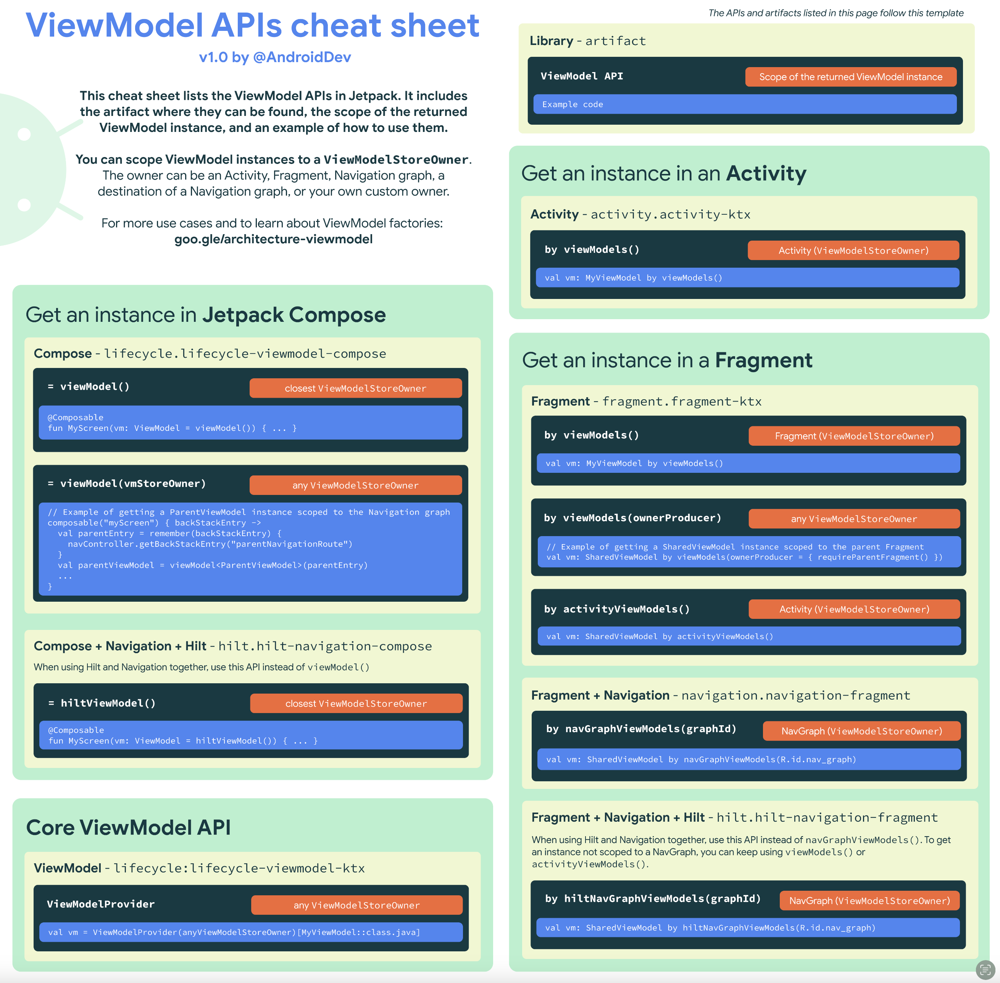
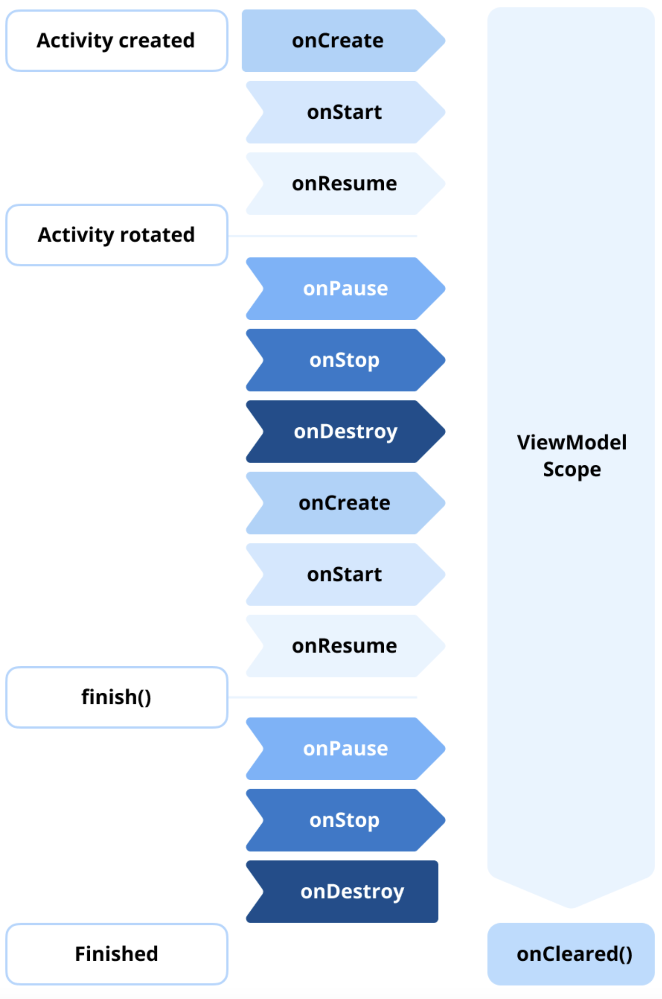
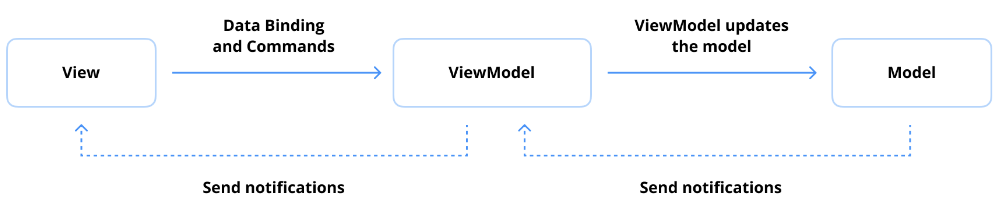

# Jetpack ViewModel이란 무엇인가?

**Jetpack ViewModel**은 안드로이드 아키텍처 컴포넌트(Android's Architecture Components)의 핵심 구성 요소로, **생명주기를 인식하는(lifecycle-conscious) 방식**으로 **UI 관련 데이터를 저장하고 관리**하도록 설계되었습니다. 이는 화면 회전과 같은 구성 변경에도 데이터가 유지되도록 보장하면서 UI 로직과 비즈니스 로직을 분리하여, 개발자가 견고하고 유지보수하기 쉬운 앱을 만들 수 있도록 돕습니다.

ViewModel의 주요 목표는 **구성 변경 중 UI 관련 데이터를 보존**하는 것입니다. 예를 들어, 사용자가 기기를 회전시키면 액티비티나 프래그먼트는 소멸되고 다시 생성되지만, ViewModel은 데이터가 손상되지 않도록 보장합니다.

```kotlin
// UI 상태를 나타내는 데이터 클래스
data class DiceUiState(
    val firstDieValue: Int? = null,
    val secondDieValue: Int? = null,
    val numberOfRolls: Int = 0,
)

// ViewModel 클래스
class DiceRollViewModel : ViewModel() {

    // 화면 UI 상태 노출
    private val _uiState = MutableStateFlow(DiceUiState()) // 내부에서 수정 가능한 StateFlow
    val uiState: StateFlow<DiceUiState> = _uiState.asStateFlow() // 외부에는 읽기 전용 StateFlow로 노출

    // 비즈니스 로직 처리
    fun rollDice() {
        _uiState.update { currentState -> // 현재 상태를 기반으로 상태 업데이트
            currentState.copy(
                firstDieValue = Random.nextInt(from = 1, until = 7),
                secondDieValue = Random.nextInt(from = 1, until = 7),
                numberOfRolls = currentState.numberOfRolls + 1,
            )
        }
    }
}
```

이 예시에서, 액티비티가 구성 변경으로 인해 다시 생성되더라도 `_uiState`가 가진 상태 값들은 유지됩니다.

-----

### ViewModel의 주요 특징

  * **생명주기 인식 (Lifecycle Awareness):**
    ViewModel은 액티비티나 프래그먼트의 생명주기 범위(scope)로 한정됩니다. 연결된 UI 컴포넌트가 더 이상 사용되지 않을 때(예: 사용자가 화면에서 벗어날 때) 자동으로 소멸됩니다.
  * **구성 변경 시 데이터 유지 (Persistence Across Configuration Changes):**
    구성 변경 중에 소멸되고 다시 생성되는 액티비티나 프래그먼트와 달리, ViewModel은 상태를 유지하여 데이터 손실을 방지하고 반복적인 데이터 재요청을 피하게 합니다.
  * **관심사 분리 (Separation of Concerns):**
    ViewModel은 UI 관련 로직과 비즈니스 로직을 분리하여 더 깔끔하고 유지보수하기 쉬운 코드를 촉진합니다. UI 레이어는 ViewModel의 업데이트를 관찰(observe)하여, 반응형 프로그래밍 원칙을 더 쉽게 구현할 수 있게 합니다.

-----

### ViewModel 생성 및 사용법

코틀린의 `by viewModels()` 딜리게이트([Jetpack `activity-ktx` 라이브러리](https://developer.android.com/jetpack/androidx/releases/activity) 제공)를 사용하여 `ComponentActivity`에서 손쉽게 ViewModel을 생성할 수 있습니다. 이 확장은 ViewModel 생성을 단순화하여 더 깔끔하고 가독성 좋은 코드를 보장합니다.

```kotlin
class DiceRollActivity : AppCompatActivity() {

    // 'by viewModels()' 코틀린 프로퍼티 딜리게이트 사용
    // (activity-ktx 아티팩트에서 제공)
    private val viewModel: DiceRollViewModel by viewModels()

    override fun onCreate(savedInstanceState: Bundle?) {
        // 시스템이 액티비티의 onCreate() 메서드를 처음 호출할 때 ViewModel이 생성됩니다.
        // 다시 생성된 액티비티들은 첫 액티비티가 생성한 동일한 DiceRollViewModel 인스턴스를 받습니다.

        lifecycleScope.launch {
            // STARTED 상태일 때만 데이터 수집을 시작하고, STOPPED 상태가 되면 중단
            repeatOnLifecycle(Lifecycle.State.STARTED) {
                viewModel.uiState.collect {
                    // UI 요소 업데이트 로직
                    // 예: it.firstDieValue 를 사용하여 이미지 업데이트
                }
            }
        }
    }
}
```

ViewModel 인스턴스는 `ViewModelStoreOwner`의 범위로 한정될 수 있으며, 이는 ViewModel 인스턴스의 생명주기를 관리하는 메커니즘 역할을 합니다. `ViewModelStoreOwner`는 액티비티, 프래그먼트, 내비게이션 그래프, 내비게이션 그래프 내의 목적지 또는 개발자가 정의한 사용자 정의 소유자가 될 수 있습니다. Jetpack 라이브러리는 다양한 사용 사례에 맞춰 ViewModel의 범위를 지정할 수 있는 다목적 옵션을 제공합니다. 포괄적인 개요는 아래 시각적 가이드도 제공하는 [ViewModel API 치트 시트](https://developer.android.com/topic/libraries/architecture/viewmodel/viewmodel-cheatsheet)를 참조할 수 있습니다.

-----



### 요약

Jetpack ViewModel은 UI 관련 데이터를 저장하고 관리하도록 설계된 핵심 컴포넌트로, 구성 변경 시에도 데이터가 원활하게 유지되도록 보장합니다. 이는 생명주기를 인식하며 MVVM 아키텍처 패턴과 효과적으로 통합되어, 화면 회전과 같은 이벤트 중에도 데이터를 보존함으로써 상태 관리를 단순화하고 전반적인 개발 경험을 향상시킵니다.

-----

## 💡 프로 팁: ViewModel의 생명주기는 무엇인가요?

ViewModel의 생명주기는 액티비티, 프래그먼트 또는 기타 생명주기 인식 컴포넌트가 될 수 있는 관련 **`ViewModelStoreOwner`에 묶여 있습니다.** ViewModel은 `ViewModelStoreOwner`가 범위 내에 남아있는 한 계속 존재하며, 이를 통해 화면 회전과 같은 구성 변경에도 데이터와 상태가 살아남도록 보장합니다.

이러한 생명주기 설계는 ViewModel을 UI 관련 데이터를 효율적으로 관리하고 그러한 변경 전반에 걸쳐 보존하는 데 필수적인 컴포넌트로 만듭니다. 예를 들어, 액티비티의 경우 ViewModel은 해당 액티비티가 완전히 종료되고 메모리에서 제거될 때까지 유지됩니다. 이 생명주기 설계는 화면 회전과 같은 구성 변경 시 데이터와 상태가 보존되도록 보장합니다.

아래 그림은 액티비티 생명주기와 관련된 ViewModel의 수명을 개략적으로 보여줍니다. 이 다이어그램은 액티비티가 일시적으로 소멸되고 다시 생성될 때도 ViewModel 인스턴스가 어떻게 생성되고 유지되는지를 강조합니다. 이 예는 액티비티를 사용하지만, 동일한 원칙이 `ViewModelStoreOwner` 역할을 하는 프래그먼트 및 기타 생명주기 인식 컴포넌트에도 적용됩니다.



`ViewModelStoreOwner`가 처음 생성될 때 ViewModel 인스턴스가 초기화됩니다. 소유자가 메모리에 남아있는 한 동일한 ViewModel 인스턴스가 유지됩니다. 기기 회전과 같은 구성 변경이 발생하면 소유자는 다시 생성되지만 기존 ViewModel 인스턴스는 재사용되어 데이터를 다시 로드하거나 재초기화할 필요가 없습니다. 이러한 ViewModel의 재사용은 더 나은 성능과 더 부드러운 사용자 경험을 보장합니다.

마지막으로, `ViewModelStoreOwner`가 영구적으로 소멸될 때 ViewModel은 정리됩니다. 예를 들어, 액티비티가 종료되거나 프래그먼트가 부모로부터 제거되어 돌아올 것으로 예상되지 않을 때, ViewModel의 **`onCleared()` 메서드가 호출됩니다.** 이는 코루틴을 취소하거나 데이터베이스 연결을 닫는 등 리소스를 정리하여 메모리 누수를 방지할 기회를 제공합니다. ViewModel의 생명주기는 안드로이드 애플리케이션의 효율적인 리소스 관리와 상태 유지를 보장합니다.

자세한 내용은 [공식 문서](https://developer.android.com/topic/libraries/architecture/viewmodel#lifecycle)를 참조하세요.

---

## 💡 프로 팁: 구성 변경 후에도 ViewModel은 어떻게 유지될 수 있나요?

안드로이드에서 Jetpack ViewModel은 화면 회전이나 기기 언어 업데이트와 같은 구성 변경에도 살아남도록 설계되었습니다. ViewModel이 UI 컴포넌트(액티비티나 프래그먼트 등)를 위해 생성될 때, 이는 컴포넌트의 생명주기 소유자에 연결됩니다. 액티비티의 경우 이 생명주기는 보통 `ComponentActivity`이며, 프래그먼트의 경우 프래그먼트 자체입니다. 핵심 요소는 **`ViewModelStore`** 이며, 이는 구성 변경 시에도 유지되어 ViewModel이 다시 생성되지 않고 데이터를 보존할 수 있게 합니다.

Jetpack 라이브러리의 내부 구현을 살펴보면, [`androidx.activity.ComponentActivity`](https://cs.android.com/androidx/platform/frameworks/support/+/androidx-main:activity/activity/src/main/java/androidx/activity/ComponentActivity.kt;l=111?q=ComponentActivity)와 [`androidx.fragment.app.Fragment`](https://cs.android.com/androidx/platform/frameworks/support/+/androidx-main:fragment/fragment/src/main/java/androidx/fragment/app/Fragment.java;l=126?q=androidx.fragment.app.Fragment)가 모두 [`ViewModelStoreOwner`](https://developer.android.com/reference/androidx/lifecycle/ViewModelStoreOwner) 인터페이스를 구현한다는 것을 알 수 있습니다. 이 인터페이스는 액티비티와 프래그먼트가 자체 `ViewModelStore`를 가질 수 있게 하여, ViewModel 인스턴스가 구성 변경 시에도 유지되도록 보장합니다. `ViewModelStore` 자체는 아래 코드에서 볼 수 있듯이 각 ViewModel이 고유한 문자열 키와 연결된 `Map`을 유지하여 ViewModel 인스턴스를 관리합니다.

```kotlin
// ViewModelStore.kt 내부 (개념적 표현)
public open class ViewModelStore {

    private val map = mutableMapOf<String, ViewModel>()

    @RestrictTo(RestrictTo.Scope.LIBRARY_GROUP)
    public fun put(key: String, viewModel: ViewModel) {
        val oldViewModel = map.put(key, viewModel)
        oldViewModel?.clear()
    }

    @RestrictTo(RestrictTo.Scope.LIBRARY_GROUP)
    public operator fun get(key: String): ViewModel? {
        return map[key]
    }

    @RestrictTo(RestrictTo.Scope.LIBRARY_GROUP)
    public fun keys(): Set<String> {
        return HashSet(map.keys)
    }

    public fun clear() {
        for (vm in map.values) {
            vm.clear()
        }
        map.clear()
    }
}
```

`ComponentActivity`의 또 다른 주목할 만한 측면은 자체 생명주기 상태를 관찰하는 능력입니다. 액티비티가 생성될 때, 만약 소멸이 구성 변경으로 인해 트리거된 것이 아니라면, 생명주기 상태가 `ON_DESTROY`로 전환될 때 모든 유지된 ViewModel 인스턴스를 정리하는 메커니즘을 설정합니다. 이는 아래 코드에서 볼 수 있듯이, 예상되는 생명주기 이벤트 동안 ViewModel 인스턴스를 보존하면서 효율적인 리소스 정리를 보장합니다.

```java
// ComponentActivity.java 내부 (개념적 표현)
getLifecycle().addObserver(new LifecycleEventObserver() {
    @Override
    public void onStateChanged(@NonNull LifecycleOwner source,
                               @NonNull Lifecycle.Event event) {
        if (event == Lifecycle.Event.ON_DESTROY) {
            // ...
            // isChangingConfigurations()가 false일 때, 즉 구성 변경이 아닐 때
            // ViewModelStore를 정리합니다.
            if (!isChangingConfigurations()) {
                getViewModelStore().clear();
            }
            // ...
        }
    }
});
```

### 요약

ViewModel은 액티비티 및 프래그먼트와 같은 생명주기에 연결된 안드로이드 컴포넌트에 의해 관리되는 `ViewModelStore`에 저장됨으로써 구성 변경 시에도 유지됩니다. 유사하게, [Compose Navigation 라이브러리](https://developer.android.com/develop/ui/compose/navigation)에서는 `ViewModelStore`가 내비게이션 경로 범위로 지정되어 특정 화면에 대한 ViewModel이 적절하게 유지되도록 보장합니다. 사용자 정의 사용 사례를 위해 `ViewModelStore`를 수동으로 관리하는 것도 가능하지만, 구성 변경 중 검색 처리가 복잡할 수 있어 이 접근 방식은 일반적으로 권장되지 않습니다.

-----

## 💡 프로 팁: Jetpack ViewModel과 Microsoft의 MVVM 아키텍처 ViewModel의 차이점은 무엇인가요?

[공식 문서](https://developer.android.com/topic/architecture/ui-layer/stateholders)에 따르면, **Jetpack ViewModel**은 **비즈니스 로직 또는 화면 수준 상태 홀더** 역할을 하도록 설계된 생명주기 인식 컴포넌트입니다. 관련된 비즈니스 로직을 캡슐화하면서 UI에 상태를 관리하고 노출합니다. 주요 장점은 상태를 캐시하고 화면 회전이나 액티비티 재생성과 같은 **구성 변경 시에도 이를 유지**하는 능력에 있습니다. 이는 UI가 불필요하게 데이터를 다시 가져올 필요가 없도록 하여 효율성과 반응성을 향상시킵니다. 본질적으로, Jetpack ViewModel은 안드로이드 애플리케이션 내에서 생명주기를 인식하는 상태를 관리하는 데 최적화되어 있습니다.

반면에, 마이크로소프트가 처음 소개한 **MVVM (Model-View-ViewModel) 아키텍처**는 **ViewModel을 뷰(View)와 모델(Model) 사이의 다리**로 설명합니다. MVVM의 ViewModel은 뷰가 데이터 바인딩할 수 있는 속성과 커맨드를 구현하여 UI에 필요한 기능을 제공합니다. 또한 변경 알림 이벤트를 통해 뷰에 상태 변경을 알립니다. MVVM의 ViewModel은 뷰의 상호작용을 모델과 조정하고 UI로부터 비즈니스 로직을 추상화하는 책임을 집니다. 상태 관리와 생명주기 인식에 초점을 맞춘 Jetpack ViewModel과 달리, MVVM ViewModel은 뷰가 상태 변화에 수동적으로 반응하게 하여 더 선언적이고 모듈화된 설계를 용이하게 하는 **바인딩 메커니즘(Data Binding)** 을 강조합니다.



### Jetpack ViewModel과 MVVM ViewModel의 차이점

근본적으로 Jetpack ViewModel과 MVVM ViewModel은 다른 목적을 수행하며 별개의 패러다임 하에서 작동합니다. Jetpack ViewModel은 주로 구성 변경을 통해 UI 관련 상태를 유지하는 **생명주기 인식 상태 관리**에 중점을 둡니다. 반면에, MVVM 아키텍처가 정의한 MVVM ViewModel은 뷰와 모델 간의 데이터 및 커맨드 **바인딩**을 용이하게 하여 UI가 오직 데이터 표시에만 집중하도록 하는 역할을 합니다.

Jetpack ViewModel의 이름은 MVVM ViewModel과의 연관성을 시사할 수 있지만, 이것만 사용하는 것이 MVVM 아키텍처의 요구 사항을 완전히 만족시키는 것은 아닙니다. MVVM의 원래 의도를 충족시키려면, 개발자는 UI가 ViewModel이 제공하는 데이터에 수동적으로 반응하도록 보장하는 추가적인 바인딩 메커니즘을 구현해야 합니다. 이는 UI 계층을 기본 비즈니스 로직으로부터 분리하여 명확한 관심사 분리와 더 나은 테스트 용이성을 허용하는 견고한 데이터 바인딩 시스템을 구축하는 것을 포함합니다.

### 요약

Jetpack ViewModel과 MVVM ViewModel은 그 범위와 구현에서 다릅니다. Jetpack ViewModel은 안드로이드 애플리케이션에서 **생명주기를 인식하는 UI 상태 관리**에 중점을 두는 반면, MVVM ViewModel은 뷰와 모델 간의 **데이터 및 커맨드 바인딩**을 강조하여 더 선언적이고 수동적인 UI를 가능하게 합니다. Compose의 경우, ViewModel에서 직접 데이터를 관찰하는 것이 구현을 단순화하는 반면, XML 기반 UI는 MVVM의 목표를 달성하기 위해 DataBinding이 필요합니다. 개발자는 작업 중인 아키텍처와 UI 프레임워크에 따라 신중하게 접근 방식을 선택해야 합니다.

---

## Q. ViewModel은 구성 변경 시 데이터를 어떻게 유지하며, `onSaveInstanceState()`를 사용하여 상태를 저장하는 것과 어떻게 다른가요?

`ViewModel`과 `onSaveInstanceState()`는 안드로이드에서 구성 변경(예: 화면 회전) 시 데이터를 보존하기 위한 두 가지 주요 메커니즘입니다. 둘 다 데이터를 유지한다는 공통된 목표를 가지지만, 작동 방식, 목적, 그리고 생존 범위에서 근본적인 차이가 있습니다.

-----

### 1. ViewModel이 구성 변경 시 데이터를 유지하는 방식: 메모리 유지 (Retention)

`ViewModel`이 구성 변경에도 데이터를 유지할 수 있는 핵심 원리는 **`ViewModelStore`** 라는 특별한 객체 덕분입니다.

1.  **`ViewModelStoreOwner`와 `ViewModelStore`:**
      * `Activity`나 `Fragment`와 같은 UI 컨트롤러는 `ViewModelStoreOwner`라는 인터페이스를 구현합니다.
      * 각 `ViewModelStoreOwner`는 `ViewModelStore`라는 인스턴스를 가집니다. `ViewModelStore`는 간단히 말해 `ViewModel` 객체들을 저장하는 메모리 내의 저장소(일종의 `HashMap`)입니다.
2.  **구성 변경 시 프로세스:**
    1.  사용자가 처음으로 화면(예: `Activity`)에 진입하면, 시스템은 이 액티비티와 연결된 `ViewModelStore`를 확인합니다.
    2.  `ViewModel`을 처음 요청하면(예: `by viewModels()` 사용), 해당 `ViewModel`의 새 인스턴스가 생성되어 이 `ViewModelStore`에 저장됩니다.
    3.  사용자가 기기를 회전시키는 등 **구성 변경**이 발생하면, 시스템은 `Activity` 인스턴스를 소멸시키고 새로운 `Activity` 인스턴스를 생성합니다.
    4.  **핵심적으로, 이 과정에서 `ViewModelStore` 객체는 파괴되지 않고 메모리에 그대로 유지됩니다.**
    5.  새로 생성된 `Activity` 인스턴스가 `ViewModel`을 다시 요청하면, 시스템은 파괴되지 않고 유지된 `ViewModelStore`에서 기존 `ViewModel` 인스턴스를 찾아 반환합니다.
3.  **결과:**
    `ViewModel` 객체 자체가 직렬화되거나 어딘가에 저장되는 것이 아니라, 단순히 **메모리 상에서 파괴되지 않고 살아남아** 새로운 `Activity` 인스턴스에 다시 연결되는 것입니다. 이를 **메모리 유지(Retention)** 방식이라고 합니다.

-----

### 2. `onSaveInstanceState()`와의 주요 차이점

`onSaveInstanceState()`는 `ViewModel`과는 매우 다른 방식으로 상태를 저장하고 복원합니다.

| 구분 | ViewModel | onSaveInstanceState() |
| :--- | :--- | :--- |
| **2.1. 목적 및 사용 사례** | - UI를 표시하는 데 필요한 **데이터 전체**를 로드하고 관리.\<br\>- 화면의 상태(State)를 나타냄.\<br\>- 예: 사용자 프로필 정보, 서버에서 받은 아이템 목록. | - 사용자의 상호작용으로 인한 **소량의 임시 UI 상태** 저장.\<br\>- 예: `EditText`에 입력된 텍스트, `ScrollView`의 스크롤 위치, `CheckBox`의 체크 상태. |
| **2.2. 데이터 유형 및 크기** | - **모든 종류의 객체** 저장 가능 (복잡한 객체, 리스트 등).\<br\>- 메모리에 직접 존재하므로 **데이터 크기 제한이 거의 없음.** | - 반드시 `Bundle`에 저장할 수 있는 타입이어야 함 (`Parcelable` 또는 `Serializable` 등).\<br\>- 시스템 트랜잭션 크기 제한으로 **소량의 데이터만** 적합. |
| **2.3. 생존 범위** | - **구성 변경** 시 생존.\<br\>- **시스템에 의한 프로세스 종료 시에는 기본적으로 함께 소멸됨.** (단, `SavedStateHandle`을 사용하면 이 경우도 처리 가능) | - **구성 변경** 시 생존.\<br\>- **시스템에 의한 프로세스 종료 시에도 생존.** (데이터가 시스템 프로세스에 의해 저장됨) |
| **2.4. 작동 메커니즘** | - **메모리 유지 (Retention):** 객체가 메모리에서 파괴되지 않고 유지됨. 직렬화/역직렬화 과정 없음. | - **직렬화 (Serialization):** 데이터를 `Bundle`에 직렬화하여 저장하고, 재생성 시 역직렬화하여 복원. |
| **2.5. 성능** | - 구성 변경 시 매우 효율적 (데이터가 그대로 있으므로). | - 직렬화 및 역직렬화 과정에서 약간의 성능 오버헤드 발생. |

-----

### 3. 언제 무엇을 사용해야 하는가? (결론 및 요약)

`ViewModel`과 `onSaveInstanceState()`는 서로를 대체하는 관계가 아니라, 각자의 역할에 맞게 **함께 사용하는 것이 일반적인 모범 사례**입니다.

  * **`ViewModel` 사용:**

      * 화면을 구성하는 데 필요한 대부분의 데이터를 로드하고 관리하는 데 사용합니다. 예를 들어, 네트워크나 데이터베이스에서 가져온 사용자 데이터 목록, 화면의 현재 필터 상태 등 복잡하고 양이 많은 UI 관련 데이터는 `ViewModel`에 보관합니다. 이는 구성 변경 시 데이터를 다시 로드할 필요가 없게 하여 효율성을 크게 높여줍니다.

  * **`onSaveInstanceState()` 사용:**

      * 시스템에 의해 앱 프로세스가 예기치 않게 종료되었다가 다시 시작될 경우를 대비하는 데 사용합니다. 사용자가 앱으로 돌아왔을 때 이전 상태를 최대한 복원해주기 위함입니다.
      * `ViewModel`이 프로세스 종료 시에는 데이터를 잃어버리므로, 이 경우 복원해야 할 최소한의 정보(예: 현재 보고 있던 아이템의 ID, 사용자가 입력 필드에 입력했지만 아직 저장하지 않은 검색어 등)를 `onSaveInstanceState()`의 `Bundle`에 저장합니다.
      * **현대적인 개발:** 이렇게 저장된 정보는 `ViewModel`의 `SavedStateHandle`을 통해 `ViewModel`에 전달되어, `ViewModel`이 프로세스 종료 후에도 초기 상태를 복원할 수 있도록 하는 방식으로 함께 사용됩니다.

### 요약

  * **`ViewModel`:** 구성 변경으로부터 **무겁고 복잡한 데이터**를 보호하는 데 이상적입니다.
  * **`onSaveInstanceState()`:** 구성 변경 **및** 시스템에 의한 프로세스 종료로부터 **가볍고 간단한 상태**를 보호하는 데 이상적입니다.

이 두 가지 메커니즘을 함께 사용하면, 어떤 상황에서도 사용자 데이터를 안전하게 보존하고 일관된 사용자 경험을 제공하는 견고한 애플리케이션을 만들 수 있습니다.


## Q. `ViewModelStoreOwner`의 목적은 무엇이며, 동일한 액티비티 내의 여러 프래그먼트 간에 ViewModel을 어떻게 공유할 수 있나요?

`ViewModelStoreOwner`는 Jetpack ViewModel의 생명주기 관리와 컴포넌트 간 데이터 공유에 있어 매우 중요한 역할을 하는 핵심 개념입니다.

---

### 1. `ViewModelStoreOwner`의 목적

#### 1.1. 정의

**`ViewModelStoreOwner`** 는 `ViewModel`들을 저장하고 관리하는 `ViewModelStore` 객체를 소유하고 제공할 책임이 있는 컴포넌트를 나타내는 **인터페이스**입니다. 이 인터페이스는 `getViewModelStore()`라는 단 하나의 메서드만을 가지고 있습니다.

#### 1.2. 핵심 역할: ViewModel의 생명주기 범위(Scope) 결정

`ViewModelStoreOwner`의 주된 목적은 **`ViewModel`이 얼마나 오래 살아남을지를 결정하는 생명주기 범위를 제공**하는 것입니다.

* **`ViewModel`의 생존:** `ViewModel` 인스턴스는 자신이 연결된 `ViewModelStoreOwner`가 완전히 소멸될 때까지 메모리에서 파괴되지 않고 유지됩니다.
* **구성 변경 시 데이터 유지:** 화면 회전과 같은 구성 변경이 발생하면 `Activity`나 `Fragment` 인스턴스는 파괴되고 다시 생성되지만, 이들이 소유하는 `ViewModelStore`와 그 안의 `ViewModel`은 파괴되지 않고 그대로 유지됩니다. 새로 생성된 `Activity`나 `Fragment`는 이 유지된 `ViewModelStore`에 다시 연결되어 기존 `ViewModel` 인스턴스를 재사용하게 됩니다.
* **영구적 소멸:** `ViewModelStoreOwner`가 영구적으로 소멸되면(예: `Activity`가 `finish()`로 종료되거나, `Fragment`가 백 스택에서 완전히 제거될 때), 해당 `ViewModelStore`도 정리(clear)되며, 그 안의 모든 `ViewModel` 객체의 `onCleared()` 메서드가 호출되어 리소스를 해제할 기회를 갖게 됩니다.

#### 1.3. 주요 구현체

안드로이드 Jetpack 라이브러리에서 기본적으로 `ViewModelStoreOwner`를 구현하는 주요 컴포넌트는 다음과 같습니다.

* **`androidx.activity.ComponentActivity`:** 모든 `AppCompatActivity`의 기반이 되는 클래스입니다.
* **`androidx.fragment.app.Fragment`:** 프래그먼트.
* **`androidx.navigation.NavBackStackEntry`:** Jetpack Navigation 컴포넌트 사용 시, 각 내비게이션 목적지(destination)나 내비게이션 그래프(graph) 자체도 `ViewModelStoreOwner`가 될 수 있습니다.

---

### 2. 동일한 액티비티 내 여러 프래그먼트 간 ViewModel 공유 방법

동일한 액티비티 내에 있는 여러 프래그먼트들이 데이터를 공유하거나 서로 통신해야 할 때, **공유 ViewModel(Shared ViewModel)** 을 사용하는 것이 가장 권장되는 방법입니다.

#### 2.1. 핵심 원리: 공통된 `ViewModelStoreOwner` 사용

* 프래그먼트들이 서로 다른 `ViewModel` 인스턴스를 갖지 않고 **동일한 `ViewModel` 인스턴스를 공유**하려면, 각 프래그먼트가 자신의 범위가 아닌, 이들을 모두 포함하는 **공통의 상위 `ViewModelStoreOwner`로부터 `ViewModel`을 요청**해야 합니다.
* 동일한 액티비티 내의 프래그먼트들에게 가장 흔한 공통 `ViewModelStoreOwner`는 바로 **호스팅하는 액티비티(hosting activity)** 입니다.

#### 2.2. 구현 방법: `by activityViewModels()` KTX 확장 함수 사용

`androidx.fragment:fragment-ktx` 라이브러리는 이를 매우 쉽게 구현할 수 있도록 `activityViewModels()`라는 코틀린 프로퍼티 딜리게이트(delegate)를 제공합니다.

* **`by viewModels()`와의 차이점:**
    * `by viewModels()`: `ViewModel`을 **해당 프래그먼트 자체의 생명주기 범위**로 생성합니다. 따라서 각 프래그먼트는 자신만의 고유한 `ViewModel` 인스턴스를 갖게 됩니다.
    * **`by activityViewModels()`:** `ViewModel`을 **호스팅 액티비티의 생명주기 범위**로 생성합니다.

#### 2.3. 공유 과정 예시

1.  `FragmentA`가 화면에 추가되고 `by activityViewModels<SharedViewModel>()`를 호출합니다.
2.  시스템은 `FragmentA`를 호스팅하는 `Activity`의 `ViewModelStore`를 확인합니다.
3.  `ViewModelStore`에 `SharedViewModel` 인스턴스가 없으면 새로 생성하여 저장하고, 이 인스턴스를 `FragmentA`에 반환합니다.
4.  `FragmentB`가 같은 `Activity` 내에서 화면에 추가되고 `by activityViewModels<SharedViewModel>()`를 호출합니다.
5.  시스템은 다시 `Activity`의 `ViewModelStore`를 확인합니다.
6.  이미 3번 단계에서 생성된 `SharedViewModel` 인스턴스가 존재하므로, 시스템은 이 **기존 인스턴스를 `FragmentB`에 반환**합니다.

결과적으로, `FragmentA`와 `FragmentB`는 **완전히 동일한 `SharedViewModel` 인스턴스를 공유**하게 됩니다.

#### 2.4. 공유 ViewModel을 통한 통신 예시 (Kotlin 코드)

```kotlin
// 1. 공유할 데이터를 담을 ViewModel
class SharedViewModel : ViewModel() {
    private val _selectedItem = MutableLiveData<String>()
    val selectedItem: LiveData<String> = _selectedItem

    fun selectItem(item: String) {
        _selectedItem.value = item
    }
}

// 2. 데이터를 생산하는 프래그먼트 (예: 아이템 목록을 보여주는 프래그먼트)
class ListFragment : Fragment() {
    // 액티비티 범위의 SharedViewModel 인스턴스를 가져옴
    private val sharedViewModel: SharedViewModel by activityViewModels()

    override fun onViewCreated(view: View, savedInstanceState: Bundle?) {
        super.onViewCreated(view, savedInstanceState)
        
        val myButton: Button = view.findViewById(R.id.my_button)
        myButton.setOnClickListener {
            // 버튼 클릭 시 공유 ViewModel의 데이터 업데이트
            sharedViewModel.selectItem("선택된 아이템: ${System.currentTimeMillis()}")
        }
    }
}

// 3. 데이터를 소비하는 프래그먼트 (예: 선택된 아이템의 상세 정보를 보여주는 프래그먼트)
class DetailFragment : Fragment() {
    // 동일한 액티비티 범위의 SharedViewModel 인스턴스를 가져옴
    private val sharedViewModel: SharedViewModel by activityViewModels()

    override fun onViewCreated(view: View, savedInstanceState: Bundle?) {
        super.onViewCreated(view, savedInstanceState)
        
        val detailTextView: TextView = view.findViewById(R.id.detail_text)

        // 공유 ViewModel의 데이터를 관찰하여 UI 업데이트
        sharedViewModel.selectedItem.observe(viewLifecycleOwner) { item ->
            detailTextView.text = item
        }
    }
}
```
위 예시에서 `ListFragment`가 `sharedViewModel.selectItem(...)`을 호출하면, 동일한 `SharedViewModel` 인스턴스의 `selectedItem` `LiveData`를 관찰하고 있는 `DetailFragment`의 UI가 자동으로 업데이트됩니다. 프래그먼트 간 직접적인 참조 없이 `ViewModel`을 통해 통신이 이루어집니다.

---
### 3. 결론

`ViewModelStoreOwner`는 `ViewModel`의 **생존 범위와 생명주기를 정의**하는 중요한 역할을 합니다. 개발자는 `activityViewModels()`와 같은 도구를 사용하여 프래그먼트들이 공통의 `ViewModelStoreOwner`(주로 호스팅 액티비티)를 공유하도록 함으로써, 여러 프래그먼트 간에 데이터를 안전하고 효율적으로 공유하고 통신할 수 있습니다. 이는 프래그먼트 간의 결합도를 낮추고, 생명주기를 고려한 안정적인 데이터 관리를 가능하게 하는 현대적인 안드로이드 앱 아키텍처의 핵심 패턴입니다.


## Q. ViewModel 내에서 UI 상태 관리를 위해 StateFlow 또는 LiveData를 사용할 때의 장점과 잠재적인 단점은 무엇인가요?

`ViewModel` 내에서 UI 상태를 관리할 때, 안드로이드 Jetpack 라이브러리의 `StateFlow`와 `LiveData`는 모두 훌륭한 도구이지만, 각각의 특성과 장단점이 있어 프로젝트의 요구사항과 기술 스택에 따라 적절히 선택해야 합니다.

---
### 1. LiveData

`LiveData`는 초기에 Jetpack 아키텍처 컴포넌트의 일부로 소개된, 생명주기를 인식하는(lifecycle-aware) 관찰 가능한(observable) 데이터 홀더입니다.

#### 1.1. LiveData의 장점

* **간단하고 명시적인 생명주기 인식 (Lifecycle Awareness):**
    * `LiveData`의 가장 큰 장점입니다. `observe(lifecycleOwner, ...)` 메서드 한 줄만으로 `Activity`나 `Fragment`의 생명주기를 자동으로 구독합니다.
    * UI 컴포넌트가 활성 상태(STARTED 또는 RESUMED)일 때만 데이터를 전달하고, 컴포넌트가 소멸(DESTROYED)될 때 자동으로 관찰을 중지합니다. 이는 **메모리 누수와 비활성 상태의 UI 업데이트로 인한 비정상 종료를 매우 쉽게 방지**해 줍니다.

* **낮은 학습 곡선 및 안정성:**
    * API가 매우 단순합니다. `MutableLiveData`를 만들고, `.value` 또는 `.postValue()`로 값을 업데이트하며, `.observe()`로 관찰하는 과정이 직관적이어서 초보 개발자도 쉽게 배울 수 있습니다.
    * 오랫동안 사용되어 온 만큼 안정적이며, 관련 문서나 커뮤니티 예제가 풍부합니다.

* **Data Binding과의 원활한 통합:**
    * 안드로이드의 DataBinding 라이브러리와 네이티브하게 잘 통합되어 있어, XML 레이아웃에서 `LiveData`를 직접 바인딩하고 생명주기 관리를 자동으로 처리할 수 있습니다.

#### 1.2. LiveData의 잠재적인 단점

* **제한적인 변환 연산자(Operators):**
    * `Transformations.map()`과 `Transformations.switchMap()` 외에는 기본적으로 제공하는 데이터 변환 연산자가 거의 없습니다. 여러 데이터 스트림을 결합하거나, 필터링, 디바운스(debounce) 등 복잡한 데이터 조작이 필요할 경우 코드가 복잡해지거나 RxJava/Flow와 같은 다른 도구를 함께 사용해야 할 수 있습니다.

* **일회성 이벤트(One-time Event) 처리의 어려움:**
    * `LiveData`는 마지막 값을 저장하고 있다가 새로운 관찰자가 구독하면 즉시 전달하는 "상태" 기반으로 설계되었습니다. 이로 인해 토스트 메시지 표시나 화면 이동과 같은 일회성 이벤트를 처리할 때, 화면 회전 등으로 인해 관찰자가 재생성되면 이벤트가 다시 발생하는 문제가 있습니다. 이를 해결하기 위해 `SingleLiveEvent`와 같은 별도의 래퍼(wrapper) 클래스 패턴을 구현해야 합니다.

* **메인 스레드 의존성:**
    * `setValue()`는 반드시 메인 스레드에서 호출해야 합니다. `postValue()`가 백그라운드 스레드를 지원하지만, 비동기적으로 작동하므로 즉각적인 업데이트를 보장하지 않습니다. 스레드 제어의 유연성이 떨어집니다.

---
### 2. StateFlow (코틀린 Flow)

`StateFlow`는 코틀린 코루틴의 일부로 제공되는 "상태"를 나타내기 위한 특수한 "핫 플로우(hot flow)"입니다. `LiveData`와 유사하게 현재 상태 값을 보유하고 새로운 업데이트를 수집자(collector)에게 전달합니다.

#### 2.1. StateFlow의 장점

* **코틀린 및 코루틴과의 완벽한 통합:**
    * `StateFlow`는 코틀린 언어와 코루틴의 일부이므로, 코루틴의 구조화된 동시성(structured concurrency), 비동기 처리, 예외 처리 등과 완벽하게 통합됩니다.
* **풍부한 연산자(Operators):**
    * `StateFlow`는 `Flow`의 일종이므로, `map`, `filter`, `combine`, `zip`, `debounce` 등 코틀린 Flow가 제공하는 **다양하고 강력한 연산자들**을 모두 사용할 수 있습니다. 이를 통해 복잡한 데이터 스트림을 반응형으로 쉽게 처리하고 변환할 수 있습니다.
* **Null-Safety 및 초기값:**
    * `StateFlow`는 생성 시 반드시 초기값을 가져야 하므로, 데이터가 `null`인 상태가 기본적으로 존재하지 않습니다. 이는 코틀린의 Null-Safety 원칙과 잘 부합합니다.
* **디스패처(Dispatcher)를 통한 유연성:**
    * 코루틴 디스패처를 사용하여 데이터 처리나 수집이 어떤 스레드에서 이루어질지 유연하게 제어할 수 있습니다.

#### 2.2. StateFlow의 잠재적인 단점

* **생명주기 인식을 위한 추가 코드 필요:**
    * `StateFlow` 자체는 안드로이드 생명주기를 인식하지 않습니다. 따라서 UI에서 안전하게 데이터를 수집(collect)하려면 개발자가 직접 생명주기를 고려해야 합니다.
    * 일반적으로 `viewLifecycleOwner.lifecycleScope.launch` 내에서 `viewLifecycleOwner.repeatOnLifecycle(Lifecycle.State.STARTED)` 블록을 사용하여 UI가 활성 상태일 때만 데이터를 수집하도록 하는 **상용구 코드가 필요**합니다. (단, Jetpack Compose의 `collectAsStateWithLifecycle()`과 같은 헬퍼 함수가 이 과정을 단순화해 줍니다.)
    ```kotlin
    // Fragment에서 StateFlow 수집 시 필요한 상용구 코드 예시
    viewLifecycleOwner.lifecycleScope.launch {
        viewLifecycleOwner.repeatOnLifecycle(Lifecycle.State.STARTED) {
            viewModel.uiState.collect { uiState ->
                // UI 업데이트
            }
        }
    }
    ```
* **상태 통합(Conflation) 동작:**
    * `StateFlow`는 기본적으로 "통합(conflated)" 방식으로 작동합니다. 즉, 데이터가 매우 빠르게 발행될 경우, 느린 수집자는 중간 값들을 놓치고 가장 최신 값만 받게 됩니다. 이는 대부분의 UI 상태 표시에는 바람직한 동작이지만, 모든 중간 값을 처리해야 하는 경우에는 적합하지 않을 수 있습니다.
* **비교적 높은 학습 곡선:**
    * `StateFlow`를 효과적으로 사용하려면 코틀린 코루틴, 구조화된 동시성, Flow의 개념(핫 플로우 vs. 콜드 플로우 등)에 대한 이해가 필요하므로, `LiveData`에 비해 학습 곡선이 더 높을 수 있습니다.

---

### 3. 언제 무엇을 선택해야 하는가? (요약 비교)

#### `LiveData`가 적합한 경우:
* 프로젝트가 **Java**를 주로 사용하거나, Java와 Kotlin을 혼용하는 경우.
* 복잡한 데이터 스트림 변환 없이, 단순히 **데이터를 관찰하고 UI를 업데이트**하는 간단한 시나리오.
* 팀이 코루틴이나 Flow에 아직 익숙하지 않아 **낮은 학습 곡선**이 중요할 때.
* 기존 `DataBinding` 라이브러리와의 통합이 중요한 경우.

#### `StateFlow`가 적합한 경우:
* 프로젝트가 **100% 코틀린 기반**이고, **코루틴을 적극적으로 사용**하는 현대적인 개발 환경. (Google이 권장하는 최신 방식)
* `map`, `filter`, `combine` 등 **다양한 연산자를 사용하여 여러 데이터 소스를 조합하거나 복잡한 데이터 스트림을 처리**해야 할 때.
* Null-Safety를 강제하고 명시적인 초기 상태를 갖는 것을 선호할 때.
* **Jetpack Compose**와 함께 사용할 때. (`collectAsStateWithLifecycle`을 통해 매우 자연스럽게 통합됨)

### 4. 결론

`ViewModel` 내에서 UI 상태를 관리할 때 `LiveData`와 `StateFlow`는 모두 훌륭한 선택지입니다. **`LiveData`는 단순성과 안드로이드 생명주기와의 간편한 통합**에서 강점을 보이며, **`StateFlow`는 코틀린 코루틴의 강력한 기능과 풍부한 연산자를 활용한 복잡하고 반응적인 데이터 처리**에서 강점을 보입니다.

최근 안드로이드 개발 트렌드는 코틀린과 코루틴 중심으로 이동하고 있으므로, 새로운 프로젝트에서는 `StateFlow`를 우선적으로 고려하는 것이 좋지만, 프로젝트의 기존 코드베이스, 팀의 숙련도, 그리고 구체적인 요구사항을 종합적으로 고려하여 가장 적합한 도구를 선택하는 것이 중요합니다.