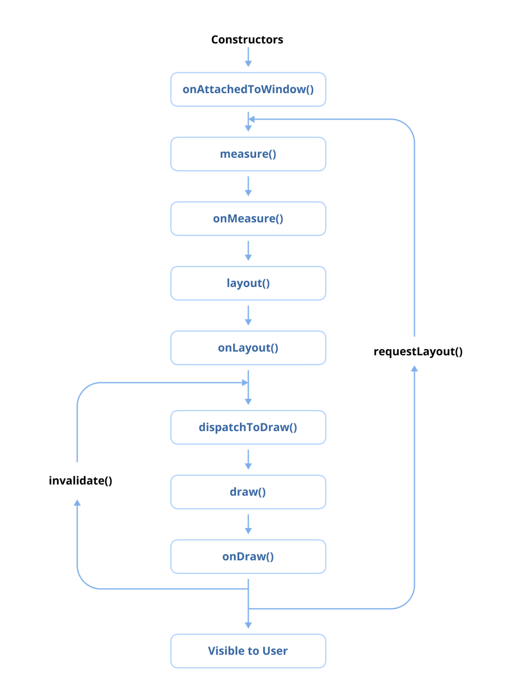

# 뷰(View) 생명주기 설명

안드로이드에서 **뷰 생명주기(View Lifecycle)** 는 `TextView`나 `Button`과 같은 뷰(View)가 생성되고, 액티비티나 프래그먼트에 연결(attach)되며, 화면에 표시되고, 결국 소멸(destroy)되거나 분리(detach)되는 과정에서 겪는 생명주기 이벤트들을 의미합니다. 뷰 생명주기를 이해하면 개발자가 뷰의 초기화, 렌더링, 해체(teardown)를 관리하고, 사용자 작업이나 시스템 이벤트에 응답하여 뷰 생명주기에 따라 사용자 정의 뷰(custom views)를 구현하며, 적절한 시점에 리소스를 폐기(dispose)하는 데 도움이 됩니다.



1.  **뷰 생성 (View Creation - `onAttachedToWindow`)**: 이 단계는 뷰가 프로그래밍 방식으로 또는 XML 레이아웃을 인플레이트(inflate)하여 인스턴스화되는 시점입니다. 리스너 설정 및 데이터 바인딩과 같은 초기 설정 작업이 여기에서 수행됩니다. `onAttachedToWindow()` 메서드는 뷰가 부모(parent)에 추가되고 화면에 렌더링될 준비가 되었을 때 트리거됩니다.

2.  **레이아웃 단계 (Layout Phase - `onMeasure`, `onLayout`)**: 이 단계에서는 뷰의 크기와 위치가 계산됩니다. `onMeasure()` 메서드는 레이아웃 파라미터와 부모의 제약 조건에 따라 뷰의 너비와 높이를 결정합니다. 측정이 완료되면, `onLayout()` 메서드가 뷰를 부모 내에 배치하여 화면에 나타날 위치를 확정합니다.

3.  **그리기 단계 (Drawing Phase - `onDraw`)**: 크기와 위치가 확정된 후, `onDraw()` 메서드는 텍스트나 이미지와 같은 뷰의 콘텐츠를 [캔버스(Canvas)](https://developer.android.com/reference/android/graphics/Canvas)에 렌더링합니다. 사용자 정의 뷰는 이 메서드를 재정의(override)하여 사용자 정의 그리기 로직을 정의할 수 있습니다.

4.  **이벤트 처리 (Event Processing - `onTouchEvent`, `onClick`)**: 상호작용이 가능한 뷰는 이 단계에서 터치 이벤트, 클릭, 제스처와 같은 사용자 상호작용을 처리합니다. `onTouchEvent()` 및 `onClick()`과 같은 메서드는 이러한 이벤트를 처리하고 사용자 입력에 대한 뷰의 응답을 정의하는 데 사용됩니다.

5.  **뷰 분리 (View Detachment - `onDetachedFromWindow`)**: 뷰가 화면과 부모 `ViewGroup`에서 제거될 때 (예: 액티비티나 프래그먼트 소멸 중), `onDetachedFromWindow()` 메서드가 호출됩니다. 이 단계는 리소스를 정리하거나 리스너를 분리하는 데 이상적입니다.

6.  **뷰 소멸 (View Destruction)**: 뷰가 더 이상 사용되지 않으면 가비지 컬렉션(garbage collected)됩니다. 개발자는 메모리 누수를 방지하고 성능을 최적화하기 위해 이벤트 리스너나 백그라운드 작업과 같은 모든 리소스가 제대로 해제되었는지 확인해야 합니다.

### 요약

뷰의 생명주기는 생성, 측정, 레이아웃, 그리기, 이벤트 처리, 그리고 최종적인 분리 과정을 포함하며, 이는 안드로이드 애플리케이션 내에서 표시되고 사용되는 동안 겪는 단계를 반영합니다.

- [Custom Components](https://developer.android.com/develop/ui/views/layout/custom-views/custom-components)

---

## Q. 이미지를 로드하거나 애니메이션을 설정하는 등 비용이 많이 드는 초기화 작업을 수행해야 하는 사용자 정의 뷰를 만들고 있습니다. 뷰 생명주기의 어느 시점에서 이러한 리소스를 초기화해야 하며, 메모리 누수를 방지하기 위해 적절한 정리 작업을 어떻게 보장해야 하나요?

사용자 정의 뷰(Custom View)를 만들 때 이미지를 로드하거나 애니메이션을 설정하는 등 비용이 많이 드는 초기화 작업과, 메모리 누수를 방지하기 위한 적절한 정리 작업은 뷰의 성능과 안정성에 매우 중요합니다.

### 1. 비용이 많이 드는 리소스 초기화 시점

비용이 많이 드는 초기화 작업은 뷰의 생명주기 중 적절한 시점에 수행하여 UI 스레드 차단을 최소화하고 효율성을 높여야 합니다.

* **생성자 (Constructor):**
    * 뷰가 XML에서 인플레이트(inflate)되거나 코드에서 직접 생성될 때 호출됩니다.
    * **피해야 하는 이유:** 생성자에서 무거운 작업을 수행하면 레이아웃 인플레이션 속도를 저해하고 앱의 반응성을 떨어뜨릴 수 있습니다. 또한, 이 시점에는 뷰의 최종 크기가 확정되지 않았고 윈도우에 연결(attach)되지 않았을 수 있어, 일부 초기화 작업(예: 크기 의존적인 리소스 로드, 윈도우 컨텍스트 필요 작업)을 수행하기에 부적절합니다.

* **`onFinishInflate()`:**
    * XML 레이아웃에서 뷰와 그 모든 자식 뷰들이 인플레이트된 후 호출됩니다.
    * **고려 사항:** XML을 통해 생성된 뷰의 초기 설정(예: 자식 뷰 참조 가져오기)에 적합할 수 있습니다. 하지만 뷰가 프로그래밍 방식으로 생성될 경우에는 호출되지 않으며, 여전히 윈도우에 연결되기 전입니다.

* **`onAttachedToWindow()`:**
    * 뷰가 윈도우에 성공적으로 연결(attached)되었을 때 호출됩니다. 이 시점에서 뷰는 화면에 그려질 준비가 되었으며, 유효한 `Window` 객체를 가집니다.
    * **적합한 작업:**
        * 이벤트 리스너 등록.
        * 뷰가 화면에 나타날 때 시작되어야 하는 애니메이션 설정 및 시작.
        * 네트워크 요청이나 데이터베이스 조회와 같이 뷰가 화면에 표시될 때 필요한 초기 데이터 로드 시작 (단, 실제 로딩 작업은 **비동기**로 처리해야 함).
    * **주의점:** 이 시점에도 뷰의 최종 크기는 아직 확정되지 않았을 수 있습니다 (`onMeasure`, `onLayout`이 이후 호출됨).

* **`onSizeChanged(int w, int h, int oldw, int oldh)`:**
    * 뷰의 크기가 (최초 레이아웃 포함) 변경될 때마다 호출됩니다. 새로운 너비(`w`)와 높이(`h`)가 전달됩니다.
    * **적합한 작업:**
        * 뷰의 크기에 의존하는 리소스 초기화 (예: 뷰 크기에 맞는 비트맵 생성, 레이아웃 기반 애니메이션 설정).
    * **주의점:** 여러 번 호출될 수 있으므로, 초기화 로직이 중복 실행되지 않도록 주의하거나(예: 플래그 사용), 크기 변경에 따라 리소스를 다시 생성해야 하는 경우에만 활용합니다.

* **`onLayout(boolean changed, int left, int top, int right, int bottom)`:**
    * `onMeasure` 이후, 뷰와 그 자식 뷰들의 크기 및 위치를 할당해야 할 때 호출됩니다.
    * **고려 사항:** 최종 크기와 위치가 확정되는 시점이지만, 여러 번 호출될 수 있고 이 단계에서 무거운 초기화를 수행하면 레이아웃 성능에 부정적인 영향을 줄 수 있습니다.

* **`onDraw(Canvas canvas)`:**
    * 뷰가 자신의 콘텐츠를 그려야 할 때 호출됩니다.
    * **절대 피해야 함:** `onDraw` 메서드는 매우 자주 호출될 수 있으며(애니메이션, 스크롤 등), 이 안에서 객체를 생성하거나 비용이 많이 드는 작업을 수행하면 심각한 성능 저하(버벅임, 프레임 드롭)를 유발합니다. 초기화 작업은 여기서 수행하면 안 됩니다.

**권장 접근 방식:**

* **크기에 의존하지 않는 일반적인 초기화 (리스너, 애니메이션 객체 생성 등):** `onAttachedToWindow()`에서 수행하는 것이 좋습니다.
* **크기에 의존하는 리소스 초기화:** `onSizeChanged()`가 호출될 때 수행하되, 최초 한 번만 실행되도록 하거나 크기 변경 시점에 맞게 효율적으로 처리합니다.
* **실제 비용이 많이 드는 작업 (이미지 로딩, 네트워크 통신 등):** `onAttachedToWindow()` 등 적절한 시점에서 시작하되, 반드시 **백그라운드 스레드(예: 코루틴, RxJava, AsyncTask 등)를 사용하여 비동기적으로 처리**하고, 결과가 준비되면 메인 스레드에서 UI에 반영해야 합니다. UI 스레드를 차단해서는 안 됩니다.

### 2. 메모리 누수 방지를 위한 적절한 정리 작업(Cleanup)

초기화된 리소스는 뷰가 더 이상 필요 없을 때 적절히 해제하여 메모리 누수를 방지해야 합니다.

* **`onDetachedFromWindow()`:**
    * **가장 중요한 정리 시점입니다.** 뷰가 윈도우에서 분리(detached)될 때 호출됩니다. 이 시점 이후 뷰는 더 이상 그려지거나 이벤트를 받지 않으며, 뷰 계층에서 제거될 준비가 된 상태입니다.
    * **수행할 작업:**
        * **리스너 등록 해제:** `onAttachedToWindow` 등에서 등록했던 모든 종류의 리스너(예: `BroadcastReceiver`, 센서 리스너, 커스텀 이벤트 리스너)를 해제합니다.
        * **애니메이션 중지 및 정리:** 실행 중인 애니메이션을 명시적으로 취소(`Animation.cancel()`, `Animator.cancel()`)하고 관련 리소스를 정리합니다.
        * **대형 리소스 해제:** 비트맵(특히 직접 관리하는 경우), 대규모 컬렉션, 열려 있는 파일/네트워크 연결 등을 해제하거나 참조를 `null`로 설정합니다. (이미지 로딩 라이브러리 사용 시 대부분 자동으로 처리됨)
        * **백그라운드 작업 취소:** 뷰의 생명주기와 연결된 백그라운드 작업(코루틴, 스레드 등)이 있다면 취소합니다.
        * **외부 객체 참조 해제:** 다른 컴포넌트나 컨텍스트에 대한 참조를 가지고 있다면 `null`로 설정하여 가비지 컬렉터가 메모리를 회수할 수 있도록 돕습니다.

* **`onWindowVisibilityChanged(int visibility)`:**
    * 뷰를 포함하는 윈도우의 가시성이 변경될 때 호출됩니다.
    * **활용:** 뷰가 보이지 않게 될 때(`visibility == View.GONE` 또는 `View.INVISIBLE`) 일부 리소스(예: 애니메이션 일시 중지)를 해제할 수 있지만, 완전한 정리는 `onDetachedFromWindow()`에서 수행하는 것이 더 확실합니다.

* **`View.OnAttachStateChangeListener` 활용:**
    * 프로그래밍 방식으로 `addOnAttachStateChangeListener()`를 사용하여 뷰가 윈도우에 연결되거나 분리될 때 알림을 받을 수 있는 리스너를 등록할 수 있습니다. 이를 통해 정리 로직을 다른 곳에 캡슐화할 수 있습니다.

* **`findViewTreeLifecycleOwner()` 활용 (이전 프로 팁 연계):**
    * 사용자 정의 뷰의 리소스가 `Activity`나 `Fragment`와 같은 `LifecycleOwner`의 생명주기와 밀접하게 연관되어 있다면, `onAttachedToWindow()`에서 `findViewTreeLifecycleOwner()`를 통해 해당 `LifecycleOwner`를 가져와 생명주기를 관찰할 수 있습니다. 그리고 `LifecycleOwner`의 `ON_STOP`이나 `ON_DESTROY` 이벤트에 맞춰 리소스를 정리할 수 있습니다. 이 경우에도 `LifecycleObserver` 자체는 `onDetachedFromWindow()`에서 `LifecycleOwner`로부터 제거해야 합니다.

### 결론

사용자 정의 뷰에서 비용이 많이 드는 초기화는 UI 스레드를 차단하지 않도록 `onAttachedToWindow` 또는 `onSizeChanged` 같은 적절한 시점에서 비동기적으로 시작하고, 관련 리소스는 반드시 `onDetachedFromWindow`에서 철저히 정리하여 메모리 누수를 방지하고 안정적인 앱 성능을 유지해야 합니다.

---

## Q. 애플리케이션에 동적으로 생성되는 뷰가 포함된 복잡한 UI가 있어 성능 문제가 발생합니다. 반응성을 유지하면서 렌더링 효율성을 향상시키기 위해 `onMeasure()` 및 `onLayout()` 메서드를 어떻게 최적화할 수 있나요?

애플리케이션에 동적으로 생성되는 뷰가 포함된 복잡한 UI가 있고 이로 인해 성능 문제가 발생하는 경우, `onMeasure()`와 `onLayout()` 메서드를 최적화하여 렌더링 효율성을 향상시키면서 반응성을 유지하는 것이 매우 중요합니다. 이 두 메서드는 뷰 계층 구조의 크기를 결정하고 요소를 배치하는 핵심 단계이므로, 이 과정에서의 비효율은 직접적으로 UI 버벅임(jank)으로 이어질 수 있습니다.

### 1. `onMeasure()` 및 `onLayout()` 최적화를 위한 일반 원칙

* **작업 최소화 (Do Less Work):** 가장 중요한 원칙입니다. 이 메서드들은 가능한 한 가볍고 빠르게 실행되어야 합니다.
* **객체 할당 지양 (Avoid Object Allocations):** `onMeasure()`나 `onLayout()` 내부에서 새로운 객체(특히 복잡하거나 많은 수의 작은 객체)를 생성하는 것은 가비지 컬렉션(GC)을 더 자주 유발하여 UI 멈춤 현상과 버벅임을 초래합니다. 가능하다면 객체를 미리 할당하거나 재사용하세요.
* **중복 계산 최소화 (Minimize Redundant Calculations):** 레이아웃 패스 간에 변경되지 않는 비싼 계산 결과는 캐싱하여 재사용하는 것을 고려하세요 (예: `onLayout`의 `changed` 파라미터가 `false`이고 다른 조건이 동일할 경우).
* **레이아웃 깊이/중첩 줄이기 (Reduce Layout Depth/Nesting):** 일반적으로 더 평평한 뷰 계층 구조가 측정하고 배치하는 데 더 빠릅니다. `ConstraintLayout`을 효과적으로 사용하거나, 필요한 경우 사용자 정의 `ViewGroup`을 구현하여 계층 구조를 최적화할 수 있습니다.
* **`MeasureSpec` 정확히 이해하고 사용:** `MeasureSpec.getMode()` (`AT_MOST`, `EXACTLY`, `UNSPECIFIED`)와 `MeasureSpec.getSize()`를 올바르게 해석하고 사용해야 합니다. 잘못된 처리는 여러 번의 측정 패스를 유발하거나 잘못된 크기 결정을 초래할 수 있습니다.

### 2. `onMeasure()` 최적화 전략

`onMeasure()`의 주 목적은 뷰 자신과 (뷰그룹의 경우) 그 자식들의 크기를 결정하는 것입니다.

* **효율적인 자식 뷰 측정 (ViewGroup의 경우):**
    * 각 자식 뷰는 가능한 한 측정 패스당 한 번만 측정하도록 합니다.
    * 특정 자식의 크기가 다른 자식들의 측정에 영향을 주지 않는다면, 측정 순서를 최적화하는 것을 고려할 수 있습니다.
    * 자식 뷰의 크기가 이미 알려져 있거나(예: 고정된 `dp` 값 또는 `EXACTLY` 모드로 측정된 부모 내의 `match_parent`) 부모로부터 정확히 결정될 수 있다면, 해당 정보를 효율적으로 활용합니다.
* **`MeasureSpec.EXACTLY` 모드 효율적 처리:** 부모가 정확한 크기를 지정했다면, 해당 크기를 직접 사용합니다. 해당 차원에 대한 복잡한 계산이 필요 없습니다.
* **`MeasureSpec.AT_MOST` 모드 신중한 처리:** 뷰가 원하는 크기를 계산하되, 사용 가능한 공간(`MeasureSpec.getSize()`)을 초과하지 않도록 보장합니다.
* **불필요한 재측정 회피:** `MeasureSpec`이나 다른 내부 상태 의존성이 변경되지 않았다면, 이전에 측정된 값을 재사용하는 것을 고려할 수 있습니다. (단, 시스템은 종종 다른 `MeasureSpec`으로 여러 번 `onMeasure`를 호출하므로, 견고한 캐싱은 신중한 상태 확인이 필요합니다.)

### 3. `onLayout()` 최적화 전략

`onLayout()`의 주 목적은 `onMeasure()`에서 결정된 크기를 바탕으로 뷰 자신과 (뷰그룹의 경우) 그 자식들의 위치를 지정하는 것입니다.

* **효율적인 자식 뷰 위치 지정 (ViewGroup의 경우):**
    * 자식 뷰들의 위치를 효율적으로 계산합니다. 간단한 공식이나 캐시된 값을 사용할 수 있다면 각 자식에 대해 복잡한 루프나 계산을 피합니다.
    * 각 자식 뷰에 대해 `child.layout(l, t, r, b)`는 레이아웃 패스당 한 번만 호출하도록 합니다.
* **`onLayout()` 또는 `onMeasure()` 내에서 `requestLayout()` 호출 금지:** 이는 레이아웃 패스의 무한 루프를 유발할 수 있으므로 절대 피해야 합니다.
* **필요한 경우에만 재배치 (`changed` 파라미터 활용):** `onLayout`의 `changed` 파라미터는 이전 레이아웃 이후 뷰의 경계가 변경되었는지 여부를 나타냅니다. 만약 `changed`가 `false`이고 다른 내부 상태가 자식들의 재배치를 요구하지 않는다면, 일부 또는 전체 자식 레이아웃 로직을 건너뛸 수 있습니다.
* **`GONE` 상태의 뷰 처리 최적화:** 자식 뷰의 `visibility`가 `GONE`이라면, 해당 뷰의 위치를 계산하거나 배치하는 데 시간을 낭비하지 않도록 합니다.

### 4. 동적으로 생성되는 뷰에 대한 최적화 전략

* **효율적인 뷰 인플레이션/생성:**
    * XML에서 뷰를 인플레이트할 경우, 효율적으로 수행합니다. 프로그래밍 방식으로 생성할 경우, 가능한 객체를 재사용합니다. 자주 생성되고 소멸되는 간단한 뷰의 경우 객체 풀(object pool)을 고려할 수 있습니다.
* **`ViewStub` 활용:** 항상 보이지는 않지만 나중에 필요할 수 있는 뷰의 경우 `ViewStub`을 사용합니다. `ViewStub`은 가볍고 크기가 없는 뷰로, `setVisibility(View.VISIBLE)` 또는 `inflate()`가 호출될 때만 지정된 레이아웃을 인플레이트합니다. 이는 복잡한 뷰의 인플레이션 비용을 실제로 필요할 때까지 지연시킵니다.
* **`RecyclerView`/`ListView` 사용 (대규모 목록):** 많은 아이템을 스크롤 가능한 목록으로 표시해야 할 경우, `ScrollView` 내에 `LinearLayout`을 사용하고 많은 뷰를 직접 추가하는 대신, 뷰를 재활용하여 효율적으로 목록을 표시하도록 설계된 `RecyclerView`를 사용해야 합니다.
* **(고급) 비동기 레이아웃 인플레이션 (`AsyncLayoutInflater`):** 매우 복잡하여 지연시켜도 여전히 버벅임을 유발하는 레이아웃의 경우 `AsyncLayoutInflater` 사용을 고려할 수 있습니다. 이는 백그라운드 스레드에서 레이아웃을 인플레이트한 후 메인 스레드에서 뷰 계층에 추가합니다. (단, 생성자에서 메인 스레드 작업이 필요한 사용자 정의 뷰 등 일부 제한 사항이 있으므로 주의해서 사용해야 합니다.)
* **레이아웃을 다시 유발하는 동적 변경 최소화:** 뷰를 동적으로 추가/제거하거나 레이아웃 파라미터를 변경할 때, 이러한 작업을 일괄 처리하거나 전체 레이아웃 패스 수를 최소화하는 방식으로 수행합니다. `requestLayout()`은 뷰 계층의 루트까지 전체를 무효화시킵니다. `forceLayout()`도 유사합니다. 단순히 다시 그려야 할 경우 `invalidate()`를 사용합니다.

### 5. 진단에 도움이 되는 도구

* **Android Studio 레이아웃 검사기 (Layout Inspector):** 뷰 계층 구조를 시각적으로 검사하고, 뷰 속성을 확인하며, 레이아웃 경계를 이해하는 데 도움을 줍니다. 깊은 중첩이나 예상치 못한 뷰 크기를 식별하는 데 유용합니다.
* **Android Studio 프로파일러 (CPU Profiler - 시스템 트레이스 사용):**
    * `onMeasure()` 및 `onLayout()` 호출에 소요된 시간을 식별합니다.
    * 레이아웃 패스 내에서 자주 호출되거나 시간이 오래 걸리는 메서드를 찾습니다.
    * "Flame Chart"는 시간이 어디에 소비되는지 시각화하는 데 도움이 됩니다.
* **Systrace (명령줄 또는 Perfetto UI 통해 사용):** 시스템의 모든 스레드에서 발생하는 상황(레이아웃 및 렌더링 단계 포함)에 대한 상세한 뷰를 제공합니다. 버벅임과 그 원인을 식별하는 데 도움이 됩니다.
* **Lint 검사 (레이아웃 유효성 검사):** Android Studio의 Lint는 때때로 비효율적인 레이아웃 관행을 지적해 줄 수 있습니다.

이러한 최적화 기법과 진단 도구를 적절히 활용하면, 동적으로 생성되는 뷰를 포함한 복잡한 UI에서도 반응성이 뛰어나고 효율적인 렌더링 성능을 가진 애플리케이션을 구축하는 데 도움이 됩니다.

---

## 💡 프로 팁: 뷰의 `findViewTreeLifecycleOwner()` 함수란 무엇인가요?

`findViewTreeLifecycleOwner()` 함수는 `View` 클래스의 일부입니다. 이 함수는 뷰 트리 계층을 따라 올라가면서 해당 뷰 트리에 연결된 가장 가까운 `LifecycleOwner`를 찾아 반환합니다. `LifecycleOwner`는 일반적으로 액티비티, 프래그먼트 또는 `LifecycleOwner`를 구현하는 모든 사용자 정의 컴포넌트와 같은 호스팅 컴포넌트의 생명주기 범위(lifecycle scope)를 나타냅니다. 만약 `LifecycleOwner`를 찾지 못하면 함수는 `null`을 반환합니다.

### `findViewTreeLifecycleOwner()`를 사용하는 이유

이 함수는 `LiveData`, `ViewModel` 또는 `LifecycleObserver`와 같이 생명주기를 인식하는(lifecycle-aware) 요소와 상호작용해야 하는 사용자 정의 뷰나 타사 컴포넌트로 작업할 때 특히 유용합니다. 이를 통해 뷰는 호스팅 액티비티나 프래그먼트에 대한 명시적인 의존성 없이도 연관된 생명주기에 접근할 수 있습니다.

`findViewTreeLifecycleOwner()`를 사용하면 다음을 보장할 수 있습니다.

* 생명주기 인식 컴포넌트가 올바른 생명주기에 제대로 바인딩됩니다.
* 생명주기가 끝날 때 옵저버가 정리되어 메모리 누수를 방지합니다.

`LifecycleObserver` 인스턴스를 바인딩해야 하는 사용자 정의 뷰를 생각해 보세요. `findViewTreeLifecycleOwner()`를 사용하면 해당 관찰(observation)을 올바른 생명주기에 바인딩할 수 있습니다.

```kotlin
class CustomView @JvmOverloads constructor(
    context: Context, attrs: AttributeSet? = null, defStyleAttr: Int = 0
) : View(context, attrs, defStyleAttr) {

    private val lifecycleObserver = object : DefaultLifecycleObserver {
        override fun onStart(owner: LifecycleOwner) {
            // 뷰가 시작될 때 로직 실행
            Log.d("CustomView", "LifecycleOwner STARTED")
        }

        override fun onStop(owner: LifecycleOwner) {
            // 뷰가 중지될 때 로직 실행
            Log.d("CustomView", "LifecycleOwner STOPPED")
        }
    }

    override fun onAttachedToWindow() {
        super.onAttachedToWindow()
        // 뷰 트리의 가장 가까운 LifecycleOwner를 찾아 관찰 시작
        findViewTreeLifecycleOwner()?.lifecycle?.addObserver(lifecycleObserver)
    }

    override fun onDetachedFromWindow() {
        super.onDetachedFromWindow()
        // 관찰 해제
        findViewTreeLifecycleOwner()?.lifecycle?.removeObserver(lifecycleObserver)
    }
}
```

여기서 사용자 정의 `CustomView`는 뷰 트리의 가장 가까운 `LifecycleOwner`에 동적으로 바인딩되어 `LifecycleObserver`의 관찰이 적절한 생명주기에 연결되도록 보장합니다.

### 주요 사용 사례

* **사용자 정의 뷰:** 사용자 정의 뷰 내의 생명주기 인식 컴포넌트가 `LifecycleObserver`, `LiveData`와 같은 생명주기 옵저버를 관찰하거나 리소스를 관리할 수 있게 합니다.
* **타사 라이브러리:** 재사용 가능한 UI 컴포넌트가 명시적인 생명주기 관리 없이도 생명주기 인식 리소스와 상호작용할 수 있게 합니다.
* **로직 디커플링(결합도 낮추기):** 뷰가 뷰 트리에서 자체 `LifecycleOwner`를 독립적으로 찾을 수 있게 하여 결합도를 줄이는 데 도움이 됩니다.

### 제한 사항

`findViewTreeLifecycleOwner()`는 유용한 유틸리티이지만, 뷰 트리에 `LifecycleOwner`가 존재해야 합니다. 만약 그러한 소유자가 없다면 함수는 `null`을 반환하므로, 비정상 종료나 예기치 않은 동작을 피하기 위해 이 경우를 적절히 처리해야 합니다.

### 요약

뷰의 `findViewTreeLifecycleOwner()` 함수는 뷰 트리에서 가장 가까운 `LifecycleOwner`를 검색하는 데 유용한 유틸리티입니다. 이는 사용자 정의 뷰나 타사 라이브러리에서 생명주기 인식 컴포넌트로 작업하는 것을 단순화하여 적절한 생명주기 관리를 보장하고 뷰와 호스팅 컴포넌트 간의 결합도를 줄입니다.