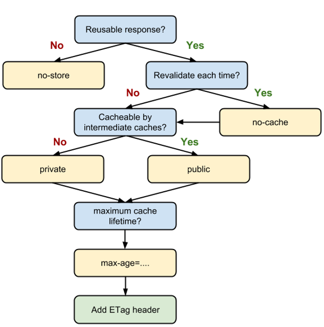

# HTTP Cache

## Cache
- `저장한다`라는 의미

## 캐시가 나온 배경

- 웹이 폭발적으로 성장하면서 전송하는 데이터 양이 급속적으로 팽창
- 이미 다운로드 받은 파일을 Cache 했다가 같은 주소로 접속할때 Cache 해둔 파일을 사용
    - 네트워크를 통하지 않고 바로 사용
    - 네트워크 지연으로 인한 속도저하 발생하지 않음
    - 비용 절약

## 캐시를 사용할때 문제

- 웹 사이트를 개편해도 과거의 파일을 보고 있을수 있다.
- 캐시를 최신의상태를 유지하기가 어렵다.

## 캐시를 배우고나면 얻을수 있는것
- 최신 상태를 유지하는 웹의 장점과 눈깜짝 할 사이에 실행되는 앱의 장점을 살릴수 있다.

---

## HTTP Cache 테스트를 위한 환경 설정

### 웹브라우저에서 네트워크 지연하는 방법

크롬
- 오른쪽 마우스 → inspect → 네트워크 탭 → online 옵션 변경 → slow 3g

### 캐시 설정 - 아파치 웹서버 사용

- 비트나미 → Manager Servers > Apach Web Server 선택 > Configure → Open Config File → httpd.conf 파일 열림 (우리가 설치한 아파치 웹서버의 설정이 들어가 있는 파일) → 파일의 끝에 캐시 설정을 추가 (적용 시키려면 아파치 웹서버 재시작을 해야함)

---

## 캐시를 금지하는 법 - Cache-Control: no-store

```jsx
// httpd.conf

SetEnv no-gzip 1
Header set Cache-Control "no-store"
```

- SetEnv no-gzip 1
    - 아파치가 가지고 있는 파일을 압축해서 전송하는 기능으로 인해 캐시의 영향을 받아서 혼란스러워서 압축 기능 제거
    - 실제로 사용할때는 압축 기능을 켜야함
- Header set Cache-Control "no-store"
    - 헤더값을 변경 → 파일이 요청될때마다 응답할때 캐시 컨트롤 헤더를 추가해서 `no-store` 로 저장하지 않도록 설정

크롬

- 캐시를 삭제하고 새로고침을 하기위해 `Hard Reload` 로 새로고침
    - 새로고침을 해도 파일을 다시 처음부터 다운로드 받음
    - 응답 헤더 → Cache-Control: no-store
    - 장점: 웹 페이지가 새로 개편되어도 새로운 페이지를 잘 가져올수 있다.

---

## 캐시를 사용하는 법 - Cache-Control: maxAge

```jsx
// httpd.conf

SetEnv no-gzip 1
Header set Cache-Control "max-age=5"
```

- Header set Cache-Control "max-age=5"
    - 캐시를 사용하다가 5초에 한번씩 서버에 접속해서 파일을 다운로드 받는데 용량이 줄어 들었다.
    - HTML 을 수정하면 다시 실제 크기의 파일을 다운로드 받는다.
- 응답 헤더
    - `Last-Modified` : 서버의 HTML 이 언제 수정되었는지 시간 정보
    - HTML 파일을 캐시에 저장할때 이 파일은 마지막으로 언제 수정되었는지 함께 저장
    - 5초가 지난 후에는 해당 캐시를 바로 사용할수 없다.
        - 요청 헤더
            - `if-Modified-Since`: 마지막으로 수정된 파일의 시간 정보
            - 이시간 이후로 서버에서 파일의 수정이 이루어졌다면 파일을 전송해주고 수정된 적이 없으면 체크만 한다.
            - 웹서버 응답
                - 304 코드 전송 - 두 파일이 마지막 수정일자가 같으므로 변경된 내용이 없을때 전송 (덩치가 큰 컨텐트 자체는 전송하지 않고, `헤더`만 주고 받음)
                - 200 코드 전송 - `Last-Modified`  정보를 알려준다.
            
---

## ETag
웹페이지 처음 접속시 파일 다운로드
- 서버는 `Last-Modified` 정보를 전달(최신 파일인지 확인)
- 초까지만 표시해주므로 경우에 따라서 부정확한 경우도 생길수 있다.
- `Response Header - ETag`: 문자열로 이루어진 알아보기 힘든 정보가 들어있음
- 웹브라우저는 웹 서버가 알려준 `ETag` 와 `html 파일`을 캐시로 저장
- 웹서버에 다음 요청시 `Request Header` 에 `if-None-Match` 와 `ETag` 를 요청
- 데이터가 같다면 304로 데이터가 수정되지 않은걸로 간주, 다르다면 200 코드와 함께 새로운 내용을 다운로드
- 어떻게 만드는지는 웹서버는 서비스하는 파일의 고유한 `ETag` 를 만들어서 웹브라우저에게 보내줘야한다는 책임을 가진것만 인지하면 된다.
- 웹서버는 `Request Header`에 `if-Modified-Since` 와 `if-None-Match` 2가지가 일치해야 파일이 같은것으로 간주한다.

---

## 캐시 정책

### Cache-Control 흐름도



<br>

### 캐싱에 대한 가이드
- 재사용 응답이 필요하나 -> `no-store`
- 로컬과 서버에 있는 파일이 서로 유효한지 매번 검색해야 하는지? -> `no-cache`
- Cacheable 캐싱 서버가 필요한지? -> `publick/private`
- 캐시 수명을 지정할수 있어야 한다면? -> `max-age` 활용
    - 사용자가 멀리 떨어져있다면 중간에 캐싱 서버를 두고 웹서버의 내용을 캐싱 서버에 캐싱을 해두면 사용자는 웹사이트를 직접 접속하지 않고 캐싱 서버에서 가져가므로 빠르게 가져갈수 있다.


## 참고
[HTTP Caching](https://developers.google.com/web/fundamentals/performance/get-started/httpcaching-6?hl=fr)
[HTTP Cache로 불필요한 네트워크 요청 방지](https://web.dev/http-cache/#defining-optimal-cache-control-policy)